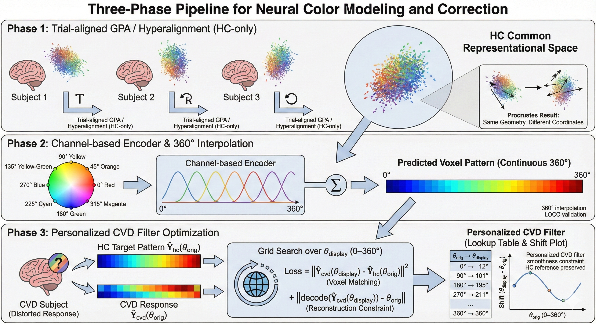
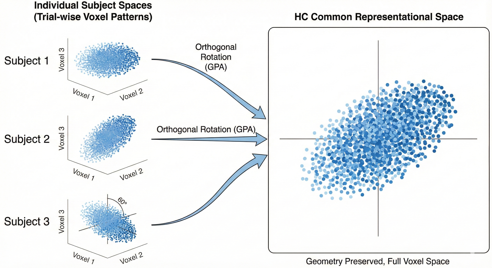
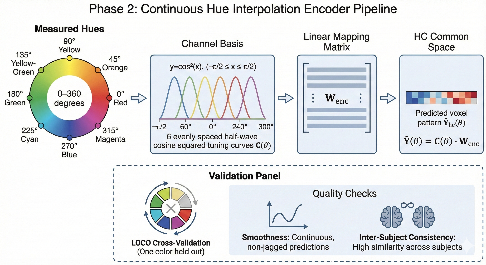
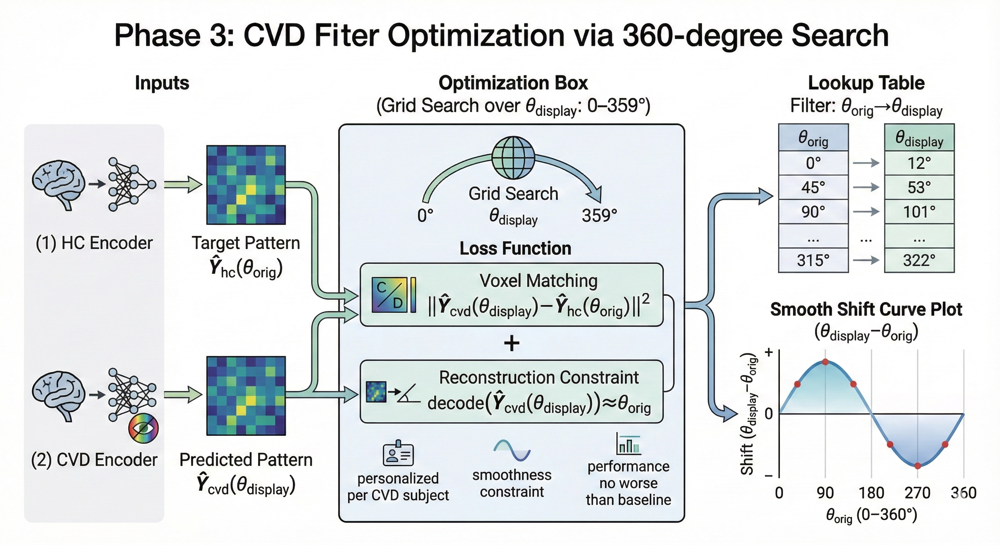

# Development of a Personalized Color Vision Correction Display Filter for Individuals with Color Vision Deficiency Using fMRI-Based Neural Responses

[](https://www.python.org/downloads/)
[](LICENSE)

> **Decoding and characterizing color perception in color vision deficiency (CVD) using fMRI-based forward encoding models and Shared Response Model (SRM) group comparison**

## Table of Contents

- [Overview](#overview)
- [Research Questions](#research-questions)
- [Current Status](#current-status)
- [Project Phases](#project-phases)
  - [Phase 1: Preprocessing & Baseline Decoding ✅](#phase-1-preprocessing--baseline-decoding-)
  - [Phase 2: SRM Between-Subject Group Comparison ✅](#phase-2-srm-between-subject-group-comparison-)
  - [Phase 2b: Decoder Model Validation ✅](#phase-2b-decoder-model-validation-)
- [Future Directions](#future-directions)
  - [Phase 1: Hyperalignment for HC Common Space 📋](#phase-1-hyperalignment-for-hc-common-space-)
  - [Phase 2: Continuous Hue Interpolation Model 📋](#phase-2-continuous-hue-interpolation-model-)
  - [Phase 3: CVD Filter Optimization via 360° Search 🎯](#phase-3-cvd-filter-optimization-via-360-search-)
- [Installation](#installation)
- [Usage](#usage)
- [Project Structure](#project-structure)
- [Data](#data)
- [References](#references)

---

## Research Questions

### Primary Questions (연구 질문)

#### RQ1: Neural Color Discrimination Despite Retinal Deficits
**Can individuals with CVD distinguish colors neurally despite retinal deficits, as measured by fMRI decoding accuracy in visual cortex?**

**망막 결함에도 불구하고 색맹자가 신경 수준에서 색을 구별할 수 있는가? (fMRI 디코딩 정확도 측정)**

- ✅ **Answer**: Yes! All CVD participants showed successful color decoding
  - **답변**: 예! 모든 색맹 참가자가 성공적인 색 디코딩을 보임
  - Mean decoding accuracy: **0.592 ± 0.121** across 40 subject-ROI pairs (C010 + Procrustes pipeline)
  - hV4 shows strongest selectivity: **0.613 ± 0.092** (decoding), **0.541 ± 0.283** (RDM correlation)
  - RDM correlation after Procrustes: **0.381 ± 0.278** (100% positive pairs, up from 52.5% pre-alignment)
  - CVD group: **0.684 ± 0.094** (numerically higher than HC 0.552 ± 0.111)
  - **Supporting evidence**: Noise ceiling utilization 79.4% (C010 pipeline); all subjects p < 0.001 vs chance

#### RQ2: Inter-Individual Heterogeneity in CVD
**Does CVD show inter-individual heterogeneity in neural color representations, necessitating personalized approaches?**

**색맹은 신경 색 표상에서 개인 간 이질성을 보이는가? 개인화된 접근이 필요한가?**

- ✅ **Answer**: Yes, substantial individual heterogeneity confirmed via SRM group comparison
  - **답변**: 예, SRM 그룹 비교를 통해 상당한 개인차 확인
  - **SRM LOO-consistent group disparity** (HC-only SRM, LOO references):
    - V1: p=0.062 (g=1.16), V2: p=0.075 (g=1.04) — trending with large effects
    - V3/hV4: not significant
  - **Individual CVD tests** (Crawford & Howell 1998):
    - **sub-09** (protan): V1 p=0.007* — early visual cortex disruption
    - **sub-08** (deutan): V2 p=0.040* — mid-level visual processing impact
    - **sub-10** (deutan): falls within HC range — functionally normal representations
  - **LOSO color-dependency** (CVD color-specific, HC color-agnostic):
    - CVD: V2 p=0.010, V3 p=0.000, hV4 p=0.016
    - HC: p=0.21–0.36 (not significant)
  - **CVD heterogeneity**: 1.4–1.6× more dispersed than HC across all ROIs
  - **Key finding**: Identical genotype (deuteranopia) → Opposite neural phenotypes (sub-08 vs sub-10)
  - **Robustness**: Convergent validity with SRM-independent metrics (crossnobis r=0.486**, PCA r=0.742***)

#### RQ3: Neural-Guided Personalized Filter Design
**Can three-dimensional neural profiles (magnitude, sign, structure) inform individual-specific display filter design?**

**3차원 신경 프로파일(크기, 부호, 구조)이 개인별 맞춤형 디스플레이 필터 설계에 활용될 수 있는가?**

- 📋 **Planned** — Rigorous pipeline under development
  - **결과**: 체계적 파이프라인 개발 중
  - Retrospective Procrustes-based filter showed feasibility (97.2% disparity reduction, RDM ≥ 0.999)
  - ⚠️ **Limitation**: Previous results were retrospective; prospective pipeline requires hyperalignment → continuous encoder → optimization
  - Development workspace: `prediction_model_workspace/MASTER_PLAN.md`

---

### Sub-Research Questions (이후 연구 질문)

These questions address methodological foundations for the 3-phase neural-guided filter development pipeline (MASTER_PLAN.md).

#### SRQ1: Shared Decoder Validation
**Can a common color decoder be successfully applied across HC and CVD participants after alignment?**

- ✅ **Answer**: Yes — alignment is essential; optimal pipeline is task-dependent
  - **LORO classification**: LDA+SRM best (acc_45 = 0.793, ICC = 0.666); resolves Procrustes LDA reliability paradox
  - **LOCO interpolation**: FE+Procrustes best (HC MAE 75.7°); ForwardEncoding is the only model with interpolation ability
  - Without alignment: ALL models perform at chance (~37–39% LORO, ~90° LOCO)
  - HC ≈ CVD performance (LDA: HC 0.805, CVD 0.859) → shared voxel-color mapping confirmed
  - Group prior: HC-mean W improves CVD LOCO by +4–8% (leakage-free nested CV)

#### SRQ2: Hyperalignment for Common Space
**Can trial-aligned Generalized Procrustes Analysis (GPA) create a stable HC common space for robust encoder learning?**

- 📋 **Planned** (Future Phase 1)
  - **Goal**: Align HC participants' trial-wise voxel patterns into shared representational space
  - **Method**: Trial-aligned GPA with full voxel space (NO PCA) to preserve geographic features
  - **Success criteria**: Procrustes disparity <0.10, split-half stability >0.80

#### SRQ3: Continuous Hue Interpolation
**Can a channel-based forward encoding model predict brain responses for any hue angle in 360° circular space?**

- 📋 **Planned** (Future Phase 2)
  - **Goal**: Develop continuous hue encoder (0-360°) using 6 half-wave rectified basis channels
  - **Validation**: Leave-One-Color-Out (LOCO) CV — train on 7 colors, predict held-out 8th
  - **Success criteria**: LOCO error <50° (chance: 90°)

#### SRQ4: CVD Filter Optimization via 360° Search
**Can optimization-based filter discovery find display colors that make CVD brain responses match HC responses?**

- 🎯 **Planned** (Future Phase 3)
  - **Goal**: For each original color θ_orig, optimize display color θ_display using dual-constraint loss
  - **Success criteria**: Voxel pattern similarity >50% reduction, reconstruction error >30% reduction

---

### Methodology

- **Participants**: 10 subjects (7 HC, 3 CVD: 2 deuteranopia, 1 protanomaly)
- **Paradigm**: Rapid serial visual presentation (RSVP) of 8 isoluminant colors
- **Runs**: 6 runs per subject
- **ROIs**: V1, V2, V3, hV4 (defined using Wang et al. 2015 probabilistic atlas)
- **Space**: MNI152NLin2009cAsym, res-2
- **Preprocessing**: fMRIPrep v23.2.3 with MI-based coregistration
- **Pipeline**: C010 (2nd-level drift removal) + Procrustes alignment (validated 2026-02-09)
- **Analysis methods**:
  - Forward encoding models (Brouwer & Heeger, 2009)
  - Shared Response Model (SRM; BrainIAK) for between-subject alignment
  - Crawford & Howell (1998) modified t-test for single-case inference
  - Crossnobis distance (Walther et al., 2016) for SRM-independent validation

---

## Current Status

### Completed ✅

- **Phase 1**: C010 + Procrustes baseline decoding (validated 2026-02-09)
  - Mean decoding accuracy 0.592, RDM correlation 0.381, noise ceiling utilization 79.4%
- **Phase 2**: SRM between-subject group comparison (HC-only SRM, LOO-consistent)
  - Group: V1 p=0.062, V2 p=0.075; Individual: sub-09 V1 p=0.007*, sub-08 V2 p=0.040*
  - LOSO color-dependency: CVD V2/V3/hV4 significant, HC not significant
- **Phase 2b**: Decoder model comparison and cross-validation (21/21 validations complete)
  - Task-dependent optimality: LDA+SRM for LORO (0.793), FE+Procrustes for LOCO (75.7°)
  - Procrustes/SRM alignment essential; HC ≈ CVD; group prior validated (+4–8% CVD LOCO)
  - Negative results: decoder bottleneck not improvable (Result 7), sequential/MLP dead ends (Result 10)
- **Robustness triangulation** (A3/A4/A5):
  - A3 Variance Explained: CVD VE ≥ HC (V2 g=−1.68)
  - A4 Crossnobis RDM: SRM-independent convergent r=0.486**
  - A5 PCA-CCA replication: convergent r=0.742***

### Planned 📋

- **Future Phase 1**: Hyperalignment — HC common space via trial-aligned GPA
- **Future Phase 2**: Continuous hue encoder — 360° forward model
- **Future Phase 3**: Filter optimization — neural-guided personalized display filters

---

## Project Phases

### Phase 1: Preprocessing & Baseline Decoding ✅

**Goal**: Establish baseline decoding performance and quantify color representation quality

**Pipeline** (C010 + Procrustes, validated 2026-02-09):
- 1st-level GLM: FIR basis (8 delays, 0–12s)
- Voxel selection: Top 50% by FIR R²
- 2nd-level GLM: 8 HRF + 8 derivative + 12 per-run drift regressors
- Procrustes alignment: runs 1–5 aligned to run 0
- Forward encoding: 6 half-wave rectified channels, LORO cross-validation

**Key Results**:

| ROI | N | RDM Correlation (M ± SD) | Decoding Accuracy (M ± SD) |
|-----|---|--------------------------|---------------------------|
| V1 | 10 | 0.313 ± 0.215 | 0.560 ± 0.138 |
| V2 | 10 | 0.370 ± 0.256 | 0.581 ± 0.131 |
| V3 | 10 | 0.316 ± 0.328 | 0.613 ± 0.130 |
| hV4 | 10 | **0.541 ± 0.283** | **0.613 ± 0.092** |

**Documents**: `analysis/phase1_preprocess_decoding/README.md`, `analysis/METHODS_RESULTS_SUMMARY_FOR_PAPER.md`

---

### Phase 2: SRM Between-Subject Group Comparison ✅

**Goal**: Quantify HC-CVD representational differences in SRM shared space

**Method**: HC-only SRM (BrainIAK) with LOO-consistent disparity analysis
- SRM trained on 7 HC subjects only; CVD projected via SVD
- LOO references: HC sub-i vs mean of other 6 HC; CVD vs same LOO references
- Three bias fixes: (1) HC-only training, (2) LOO for HC, (3) same LOO refs for CVD
- Crawford & Howell (1998) for individual CVD inference
- 10,000 permutation iterations (LOO-consistent)

**Canonical script**: `analysis/phase2_SRM_across_between/rerun_loo_consistent.py`

**Key Results**:

| ROI | HC LOO | CVD LOO | Separation | p (perm) | Hedges' g |
|-----|--------|---------|------------|----------|-----------|
| V1 | 0.453 | 0.590 | 0.137 | 0.062 | 1.16 |
| V2 | 0.486 | 0.606 | 0.120 | 0.075 | 1.04 |
| V3 | 0.540 | 0.564 | 0.023 | 0.395 | 0.18 |
| hV4 | 0.700 | 0.677 | −0.023 | 0.559 | −0.14 |

**Individual CVD** (Crawford & Howell):
- sub-09 (protan): **V1 p=0.007*** — early visual cortex
- sub-08 (deutan): **V2 p=0.040*** — mid-level processing
- sub-10 (deutan): HC range — functionally normal

**Validation** (12+ tests): LOSO stability (V2 7/7), split-half (V2 both halves sig), permutation, ICC, RDM consistency, alignment comparison, crossnobis, PCA-CCA, variance explained

**Documents**: `analysis/phase2_SRM_across_between/README.md`, `analysis/phase2_SRM_across_between/validation/`

---

### Phase 2b: Decoder Model Validation ✅

**Goal**: Validate decoder assumptions — linearity, alignment necessity, group comparability, interpolation

**Methods**: 6 models (LDA, Ridge, ForwardEncoding, KernelRidge, SVM, MLP) compared with LORO and LOCO CV

**Key Findings**:
1. **Task-dependent optimality**: LDA+SRM for LORO classification (0.793, ICC 0.666); FE+Procrustes for LOCO interpolation (75.7°)
2. **Alignment is essential**: Without it, ALL models perform at chance (~37–39% LORO, ~90° LOCO)
3. **HC ≈ CVD**: Shared voxel-color mapping confirmed (justifies filter learning)
4. **ForwardEncoding is the only model with interpolation ability** (LOCO MAE 72–83° vs 90° chance)
5. **LDA+SRM = optimal LORO pipeline**: SRM resolves LDA fold-instability (ICC 0.013 → 0.666)
6. **Group prior validated**: HC-mean W improves CVD LOCO by +4–8% (leakage-free nested CV)
7. **Cross-subject generalization**: HC→CVD = HC→HC in SRM space (no group bias)
8. **Negative results**: Decoder bottleneck not improvable (4 alt. methods all worse); sequential/MLP dead ends

**Documents**: `analysis/phase3_decoder_comparing/model_comparison_validation/`, `analysis/METHODS_RESULTS_SUMMARY_FOR_PAPER.md`

---

## Future Directions: 3-Phase Neural-Guided Filter Development

### Overall Pipeline



Our future work follows a systematic 3-phase approach to develop personalized, neural-guided color correction filters:

1. **Phase 1**: Hyperalignment — Create common neural space across individuals
2. **Phase 2**: Forward Model — Learn continuous hue → brain response mapping
3. **Phase 3**: Filter Optimization — Find optimal display colors via 360° search

---

### Phase 1: Hyperalignment for HC Common Space 📋



**Goal**: Align HC participants' brain responses into a common representational space

**Motivation**: Phase 2 SRM results show that between-subject alignment substantially improves analysis (2.4–6.5× over raw). Hyperalignment with trial-level data will create a more refined common space for encoder learning.

**Method**: Trial-aligned Generalized Procrustes Analysis (GPA)

**Success Criteria**:
- Trial-level ISC > 0.30
- LOSO decoding > 25% (chance: 12.5%)
- Procrustes disparity < 0.08 (baseline: 0.089)
- RDM correlation > 0.30 (baseline: 0.26)

**Documents**: `prediction_model_workspace/docs/PHASE1_HYPERALIGNMENT.md`

---

### Phase 2: Continuous Hue Interpolation Model 📋



**Goal**: Develop a continuous hue encoder predicting brain responses for any color in 360° space

**Motivation**: Our experiment measured responses to only 8 discrete colors (45° spacing). Phase 2b LOCO results confirm ForwardEncoding can interpolate between measured points. A full continuous encoder enables filter optimization across all possible display colors.

**Method**: Channel-based forward encoding (Brouwer & Heeger 2009)

**Validation**: Leave-One-Color-Out (LOCO) CV — train on 7 colors, predict held-out 8th

**Documents**: `prediction_model_workspace/docs/PHASE2_PREDICTION_MODEL.md`

---

### Phase 3: CVD Filter Optimization via 360° Search 🎯



**Goal**: For each original color, find the optimal display color that makes CVD brain responses match HC responses

**Core Innovation**: Optimization-based filter discovery (not direct voxel transformation)

**Mathematical Framework**:

```python
θ_display = argmin_θ [
    Loss_voxel:  ||Ŷ_cvd(θ) - Ŷ_hc(θ_orig)||²  # Brain pattern matching
    + λ * Loss_decode: ||Decode(Ŷ_cvd(θ)) - θ_orig||²  # Reconstruction accuracy
]
```

**Documents**: `prediction_model_workspace/docs/PHASE3_CVD_FILTER_OPTIMIZATION.md`

---

## Legacy Plans (For Reference)

<details>
<summary><b>Original Phase Plans (Click to expand)</b></summary>

These were the original phase plans, now superseded by the SRM-based approach (Phase 2) and the 3-phase neural-guided pipeline above.

### Original Phase 2A: Linear Filter Learning
- Goal: Learn linear transformations to map CVD patterns to HC-like patterns
- Status: Superseded by SRM group comparison approach

### Original Phase 2B: Forward Encoding Model
- Goal: Learn explicit stimulus → brain mapping
- Status: Addressed in Phase 2b decoder comparison

### Original Phase 3: Inverse Transformation
- Goal: Compute stimulus-level color corrections
- Status: Incorporated into future Phase 3 filter optimization

### Original Phase 4: Deep Learning Filter
- Goal: End-to-end neural network for CVD color correction
- Status: Deferred pending rigorous forward model pipeline

</details>

---

## Installation

### Requirements

- Python 3.8+
- Conda (recommended)
- SLURM cluster (for large-scale analysis)

### Setup

1. **Clone repository**
   ```bash
   git clone https://github.com/yourusername/colorBlind_analysis.git
   cd colorBlind_analysis
   ```

2. **Create conda environment**
   ```bash
   conda env create -f environment.yml
   # Server: conda activate nilearn
   # Local (SRM analysis): conda activate srm
   ```

3. **Verify installation**
   ```bash
   python -c "import nilearn, nibabel, sklearn; print('Success!')"
   ```

---

## Usage

### Phase 1: Baseline Decoding

```bash
# Run forward encoding model for a single subject-ROI
conda activate nilearn
python analysis/phase1_preprocess_decoding/fir_reconstruction_BH2009_system_clean.py \
    --subject 02 \
    --roi V1 \
    --dataset full_dataset_C010
```

### Phase 2: SRM Group Comparison

```bash
# Run canonical LOO-consistent SRM analysis
conda activate srm
mpirun -np 1 python analysis/phase2_SRM_across_between/rerun_loo_consistent.py
```

### Phase 2b: Decoder Comparison

```bash
# Run model comparison (LORO + LOCO)
python analysis/phase3_decoder_comparing/model_comparison_validation/scripts/run_comparison.py
```

---

## Project Structure

```
colorBlind_analysis/
├── README.md                              # This file
├── CLAUDE.md                              # Development guide for Claude Code
│
├── analysis/                              # Core analysis code
│   ├── README.md                          # Master analysis overview
│   ├── METHODS_RESULTS_SUMMARY_FOR_PAPER.md  # Exact statistics for all phases
│   ├── filter_design_plan.md              # Filter design planning
│   │
│   ├── prep_trials/                       # Registration quality comparison
│   ├── roi_masks/                         # ROI mask files
│   │
│   ├── phase1_preprocess_decoding/        # Phase 1: Baseline (C010 + Procrustes) ✅
│   │   ├── fir_reconstruction_BH2009_system_clean.py  # Main analysis script
│   │   └── results/full_dataset_C010/     # Per-subject per-ROI results
│   │
│   ├── phase2_SRM_across_between/         # Phase 2: SRM group comparison ✅
│   │   ├── rerun_loo_consistent.py        # Canonical LOO-consistent analysis
│   │   ├── validation/                    # 12+ validation tests (A3/A4/A5, 1A-2D)
│   │   └── results/
│   │
│   ├── phase3_decoder_comparing/          # Phase 2b: Decoder cross-validation ✅
│   │   ├── model_comparison_validation/   # 6-model LORO + LOCO comparison
│   │   └── results/
│   │
│   ├── phase2_procrustes_cvd_hc/          # Legacy: Procrustes-based comparison
│   ├── archive/phase3_procrustes_filter/          # Legacy: Exploratory filter learning
│   │
│   ├── archive/future_phase1_hyperalignment/      # SRQ2: HC common space (planned)
│   ├── future_phase1_forward_model/       # SRQ3: 360° encoder (planned)
│   ├── future_phase2_filter_optimization/ # SRQ4: Filter optimization (planned)
│   │
│   ├── comprehensive/                     # Cross-phase analyses
│   ├── validation/                        # Cross-pipeline validation
│   └── utils/                             # Shared utilities
│
├── prediction_model_workspace/            # Future phases dev workspace
│   ├── MASTER_PLAN.md                     # 3-phase development plan
│   ├── docs/                              # Detailed documentation + pipeline diagrams
│   ├── scripts/                           # Experimental scripts
│   └── final/                             # Completed code staging area
│
├── docs/                                  # Documentation
│   ├── program_paper/                     # Manuscript (main.tex, main_kr.tex)
│   ├── methods/                           # Methodology docs
│   ├── results/                           # Result summaries
│   └── technical/                         # Technical reports
│
├── data/                                  # Local data
├── ProbAtlas_v4/                          # Wang Atlas (2015)
├── papers/                                # Reference papers
├── results/                               # Analysis outputs (gitignored)
└── derivatives/                           # Processed fMRI data (gitignored)
```

### Key Directories

**`analysis/`** — Organized by research phases (Phase 1 → Phase 2 → Phase 2b → Future Phases 1-3)
- Each phase has its own README explaining methods, results, and connections
- `METHODS_RESULTS_SUMMARY_FOR_PAPER.md`: Authoritative source for all statistics

**`prediction_model_workspace/`** — Development workspace for Future Phases 1-3
- Work-in-progress scripts and intermediate results
- Migration rule: Completed phases move from `workspace/final/phase*/` → `analysis/future_phase*/`

---

## Data

### Data Availability

Due to participant privacy, raw fMRI data are not publicly available. Processed results and code are provided for reproducibility.

### Data Structure (BIDS format)

```
colorBlind_data/
├── sub-01/
│   ├── anat/
│   │   └── sub-01_T1w.nii.gz
│   ├── func/
│   │   ├── sub-01_task-rsvp_run-1_bold.nii.gz
│   │   ├── sub-01_task-rsvp_run-1_events.tsv
│   │   └── ... (6 runs total)
│   └── fmap/
│       └── sub-01_fieldmap.nii.gz
└── ... (sub-02 through sub-10)
```

### Stimulus Information

- **Colors**: 8 isoluminant colors equally spaced in CIELAB (L*=70)
- **Presentation**: RSVP at 2 Hz (500ms/stimulus)
- **Runs**: 6 runs per subject
- **Duration**: ~25 min per run

See `materials/` for stimulus generation code.

---

## Contributors

- **Jin-il Kim** — Principal investigator

---

## References

### Key Papers

1. **Brouwer, G. J., & Heeger, D. J. (2009).** Decoding and reconstructing color from responses in human visual cortex. *Journal of Neuroscience*, 29(44), 13992-14003.
   - Foundation for our forward encoding model approach

2. **Chen, P.-H. C., Chen, J., Yeshurun, Y., Hasson, U., Haxby, J., & Ramadge, P. J. (2015).** A reduced-dimension fMRI shared response model. *Advances in Neural Information Processing Systems*, 28, 460-468.
   - BrainIAK Shared Response Model (SRM) for between-subject alignment

3. **Crawford, J. R., & Howell, D. C. (1998).** Comparing an individual's test score against norms derived from small samples. *The Clinical Neuropsychologist*, 12(4), 482-486.
   - Single-case inference for individual CVD testing

4. **Walther, A., Nili, H., Ejaz, N., Alink, A., Kriegeskorte, N., & Diedrichsen, J. (2016).** Reliability of dissimilarity measures for multi-voxel pattern analysis. *NeuroImage*, 137, 188-200.
   - Cross-validated Mahalanobis distance (crossnobis) for RDM computation

5. **Haxby, J. V., Connolly, A. C., & Guntupalli, J. S. (2014).** Decoding neural representational spaces using multivariate pattern analysis. *Annual Review of Neuroscience*, 37, 435-456.
   - Theoretical framework for MVPA

6. **Wang, L., Mruczek, R. E., Arcaro, M. J., & Bhatt, M. (2015).** Probabilistic maps of visual topography in human cortex. *Cerebral Cortex*, 25(10), 3911-3931.
   - ROI definition atlas

### Additional References

- See `docs/program_paper/main.tex` for complete bibliography
- Key papers available in `papers/` directory

---

**Last Updated**: 2026-02-28
