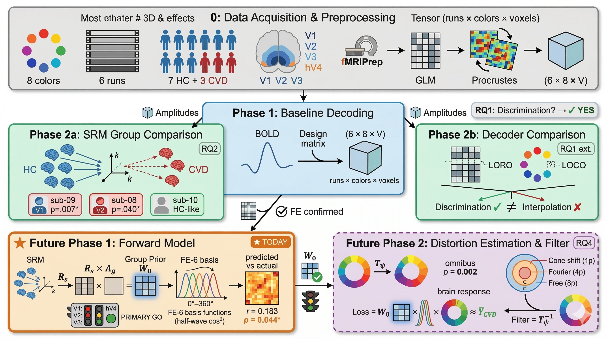

# Analysis Pipeline for fMRIPrep method3_header_mi

## Overview


Complete analysis pipeline for fMRIPrep method3_header_mi dataset covering three research questions:

- **RQ1**: Neural Color Discrimination Despite Retinal Deficits
- **RQ2**: Inter-Individual Heterogeneity in CVD
- **RQ3**: Neural-Guided Personalized Filter Design

## Dataset: method3_header_mi

### Data Paths

| Data | Path (relative to repo root) |
|------|------------------------------|
| C010 baseline amplitudes | `analysis/phase1_preprocess_decoding/results/full_dataset_C010/sub-{ID}/{ROI}/` |
| SRM-aligned amplitudes | `analysis/phase2_SRM_across_between/results/c010/combined_with_aligned/` |
| SRM validation results | `analysis/phase2_SRM_across_between/validation/1D_permutation/results_rigorous/` |
| Per-group permutation results | `analysis/phase2_SRM_across_between/validation/1D_permutation/results_pergroup/` |

**ROI disk mapping:** hV4 is stored as `V4` on disk in all data directories.

### C010 Baseline Data Structure

Per-subject per-ROI directory (`full_dataset_C010/sub-{ID}/{ROI}/`):
```
config.json                    # {subject, roi, n_voxels, pipeline, motion_tissue, wm_acompcor}
metrics.json                   # noise ceiling, RDM reliability, temporal autocorrelation
amplitudes_procrustes.npy      # (6, 8, n_voxels) — 6 runs, 8 colors, Procrustes-aligned
amplitudes_srm.npy             # (6, 8, k) — SRM-projected per-run amplitudes (k=3-4 per ROI)
srm_config.json                # SRM provenance: k, training subjects, projection method
amplitudes_raw.npy             # (6, 8, n_voxels) — raw (no Procrustes)
procrustes_disparities.npy     # per-run disparities
roi_hrf.npy                    # HRF estimates
roi_hrf_deriv.npy              # HRF derivative estimates
```

### SRM-Aligned Data Structure

Directory: `phase2_SRM_across_between/results/c010/combined_with_aligned/`
```
{ROI}_{alignment}_aligned_amplitudes.npy   # dict: {subject_id: (8, k) array}, 10 subjects
{ROI}_{alignment}_srm_results.json         # SRM metadata, disparities, RDM similarities
{ROI}_{alignment}_config.json              # dataset provenance (alignment_method, srm_k, subjects, etc.)
{ROI}_dual_comparison.json                 # raw vs procrustes comparison
```
- ROIs: V1, V2, V3, V4
- Alignments: `procrustes`, `raw`
- SRM K values: V1=4, V2=4, V3=3, hV4=3

### fMRIPrep Settings

- **Registration**: MI-based coregistration with header optimization
- **FreeSurfer**: Removed (`--fs-no-reconall`)
- **Space**: MNI152NLin2009cAsym 2mm
- **Task**: RSVP (500ms/stimulus), 8 colors x 6 runs per subject
- **See**: `analysis/prep_trials/README.md` for registration quality comparison

### Subject Groups

**Non-CVD (HC)**: sub-01, sub-02, sub-03, sub-04, sub-05, sub-06, sub-07 (7 subjects)
**CVD**: sub-08, sub-09, sub-10 (3 subjects)

## Preprocessing: C010 + Procrustes (Validated 2026-02-09)

**IMPORTANT**: Use C010 + Procrustes pipeline (NOT Baseline32). Validation shows nearly doubled performance.

Parameters validated through systematic comparison (analysis/validation/preprocess_Check/compare_with_previous.md):

```
Smoothing:          0mm
High-pass:          None (0.0 Hz)
Motion confounds:   None
CompCor:            None
1st-level drift:    None
2nd-level drift:    Per-run linear + constant (12 regressors: 6x linear + 6x constant)
Normalization:      None
Procrustes:         ESSENTIAL (align runs 1-5 to run 0)
PCA:                30 components
```

**Performance vs Baseline32**:
- RDM Reliability: 0.154-0.256 -> **0.487** (+90-216%)
- Noise Ceiling: 0.434-0.609 -> **0.613**
- Ceiling Utilization: 41.3% -> **79.4%** (+37.7 pp)

**Rationale**:
- No smoothing: Preserves voxel patterns for MVPA
- No high-pass: Redundant with 2nd-level drift regressors
- No motion/CompCor: Avoids over-correction and signal loss
- **2nd-level drift** (KEY): Captures session-wide temporal trends across 6 runs
- No normalization: Drift regressors handle baseline shifts
- **Procrustes alignment**: Essential for geometric alignment (16.4x improvement)
- PCA 30: Computational efficiency

**Critical**: 2nd-level drift regressors are the primary factor enabling 79% ceiling utilization. Do NOT use only 1st-level drift for multi-run sessions.

## Pipeline Structure

### Phase 1: Baseline Decoding (`phase1_preprocess_decoding/`)

**1A. ROI Building** (`roi_pipeline_selected_1202used.py`)
- Extract V1, V2, V3, hV4 from Wang Atlas (2015)
- Transform to subject MNI space, apply functional mask
- Threshold: 50% atlas probability

**1B. QC Visualization** (`visualize_roi_overlay.py`)
- ROI alignment check on functional data

**1C. Baseline Analysis** (`fir_reconstruction_BH2009_system_clean.py`)
- **1st-level GLM**: FIR-based HRF estimation (8 delays, 12s window, NO drift)
- Voxel selection: Top 50% by FIR R-squared
- **2nd-level GLM**: HRF + derivative + **2nd-level drift** (12 regressors: 6x linear + 6x constant)
  - **CRITICAL**: Per-run drift regressors capture session-wide temporal trends
  - Design matrix: (n_scans_total, 28) = [8 HRF + 8 deriv + 12 drift]
- **Procrustes alignment**: Align runs 1-5 to run 0 (ESSENTIAL step)
- Forward encoding (6 half-wave rectified channels, 60-degree FWHM)
- Leave-one-run-out cross-validation
- **Output**: `full_dataset_C010/sub-{ID}/{ROI}/` with amplitudes, config, metrics

### Phase 2: SRM Between-Subject Group Comparison (`phase2_SRM_across_between/`)

**Main analysis: HC-CVD group comparison in SRM shared space**

**2A. HC-Only SRM + LOO-Consistent Analysis** (`rerun_loo_consistent.py` — canonical script)
- SRM trained on 7 HC subjects only; CVD projected via SVD
- LOO-consistent disparity: HC sub-i vs mean of other 6 HC; CVD vs same LOO references
- Three bias fixes: (1) HC-only training, (2) LOO for HC, (3) same LOO refs for CVD
- Crawford & Howell (1998) individual CVD tests
- Permutation test (10,000 iter, LOO-consistent)
- **Key results**: V1 p=0.062 (g=1.16), V2 p=0.075 (g=1.04); sub-09 V1 p=0.007*, sub-08 V2 p=0.040*

**2B. LOSO Color-Dependency** (in `rerun_loo_consistent.py`)
- Leave-one-subject-out: HC tested in space they did NOT train (same treatment as CVD)
- CVD color-dependency: V2 p=0.010, V3 p=0.000, hV4 p=0.016
- HC color-agnostic: p=0.21–0.36 (not significant)
- Key finding: HC-CVD disparity asymmetry is color-specific

**2C. Robustness Triangulation** (`validation/compute_*.py`)
- A4 Crossnobis RDM: SRM-independent voxel-space validation (V1 p=0.051; convergent r=0.486**)
- A5 PCA→CCA: Alternative alignment replication (convergent r=0.742***)
- A3 Variance Explained: SRM reconstruction quality (CVD VE ≥ HC; V2 g=−1.68)
- **Output**: `validation/results/{crossnobis_rdm,pca_cca_replication,variance_explained}/`

### Phase 2 Validation (`phase2_SRM_across_between/validation/`)

| Test | Directory | Purpose | Status |
|------|-----------|---------|--------|
| 1A HC-only + LOO | `rerun_loo_consistent.py` | HC-only SRM, LOO-consistent analysis | Done |
| 1B LOSO Stability | `1B_loso_stability/` | Leave-one-subject-out SRM stability (V2 7/7) | Done |
| 1C Split-Half | `1C_split_half/` | Split-half SRM reliability (V2 both halves sig) | Done |
| 1D Permutation | `1D_permutation/` | Color label permutation (10,000 iter) | Done |
| 1D-ext Per-Group | `rerun_loo_consistent.py` | CVD color-dependency V2/V3/hV4 sig | Done |
| 1D-ext LOSO | `rerun_loo_consistent.py` | LOSO CVD color V2 p=0.010, V3 p=0.000 | Done |
| 2A Split ICC | `2A_run_split_icc/` | Intraclass correlation (8/12 moderate+) | Done |
| 2B RDM Consistency | `2B_rdm_consistency/` | CVD ≥ HC in V1/V2 ("parallel") | Done |
| 2C Optimal K | `2C_optimal_k_selection/` | Mean rank aggregation: V1=4, V2=4, V3=3, hV4=3 | Done |
| 2D Alignment Comparison | `2D_alignment_comparison/` | SRM 2.4–6.5× over raw/Procrustes | Done |
| **A3 Variance Explained** | `validation/` | LOSO VE: CVD ≥ HC, V2 g=−1.68 | **Done** |
| **A4 Crossnobis RDM** | `validation/` | SRM-independent: V1 p=0.051, convergent r=0.486** | **Done** |
| **A5 PCA-CCA** | `validation/` | Alt alignment: convergent r=0.742*** | **Done** |

**Key results (LOO-consistent, 2026-02-18):**
- Group: V1 p=0.062 (g=1.16), V2 p=0.075 (g=1.04)
- Individual: sub-09 V1 p=0.007*, sub-08 V2 p=0.040*
- LOSO CVD color-dependency: V2 p=0.010, V3 p=0.000, hV4 p=0.016
- Convergent validity: SRM ↔ crossnobis r=0.486**, SRM ↔ PCA r=0.742***

### Phase 2-alt: Procrustes CVD-HC Comparison (`phase2_procrustes_cvd_hc/`)

Earlier reference-based Procrustes approach (before SRM):
- Reference-based alignment (sub-02)
- HC super-participant template
- Quality metrics: Procrustes disparity, RDM correlation

### Phase 3: Decoder Model Comparison (`phase3_decoder_comparing/`)

**LORO + LOCO decoder validation**
- LORO: LDA+SRM optimal (0.793, ICC 0.666)
- LOCO: FE+Procrustes optimal (HC MAE 75.7°); correlation-based template matching confirmed optimal
- Pooled W adopted as base for both LOCO and LORO
- Includes LOCO_trials sub-pipeline (MDS diagnostic, Ridge stabilization, GP validation)

### Future Phases

- **Future Phase 1** (`future_phase1_forward_model/`): 360-degree hue encoder (SRQ3)
- **Future Phase 2** (`future_phase2_filter_optimization/`): CVD stimulus-space filter optimization (SRQ4)

### Archived (superseded)

- `archive/phase3_procrustes_filter/`: Voxel-space Procrustes filter (superseded by stimulus-space approach)
- `archive/future_phase1_hyperalignment/`: HC hyperalignment (superseded by SRM, Phase 2)

## Version History

**2026-02-28**: Phase 2b decoder validation complete (21/21 validations)
- LORO 3-alignment comparison: LDA+SRM optimal (0.793, ICC 0.666); Procrustes LDA reliability paradox resolved
- LOCO 3-alignment comparison: FE+Procrustes optimal (HC MAE 75.7°); FE sole interpolation model
- LOCO decoder improvement attempts: 4 alternatives all worse (correlation-based is optimal)
- Sequential/MLP architecture sweep: negative result — non-linear LOCO dead end
- Group prior (HC-mean W): CVD LOCO improvement +4–8% with leakage-free nested CV
- FE cross-decoding (HC→CVD in SRM): 10/12 pairs significant; HC→CVD ≈ HC→HC
- hV4 k confirmed as 3 (mean rank aggregation, 2026-02-18)
- Pooled W adopted as base for both LOCO and LORO; ensemble classes removed

**2026-02-18**: Robustness triangulation (A3/A4/A5) + LOO-consistent analysis
- HC-only SRM + LOO-consistent disparity: V1 p=0.062, V2 p=0.075
- Crawford & Howell individual CVD tests: sub-09 V1 p=0.007*, sub-08 V2 p=0.040*
- LOSO color-dependency: CVD V2 p=0.010, V3 p=0.000, hV4 p=0.016
- A4 Crossnobis RDM (SRM-independent): convergent r=0.486**
- A5 PCA-CCA replication: convergent r=0.742***
- A3 Variance Explained (LOSO): CVD VE ≥ HC, V2 g=−1.68
- hV4 k revised from 4→3 via mean rank aggregation

**2026-02-17**: Per-group disparity permutation test added
- Tests HC and CVD within-group consistency separately
- Supplements existing disparity_difference test (p=0.953, uninformative)
- Dataset provenance config.json added to SRM-aligned datasets

**2026-02-16**: Rigorous permutation test completed (1000 perms)
- SRM retraining per permutation (unbiased null)
- V2: HC RDM p=0.010, CVD RDM p=0.006 (significant)
- V3: CVD RDM p=0.035 (significant)

**2026-02-09**: Preprocessing validation & C010 adoption
- **VALIDATED**: C010 + Procrustes pipeline replaces Baseline32
- Performance: RDM reliability 0.487 (was 0.154-0.256), 79% ceiling utilization (was 41%)
- Key change: 2nd-level drift regressors (12 per run) + mandatory Procrustes alignment
- Evidence: analysis/validation/preprocess_Check/compare_with_previous.md

**2026-02-09**: SRM between-subject alignment
- BrainIAK SRM on HC subjects, CVD projected into shared space
- Procrustes pre-alignment validated as superior to raw
- K values optimized via mean rank aggregation: V1=4, V2=4, V3=3, hV4=3

**2026-01-22**: Dataset migration to method3_header_mi
- Updated dataset from original_v3 to method3_header_mi
- Improved registration: MI-based coregistration with header optimization

**2026-01-06**: Parallel execution implementation
- SLURM array jobs (10 subjects simultaneous)
- Runtime reduction: 83-131h -> 10-16h

## References

- **Preprocessing Validation**: `analysis/validation/preprocess_Check/compare_with_previous.md`
- **SRM Validation**: `analysis/phase2_SRM_across_between/validation/README_VALIDATION.md`
- **Registration Comparison**: `analysis/prep_trials/README.md`
- **Development Guide**: `../CLAUDE.md`

---

Last Updated: 2026-02-28
