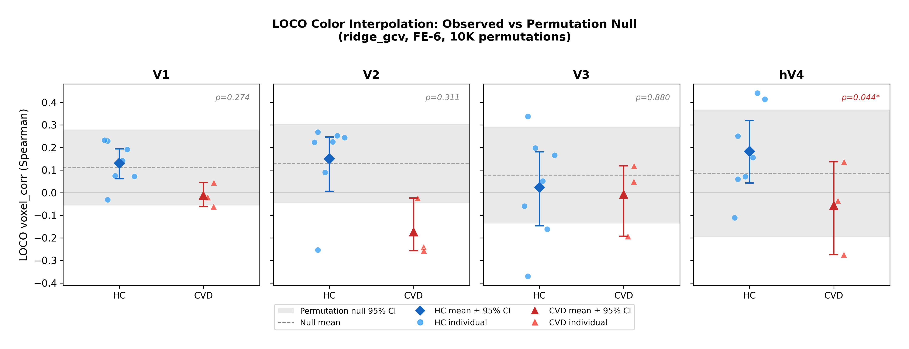
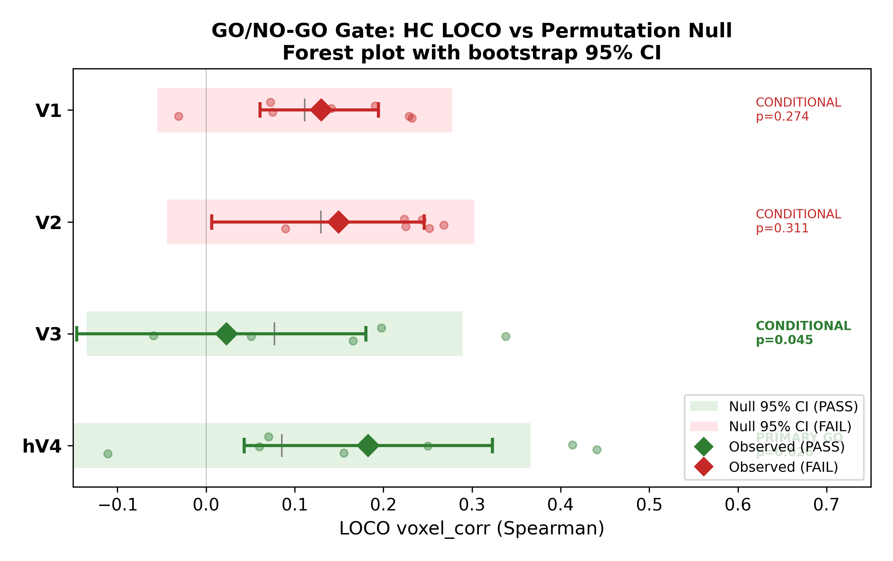
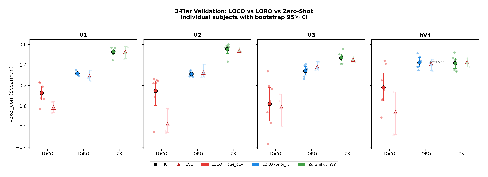
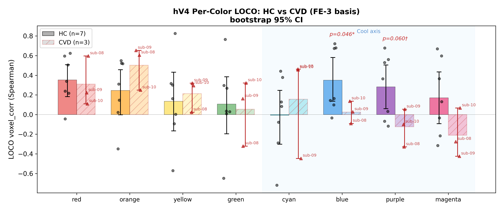

# Future Phase 1: Forward Model — PPT

> **발표 대상**: 지도교수님
> **날짜**: 2026-03-16
> **슬라이드 수**: 본편 16장 + Supplementary 6장
> **관통 서사**: hV4에서 held-out 색상 voxel 반응을 예측하는 모델(W₀) 구축 및 검증 → Phase 2 왜곡 추정(T_ψ)의 prediction engine 확보

---

## Slide 1 — Title

### Forward Model for Color Interpolation in Visual Cortex
#### HC Group Prior as Prediction Engine for CVD Distortion Estimation

**핵심 결론**

- hV4 forward model이 학습에 없던 색상의 voxel 반응 예측에 성공 (omnibus p=0.002)
- Group prior W₀가 Phase 2 T_ψ 추정의 prediction engine으로 유효 (LOSO 검증)

**연구 정보**

- HC 7명 (sub-01~07), CVD 3명 (sub-08 deutan, sub-09 protan, sub-10 deutan)
- ROI: V1, V2, V3, hV4
- 데이터: C010 dataset, Procrustes-aligned, 6 runs × 8 colors

---

## Slide 2 — Overall Pipeline

### 프로젝트 전체 구조

**연구 질문 4개, 5-Phase 파이프라인**

```
┌─────────────────────────────────────────────────────────────────────┐
│  fMRIPrep → C010 + Procrustes (2nd-level drift, PCA 30)            │
│  8 colors × 6 runs × 10 subjects (7 HC, 3 CVD)                    │
│  ROIs: V1, V2, V3, hV4 (Wang Atlas)                               │
└──────────────────────────────┬──────────────────────────────────────┘
                               │
                               ▼
┌──────────────────────────────────────────────────────────────────────┐
│  Phase 1: Baseline Decoding                                         │
│  ─────────────────────────────                                      │
│  FIR HRF → voxel selection → 2nd-level GLM → Procrustes alignment  │
│  Output: amplitudes_procrustes.npy (6, 8, n_voxels) per subject    │
│                                                                      │
│  RQ1: CVD도 색을 구별하는가? → YES (noise ceiling HC ≈ CVD)         │
└──────────────────────────────┬───────────────────────────────────────┘
                               │
              ┌────────────────┴────────────────┐
              ▼                                 ▼
┌─────────────────────────────┐  ┌──────────────────────────────────┐
│  Phase 2a: SRM              │  │  Phase 2b: Decoder Comparison    │
│  ────────────────           │  │  ─────────────────────           │
│  HC-only SRM → CVD 투사     │  │  LORO: LDA+SRM 최적 (0.793)     │
│  LOO-consistent disparity   │  │  LOCO: FE+Procrustes 최적        │
│  Crawford & Howell (N=1)    │  │  - Correlation template matching │
│                             │  │  - Pooled W = base for both      │
│  RQ2: CVD 개인차는?         │  │  - 4 alternatives all worse      │
│  → sub-09 V1 p=0.007*      │  │                                  │
│  → sub-08 V2 p=0.040*      │  │  RQ1 확장: 구별 vs 보간 해리     │
│  → sub-10 HC-like           │  │  → LORO 보존, LOCO 결손          │
└─────────────┬───────────────┘  └────────────────┬─────────────────┘
              │                                    │
              └────────────────┬───────────────────┘
                               │
                               ▼
┌──────────────────────────────────────────────────────────────────────┐
│  ★ Future Phase 1: Forward Model  ← 오늘 발표                      │
│  ──────────────────────────────────                                  │
│  SRM → Group Prior(A_g) → W₀ = R_s @ A_g → ridge_gcv fine-tune     │
│  FE-6 basis (half-wave cos²)                                        │
│                                                                      │
│  ● LOCO 검증: hV4 perm p=0.044 (PRIMARY GO) | omnibus p=0.002     │
│  ● LOSO 검증: hV4 ZS ≈ LORO (p=0.913) → W₀ = 유효 prediction engine│
│  ● HC-CVD gap: V1 d=1.61, V2 d=1.85 (2차 목적, 탐색적)            │
│                                                                      │
│  RQ3: Held-out 색 voxel 반응을 예측할 수 있는가? → hV4에서 YES     │
└──────────────────────────────┬───────────────────────────────────────┘
                               │
                               ▼
┌──────────────────────────────────────────────────────────────────────┐
│  Future Phase 2: Distortion Estimation & Filter                     │
│  ──────────────────────────────────────────                         │
│  L(ψ) = Σ || W₀ @ C(T_ψ(θ)) − Ȳ_CVD(θ) ||²                      │
│       ↑ Phase 1 산출물              ↑ 실측 데이터                   │
│                                                                      │
│  중첩 모델: Cone shift(1p) ⊂ Fourier(4p) ⊂ Free(8p)               │
│  Filter = T_ψ⁻¹                                                     │
│                                                                      │
│  RQ4: 왜곡이 저차원 stimulus warp으로 설명되는가?                   │
└──────────────────────────────────────────────────────────────────────┘
```

**Phase 간 데이터 흐름**

| Phase | 입력 | 산출물 | 다음 Phase로 넘기는 것 |
|:-----:|------|--------|----------------------|
| 1 | fMRIPrep BOLD | amplitudes (6,8,V) | Procrustes-aligned voxel patterns |
| 2a | Phase 1 amplitudes | SRM shared space | K values, R matrices, disparity profiles |
| 2b | Phase 1 amplitudes | Decoder comparison | LOCO=FE 최적, Pooled W, 보간 해리 확인 |
| **F1** | **Phase 1+2a** | **W₀ (group prior)** | **Prediction engine + hV4 GO gate** |
| F2 | F1의 W₀ + CVD data | T_ψ (distortion) | Filter = T_ψ⁻¹ |

**오늘 발표 범위**: ★ Future Phase 1 (Forward Model)

---

## Slide 3 — 왜 W₀가 필요한가

### Phase 2 Loss Function이 요구하는 것

```
L(ψ) = Σᵢ || W₀ @ C(T_ψ(θᵢ)) − Ȳ_CVD(θᵢ) ||²
         ↑ HC prediction engine    ↑ CVD 실측 데이터
```

**의미**: HC 뇌가 T_ψ(θ)를 보면, CVD 뇌가 θ를 볼 때 실제 보인 반응과 같아지는 T_ψ를 찾는다.

**이 수식이 작동하려면**:
- W₀가 **학습에 없던 색상에도** 정확해야 함 → LOCO 검증 필요
- W₀가 **새로운 피험자에도** 전이 가능해야 함 → LOSO 검증 필요

**목적 위계**:

| 순위 | 목적 | Phase 2 연결 |
|:----:|------|-------------|
| 1차 | W₀ 구축 및 검증 | Loss 좌변 (prediction engine) |
| 2차 | HC-CVD 비교 (탐색적) | T_ψ 모델의 물리적 근거 |

---

## Slide 4 — Algorithm (Steps A–D)

### Group-Prior Prediction Model

**Step A: HC 공통공간 적합 (SRM)**

```
Y_i ∈ R^{V_i × N}  →  R_i, Z_i = R_i^T @ Y_i ∈ R^{k × N}
```
k 값: V1=4, V2=4, V3=3, hV4=3

**Step B: Group Prior 학습**

```
A_i = argmin ||Z_i − A @ C||² + λ_A||A||²    (per HC subject)
A_g = (1/M) Σᵢ A_i                            (group mean)
```

**Step C: Target Subject 투사**

```
W₀ = R_s @ A_g
```

**Step D: Fine-Tuning (Closed-Form)**

```
W_s = (Y @ C' + λW₀)(CC' + λI)⁻¹
```

**Encoding Basis: FE-6** — Half-wave rectified cos², 6 channels uniformly spaced at 60° intervals. Peaked tuning curves that capture neural selectivity better than Fourier harmonics (FE-6 vs LF-4: LOCO p=0.016~0.045, LORO p<0.001).

---

## Slide 5 — Validation 구조

### 3-Tier Cross-Validation

| Tier | 방법 | 질문 | Phase 2 연결 |
|:----:|------|------|-------------|
| **LOCO** | 7색 학습 → 1색 예측 | W₀가 본 적 없는 색 예측 가능? | **Loss 좌변 정확도 직접 검증** |
| LORO | 5 runs 학습 → 1 run 평가 | W₀가 새 run에 일반화? | 모델 안정성 |
| LOSO | 6 HC로 SRM → 1 HC 평가 | W₀가 새 subject에 전이? | Group prior 신뢰도 |

**검증 기준**:
- ✗ t-test (H₀: μ=0) — voxel covariance가 non-zero baseline 생성 → **wrong null**
- ✓ **Permutation test (10K color-label shuffle)** — 유일한 진정한 검증

**Metric**: Spearman correlation between predicted and actual voxel patterns (scale-invariant, pattern similarity).

---

## Slide 6 — LOCO: hV4 = Primary GO

### Permutation Test 결과 (10K, HC ridge_gcv, FE-6)

| ROI | HC Observed [95% CI] | Null Mean [95% CI] | **p_perm** |
|-----|:--------------------:|:------------------:|:----------:|
| V1 | +0.130 [+0.061, +0.191] | +0.111 [−0.055, +0.278] | 0.274 |
| V2 | +0.150 [+0.006, +0.247] | +0.129 [−0.044, +0.303] | 0.311 |
| V3 | +0.023 [−0.146, +0.177] | +0.077 [−0.135, +0.289] | 0.880 |
| **hV4** | **+0.183 [+0.042, +0.318]** | **+0.085 [−0.195, +0.366]** | **0.044*** |

> CI = bootstrap 95% CI (10K resamples). Null CI = permutation null의 평균±1.96SD.



**핵심**:
- V1/V2 null이 ~0.10–0.13 (zero가 아님) — voxel covariance 구조가 baseline 생성
- V1/V2의 HC observed CI가 null CI 내에 완전히 포함 → **FAIL**
- **hV4만 observed mean이 null 분포 상위 꼬리** → 진정한 색 신호 기반 보간
- → Phase 2 loss 좌변(W₀ prediction)이 hV4에서 성립

---

## Slide 7 — GO/NO-GO Gate + Omnibus

### Gate 판정

| ROI | C1 Reliability | C2 NC-Norm | C3 t-test | C3b Perm | **Overall** |
|-----|:--------------:|:----------:|:---------:|:--------:|:-----------:|
| V1 | PASS (0.416) | PASS (0.227) | PASS (p=0.006) | FAIL (0.274) | CONDITIONAL |
| V2 | PASS (0.420) | PASS (0.268) | PASS (p=0.040) | FAIL (0.311) | CONDITIONAL |
| V3 | PASS (0.398) | FAIL (0.061) | FAIL (0.404) | FAIL (0.880) | NO-GO |
| **hV4** | **PASS (0.603)** | **PASS (0.316)** | **PASS (0.026)** | **PASS (0.044)** | **PRIMARY GO** |

**Per-ROI 최적 Basis로 강화**:
- V3: FE-8로 NO-GO → **PASS (p=0.045)**
- hV4: FE-3으로 **p=0.026** (강화)
- V1/V2: FE-{2..12} + OPP-2/4/4rect 전부 **FAIL**

### 다중비교 해결: Stouffer Omnibus

| 검정 | 통계량 | p |
|------|:------:|:----:|
| **Stouffer** | **Z = 2.869** | **0.0021** |
| Fisher | χ²(8) = 21.18 | 0.0067 |

→ **피질 수준 색상 보간 존재** (단일 ROI p에 의존하지 않음)



---

## Slide 8 — hV4가 특별한 이유: 보간 품질 증거

### 4가지 독립 증거가 hV4를 지목

| 증거 | V1 | V2 | hV4 | 의미 |
|------|:---:|:---:|:---:|------|
| **Permutation** | FAIL | FAIL | **p=0.044*** | 색 신호 기반 보간 |
| **Friedman 균일성** | 비균일 (p=0.011) | 비균일 (p=0.047) | **균일 (p=0.485)** | 전 색상에 걸쳐 고른 보간 |
| **Residual r(resid,orig)** | 0.453 | 0.454 | **0.053** | 가용 구조 대부분 포착 |
| **NC-Normalized fit** | 0.227 | 0.268 | **0.316** | Noise ceiling 대비 최고 |

**V1/V2 FAIL은 basis 문제가 아님**:
- Opponent basis (OPP-2/4/4rect) 전부 V1/V2 FAIL
- Intercept model: Standard ≈ Intercept ≈ Mean_subt (p-value 동일)
- → V1/V2 LOCO 실패는 8-stimulus 조건에서의 **구조적 한계**

**결론**: W₀가 색 공간 전체를 매끈하게 보간하는 것은 **hV4에서만** 가능

---

## Slide 9 — LOSO: Group Prior = Prediction Engine

### HC 3-Tier 비교 (voxel_corr, bootstrap 95% CI)

| ROI | ZS [95% CI] | LORO [95% CI] | LOCO [95% CI] | p(ZS−LORO) |
|-----|:-----------:|:-------------:|:-------------:|:----------:|
| V1 | 0.529 [0.498, 0.554] | 0.319 [0.305, 0.334] | +0.130 [+0.061, +0.191] | **0.0004** |
| V2 | 0.555 [0.511, 0.584] | 0.313 [0.294, 0.334] | +0.150 [+0.006, +0.247] | **0.0001** |
| V3 | 0.472 [0.438, 0.508] | 0.344 [0.300, 0.386] | +0.023 [−0.146, +0.177] | **0.0022** |
| **hV4** | **0.417 [0.368, 0.468]** | **0.425 [0.380, 0.475]** | **+0.183 [+0.042, +0.318]** | **0.913** |

> ZS = zero-shot (W₀ 직접), LORO = prior_finetune, LOCO = ridge_gcv. CI = bootstrap 95%.



**핵심 발견**:

1. **hV4만 ZS ≈ LORO** (p=0.913) — CI 완전 중첩
   - W₀ 단독으로 subject-specific ridge_gcv와 동등한 패턴 재현
   - → **Phase 2 loss 좌변에 W₀를 쓸 수 있는 직접적 근거**

2. **V1/V2/V3: ZS >> LORO** (p<0.003) — CI 분리
   - ZS = 6-run 평균 비교 vs LORO = single run → noise 차이
   - hV4만의 특성 (ZS≈LORO = group prior가 voxel-level까지 안정적)

3. **LOCO 항상 최저** — CI 하한이 0 근처 또는 이하
   - 보간 격차 = ZS − LOCO = 0.417 − 0.183 = **0.234**
   - → Phase 2 T_ψ가 줄여야 할 목표

**Leakage-free**: 매 fold마다 SRM refit (R_i 재사용 없음)

---

## Slide 10 — LOSO 문헌 벤치마크

### 유일한 선행 벤치마크: Bannert & Bartels (2025)

SRM 기반 피험자 간 색상 디코딩 (N=15, 3색, 6 runs). **SRM을 무채색 retinotopic mapping data로 학습** (색상 데이터 미사용).

**설계 비교:**

| | **본 연구** | **Bannert & Bartels (2025)** |
|---|---|---|
| 피험자 | 10 (HC 7 + CVD 3) | 15 (HC only) |
| 색 수 / Chance | 8 / 12.5% | 3 / 33.3% |
| Runs | 6 | 6 |
| SRM 학습 | **색상 (hue RSVP)** | 무채색 (retinotopy) |
| 메트릭 | Voxel pattern corr | Classification acc |

**Bannert 2025 LOSO 결과 (FWE-corrected, 2000 perm):**

| ROI | LOSO acc | Within acc | **LOSO/within** |
|-----|:--------:|:----------:|:---------------:|
| V1 | 44.7% (z=13.7) | 57.0% | 78.4% |
| V2 | 39.8% (z=7.75) | 55.4% | 71.8% |
| V3 | 39.6% (z=7.57) | 52.8% | 74.8% |
| hV4 | 39.5% (z=7.42) | 51.2% | **77.1%** |

> Chance = 33.3%. 전 ROI에서 유의하지만, LOSO/within 비율은 71-78% (완전 전이 아님).

### Group Prior 효율 비교

| ROI | 본 연구 ZS/LORO | Bannert LOSO/within | 해석 |
|-----|:-----------:|:-------------------:|------|
| V1 | 166%* | 78.4% | *SNR 차이로 인한 과대 추정 |
| V2 | 177%* | 71.8% | *동일 |
| V3 | 137%* | 74.8% | *동일 |
| **hV4** | **99.5%** | **77.1%** | **색상 SRM → 개인 수준 완전 도달** |

> *V1-V3 >100%: ZS는 6-run 평균 템플릿(고 SNR) 대비, LORO는 single run(저 SNR) 대비 평가 → 비율 과대. **hV4의 99.5%만이 의미 있는 비교점.**

### 수렴점 & 본 연구 고유 기여

| | Bannert 2025 | 본 연구 |
|---|:---:|:---:|
| SRM LOSO 작동 확인 | O | O |
| hV4 group prior ≈ 개인 | 77.1% | **99.5%** |
| CVD에서도 LOSO 보존 | — | **O (전 p>0.4)** |
| LOCO 보간 평가 | — | **O (hV4 p=0.044)** |
| 3-tier (LOCO+LORO+LOSO) | — | **O** |

**핵심 메시지**:
- 색상 데이터로 SRM 학습 시 group prior 충실도 향상 (99.5% vs 77.1%)
- CVD 망막 결함은 spatial pattern 전이에 영향 없음 → **LOCO만이 해리 도구**
- **어떤 선행연구도 3-tier 평가 + CVD 적용 조합을 수행하지 않음**

---

## Slide 11 — LORO-LOCO 해리의 의미

### 같은 모델이 run 일반화는 성공, 색 보간은 선택적 실패

> Bannert 2025와의 차별점: Bannert은 within-subject(LORO) vs between-subject(LOSO)만 비교. 본 연구는 여기에 **LOCO(보간)**를 추가 → CVD에서만 나타나는 해리를 포착.

| | LORO (run 일반화) | LOCO (색 보간) |
|---|:-:|:-:|
| **최적 모델** | prior_ft | ridge_gcv |
| **HC-CVD 차이** | 없음 (d<0.72) | 있음 (V1 d=1.61, V2 d=1.85) |
| **해석** | 색 표현 자체는 보존 | 색 간 연속 구조만 왜곡 |

**LORO 결과 (prior_finetune, voxel_corr, bootstrap 95% CI)**:

| ROI | HC [95% CI] | CVD [95% CI] | p |
|-----|:----------:|:----------:|:---:|
| V1 | 0.319 [0.305, 0.334] | 0.292 [0.246, 0.350] | >0.22 |
| V2 | 0.313 [0.294, 0.334] | 0.327 [0.284, 0.407] | >0.22 |
| V3 | 0.344 [0.300, 0.386] | 0.381 [0.352, 0.436] | >0.22 |
| hV4 | 0.425 [0.380, 0.475] | 0.409 [0.346, 0.459] | >0.22 |

> HC/CVD CI가 전 ROI에서 완전 중첩 → 색 표현 자체는 보존

**Phase 2 시사점**:
- W₀ → run-level 패턴 안정적 예측 → loss 좌변의 noise 낮음
- LOCO 한계(보간 격차 0.185) = **T_ψ가 채울 공간**
- 단, LOCO ≠ Filter: LOCO는 7색→W 재추정(df 부족), Filter는 8색+W₀ 고정+4 param만 최적화

---

## Slide 12 — [2차 목적] CVD 왜곡 패턴

### Stimulus-Level 왜곡의 증거 (탐색적, CVD N=3)

**HC-CVD LOCO Gap (ridge_gcv, bootstrap 95% CI)**:

| ROI | HC [95% CI] | CVD [95% CI] | Cohen's d | p (Welch) |
|-----|:----------:|:----------:|:---------:|:---------:|
| V1 | +0.130 [+0.061, +0.191] | −0.012 [−0.062, +0.045] | +1.61 | **0.021** |
| V2 | +0.150 [+0.006, +0.247] | −0.174 [−0.257, −0.024] | +1.85 | **0.022** |
| V3 | +0.023 [−0.146, +0.177] | −0.008 [−0.193, +0.118] | +0.14 | 0.819 |
| hV4 | +0.183 [+0.042, +0.318] | −0.058 [−0.275, +0.137] | +1.19 | 0.169 |

> V1/V2: HC CI 하한 > CVD CI 상한 → CI 분리 (d>1.6). hV4: CI 겹침 있으나 d=1.19.

**Per-color 왜곡 (hV4 FE-3, bootstrap 95% CI)**: Cool-axis 집중

| 색상 | HC [95% CI] | CVD [95% CI] | d | p |
|------|:----------:|:----------:|:---:|:---:|
| **blue** | **+0.349 [+0.138, +0.553]** | **+0.025 [−0.090, +0.137]** | **+1.37** | **0.046*** |
| **purple** | **+0.283 [+0.056, +0.502]** | **−0.124 [−0.328, +0.055]** | **+1.54** | **0.060†** |
| magenta | +0.171 [−0.090, +0.440] | −0.211 [−0.424, +0.067] | +1.19 | 0.127 |
| warm 4색 | CI 중첩 | CI 중첩 | 전부 \|d\|<1 | 전 p>0.2 |



**Cross-phase 수렴**: SRM V2 blue-purple p=0.042 (유일 유의 쌍) ↔ FE hV4 blue p=0.046 (유일 유의 색) → **두 독립 파이프라인이 같은 색 영역 지목**

---

## Slide 13 — [2차 목적] 피질 재조직이 아닌 이유 + Red Team

### Stimulus-Space 왜곡의 삼각측량

| 증거 | HC | CVD | p | 의미 |
|------|:---:|:---:|:---:|------|
| Eigenspectrum α | 0.68–0.98 | 0.66–0.87 | 전 >0.14 | 같은 decay 구조 |
| MEME k* | 33–340 | 37–354 | 전 >0.17 | 같은 차원 |
| Voxel preference | — | green↓ magenta↑ | V1/V2 p<0.02 | 같은 voxel, 다른 argmax |

→ **같은 용기(cortex), 같은 용량(dimensionality), 다른 내용물(stimulus mapping)**
→ T_ψ (stimulus-space warp) 모델의 물리적 근거

### Red Team 총괄 (5항목)

| # | 취약점 | 치명도 | 중화 상태 |
|---|-------|:------:|:---------:|
| 1 | 의사복제 (동일 48 samples) | FATAL | **해결** — 언어 교정 |
| 2 | 다중비교 (hV4 p=0.044) | FATAL | **해결** — Omnibus p=0.002 |
| 3 | K-selection bias | SEVERE | **해결** — artifact 확인, 서술 폐기 |
| 4 | V1/V2 반증 불가 | MOD | **해결** — 반증 기준 명시 |
| 5 | S-축 사후적 | MOD | **부분 완화** — 가설 생성으로 유지 |

---

## Slide 14 — Phase 2로의 핸드오프: 확정 사양

### Phase 1에서 검증된 입력

| 항목 | 확정 값 | 검증 근거 | 기각된 대안 |
|------|---------|---------|-----------|
| Prediction engine | **W₀ (HC group prior)** | LOSO: ZS≈LORO, p=0.913 | W_CVD (불안정 위험) |
| Primary ROI | **hV4** | 유일한 LOCO GO (p=0.044) | V1/V2 (discrimination-only) |
| Encoder | **ridge_gcv** | Permutation 유일 통과 | smooth_tikh 외 6종 기각 |
| Basis | **FE-6** (half-wave cos²) | FE vs LF: p<0.05 | LF-4/6, OPP-2/4/4rect |
| CVD 메커니즘 | **Cone shift → stimulus 왜곡** | Eigenspectrum HC≈CVD | 피질 재조직, 차원 축소 |

### ROI 위계 (명시적 선언)

| ROI | 역할 | 근거 |
|-----|------|------|
| **hV4** | Primary — T_ψ 최적화 대상 | 유일한 LOCO GO, NC 최고, LOSO 검증 |
| V2 | Secondary — 독립 검증 | SRM pair distortion 최강, blue-purple 수렴 |
| V1 | Exploratory — sub-09 only | Protan 특이 서명, 파이프라인 공통 ROI 부적합 |

---

## Slide 15 — Phase 2: 중첩 모델 비교 설계

### 과학적 질문

> "CVD 신경 왜곡이 저차원 stimulus warp으로 설명되는가?"

### 중첩 모델 구조

```
Model 0: T(θ) = θ + δ_cone(θ; Δλ)       [1 param]   Cone shift only
   ⊂
Model A: T(θ) = θ + Σ_k(aₖsinθ + bₖcosθ) [4 params]  Fourier warp (T_ψ)
   ⊂
Model B: T(θᵢ) = θᵢ + δᵢ                [8 params]  Per-color free shift
```

### 공통 Loss

```
L = Σᵢ || W₀ @ C(T(θᵢ)) − Ȳ_CVD(θᵢ) ||²
     ↑ HC prior (LOSO 검증)   ↑ CVD 실측 (6-run 평균)
```

**W_CVD 의존성 없음** — sub-09 불안정 문제 근본 해결

### 비교 결과의 해석

| 결과 | 의미 | 시사점 |
|------|------|--------|
| 0 ≈ A ≈ B | Cone shift가 전부 설명 | 순수 망막 기원 |
| 0 < A ≈ B | 매끈한 추가 왜곡 존재 | 피질 기여 |
| A < B | 비매끈 왜곡 | T_ψ 불충분, per-color 보정 필요 |

**T_ψ는 "정답"이 아닌 "가장 검소한 경쟁 모델"**

**Filter 도출**: T_ψ 추정이 완료되면, 교정 필터 = T_ψ⁻¹ (직접 최적화가 아닌 파생물)

---

## Slide 16 — Validation 설계 + 피험자별 역할

### Validation 3단계

| 단계 | 내용 | 성격 |
|:----:|------|:----:|
| ① | hV4 LOCO 교차검증: 7색→T_ψ 추정→1색 예측 개선? | **Primary** |
| ② | V2 SRM pair rescue: 최적화에 안 쓴 ROI에서 효과? | **Independent** |
| ③ | Permutation (1K shuffle): 우연 대비 유의성 | **Statistical** |

### 피험자별 역할

| 피험자 | 유형 | 역할 | 기대 |
|--------|------|------|------|
| **sub-08** | Deutan | **Primary PoC** | T_ψ 효과 최대 (K*=8, cool deficit 최강) |
| **sub-09** | Protan | **Stress test** | 실패 가능 → "protan은 다른 전략" = 결과 |
| **sub-10** | Deutan (보상) | **Negative control** | T_ψ ≈ 0 기대 → 파이프라인 자체 검증 |

### LOCO ≠ Filter

| | LOCO | Phase 2 Filter |
|---|------|----------------|
| 학습 데이터 | 7색 | **8색** |
| 자유 파라미터 | K×V_s (수백~수천) | **4 Fourier** |
| W 역할 | 매 fold **재추정** | **고정** (LOSO 검증된 W₀) |

→ LOCO 보간 격차(0.185)는 Phase 2 filter의 개선 **여지**이지 **한계**가 아님

---
---

# Supplementary Slides

---

## Supp 1 — 모델 비교 상세

### 11 Models Tested → ridge_gcv 확정

| Model | LOCO hV4 | 판정 | 근본 원인 |
|-------|:--------:|:----:|----------|
| **ridge_gcv** | **+0.183** | **확정** | Permutation 유일 통과 |
| ols | +0.158 | baseline | 불안정 |
| prior_ft | +0.169 | LORO 승자 | LOCO에서는 prior가 방해 |
| prior_only | +0.109 | — | 보간 실패 |
| smooth_tikh | +0.157 | **기각** | 공간 공분산만 포착, perm 전 ROI FAIL |
| mixed_ridge_prior | +0.094 | **기각** | V1-V3 음 |
| bayes_prior | +0.028 | **기각** | V1-V3 음 |
| smooth_prior | +0.094 | **기각** | Prior가 smoothness 상쇄 |
| ridge_rrr | — | **기각** | SVD 절단 → 신호 손실 |
| ridge_smooth_best | — | **기각** | rdm_pearson ↓ 37-65% |

**smooth_tikh 기각 과정**: 3회 rescue 시도 모두 실패
1. Condition-centering → shuffle과 교환 → 무효
2. β 재최적화 → null에서도 높음 → 무효
3. rdm_pearson "개선" → 이상 구조와 반상관(ρ≈−0.5) → noise 매칭

### Basis 선택: FE-6 vs LF

| Basis | LOCO V1 | LOCO hV4 | LORO hV4 |
|-------|:-------:|:--------:|:--------:|
| **FE-6** | **+0.011** | **+0.090** | **0.401** |
| LF-4 | −0.066 | −0.075 | 0.347 |
| LF-6 | −0.111 | −0.093 | 0.341 |

FE-6 vs LF-4 (paired t, n=10): LOCO hV4 p=0.016, LORO 전 ROI p<0.001

---

## Supp 2 — Eigenspectrum & MEME 상세

### Eigenspectrum Decay (Pospisil & Pillow 2024 범위 내)

| ROI | HC α_early | CVD α_early | p | HC α_late | CVD α_late | p |
|-----|:---------:|:-----------:|:---:|:--------:|:----------:|:---:|
| V1 | 0.683±0.074 | 0.658±0.044 | 0.539 | 0.376±0.078 | 0.440±0.055 | 0.192 |
| V2 | 0.734±0.079 | 0.690±0.048 | 0.340 | 0.472±0.068 | 0.493±0.049 | 0.589 |
| V3 | 0.892±0.231 | 0.886±0.171 | 0.971 | 0.769±0.252 | 0.775±0.193 | 0.969 |
| hV4 | 0.979±0.302 | 0.867±0.215 | 0.534 | 0.830±0.312 | 0.688±0.223 | 0.453 |

**전 파라미터 HC ≈ CVD** (전 p > 0.14)

### MEME Dimensionality

| ROI | HC k* | CVD k* | p | SRM k | Δ |
|-----|:-----:|:------:|:---:|:-----:|:---:|
| V1 | 340±119 | 354±75 | 0.833 | 4 | +336 |
| V2 | 232±64 | 244±39 | 0.719 | 4 | +228 |
| V3 | 53±10 | 59±0 | 0.178 | 3 | +50 |
| hV4 | 33±10 | 37±0 | 0.304 | 3 | +30 |

k* >> SRM k (100×): γ >> 1 regime → SRM k=3-4가 더 유의미한 "색 신호" 차원 추정

---

## Supp 3 — Residual Biology 상세 (Track A)

### A3: Signed Circular Bias (hV4, mean °)

| Subject | blue bias | Crawford-Howell |
|---------|:---------:|:---------------:|
| HC mean | −16.1° | — |
| **sub-08 (D)** | **−136.7°** | **p<0.05** |
| **sub-09 (P)** | **+84.3°** | **p<0.05** |
| sub-10 (D) | −61.5° | n.s. (magenta −107.0° p<0.05) |

sub-08 blue→yellow (CW), sub-09 blue→magenta (CCW) — **반대 방향**, deutan/protan 차이와 일치

### A5: LOCO Confusion Structure (hV4 accuracy)

| | HC | sub-08 (D) | sub-09 (P) | sub-10 (D) |
|---|:---:|:---:|:---:|:---:|
| 전체 | 0.281 | 0.021 | 0.083 | 0.083 |
| Cool만 | 0.319 | **0.000** | **0.000** | 0.125 |

비대칭 혼동: red→green ≈ 0 (전 CVD), green→red 강함 (deutan: sub-08 V2 1.00, sub-10 V2 0.83) → M-cone 손실

---

## Supp 4 — Per-Subject K*

### hV4 결과

| 피험자 | 그룹 | K* | K* LOCO | 그룹K(=3) LOCO | Δ |
|--------|:----:|:---:|:------:|:-------------:|:----:|
| sub-01 | HC | 10 | 0.110 | 0.037 | +0.073 |
| sub-02 | HC | 3 | 0.514 | 0.514 | 0.000 |
| sub-03 | HC | 6 | 0.441 | 0.360 | +0.081 |
| sub-04 | HC | 2 | 0.285 | 0.255 | +0.031 |
| sub-05 | HC | 6 | 0.060 | 0.025 | +0.035 |
| sub-06 | HC | 4 | 0.357 | 0.301 | +0.055 |
| sub-07 | HC | 8 | 0.139 | −0.059 | +0.198 |
| **sub-08** | **CVD** | **8** | **0.541** | **0.084** | **+0.457** |
| sub-09 | CVD | 3 | 0.071 | 0.071 | 0.000 |
| sub-10 | CVD | 2 | 0.270 | 0.192 | +0.078 |

sub-08: K=3→K=8 → LOCO **6.4× 상승**. 단, K*=8 with 8 colors ≈ lookup table → cone shift 보조 증거로만 해석

---

## Supp 5 — Nested LOCO / 적응형 기저

### Center 최적화: 무효

| ROI | K | HC FE-6 | HC FE-K | HC Nested | p(FE-K vs Nested) |
|-----|:-:|:-------:|:-------:|:---------:|:-----------------:|
| V1 | 2 | +0.130 | +0.153 | +0.175 | >0.37 |
| V2 | 3 | +0.150 | +0.180 | +0.174 | >0.37 |
| V3 | 8 | +0.023 | +0.112 | +0.110 | >0.37 |
| hV4 | 3 | +0.183 | +0.205 | +0.164 | >0.37 |

**Nested ≈ FE-K** → center 최적화 = 무효. **K(채널 수)만이 유일한 유효 파라미터.**

### B2/B3 기각 요약

| 모델 | hV4 HC 영향 | 판정 |
|------|:----------:|:----:|
| B2: Anisotropic | **−0.081 (p=0.010, d=−1.4)** | 기각 — HC 유의하게 악화 |
| B3: Hierarchical | +0.000 (p=0.932) | 기각 — CVD 효과 무시 |

---

## Supp 6 — Stouffer vs Fisher 방법 선택

### 감지하는 신호 유형이 다름

| 특성 | Fisher | Stouffer |
|------|--------|----------|
| 변환 | p → −log(p) | p → Z |
| 민감도 | **극단적 p 하나**가 지배 | **일관된 약한 p**를 포착 |
| 적합 상황 | Single hotspot (GWAS) | Distributed pattern (neuroscience) |

### 우리 데이터

| ROI | p | −ln(p) (Fisher) | Z (Stouffer) |
|-----|:---:|:---:|:---:|
| V1 | 0.170 | 1.77 | 0.95 |
| V2 | 0.125 | 2.08 | 1.15 |
| V3 | 0.045 | 3.10 | 1.69 |
| hV4 | 0.026 | 3.65 | 1.94 |

극단적 p 없음 (전부 >0.01), 대신 V1→V2→V3→hV4 **단조 감소 gradient**.
→ Stouffer (p=0.002) > Fisher (p=0.007) — 분산 패턴 포착에 적합
→ **두 검정 모두 통과** → omnibus 주장 강화

Friedman 균일성(hV4만 통과)과 residual 분석(hV4만 근무작위)이 hV4 주도 신호의 독립적 보강 증거.
