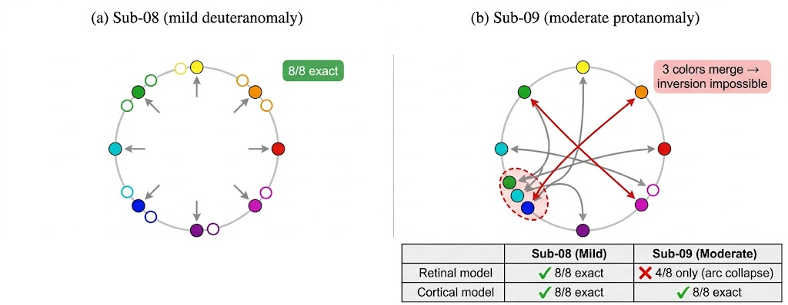

# Simulation Models, Recoverability, and Behavioral Validation of Pre-Image Filters

**Scope**: Phase-2 synthesis covering (i) three candidate CVD simulation-model classes, (ii) their pre-image recoverability dissociation, and (iii) sub-08's qualitative behavioral report comparing R+C vs 2-component. Behavioral sections are intentionally text-only — the filter renderings that were shown to sub-08 are the stimuli *of* the behavioral test and are therefore excluded from the summary.

**Companion document**: `behav_validation.md` holds the full qualitative tables. This document is the consolidated narrative + literature framing.

---

## 0. Abstract

Three simulation models are compared as CVD pre-image generators: Machado 2009 (1-parameter retinal cone shift), R+C (Machado + 1-parameter cortical opponent gain), and a 2-component cortical angular-dilation model. The three models **converge on detection** of CVD-specific neural distortion but **diverge on prescribed correction**. Machado 1-way is non-invertible for sub-09 protan — the forward opponent arc compresses 360° to ~96° at Δλ=13.5 nm, causing three colors (c4/c5/c6) to collapse onto a single perceived θ, so exact pre-images exist for only 4/8 target hues. R+C is algebraically invertible for sub-08 (mild deuteranomaly) but perceptually insufficient: its single-knob RG axis produces YG-C 4-way collapse. The 2-component model achieves **universal bijectivity** (8/8 exact pre-images for both sub-08 and sub-09) AND perceptually preserves the yellow-green→cyan arc on sub-08's qualitative report. The inferred cortical S-cone-axis rotation β_s (20° sub-08 / 23° sub-09, mean 21.5°) closely matches Emery et al. 2021's independent behavioral estimate of 21.4°. Phase-2 adopts 2-component. Residual color-local failures (sub-08 c2 orange, c8 magenta) are identified as refinement targets, not model-class failures.

---

## 1. Simulation Models

### 1.1 Machado 2009 (baseline, retinal-only)

Formula — pre-receptoral cone-fundamental shift:

```
θ' = machado_shifted_hue(Δλ, family)
```

- Free parameters: `Δλ ∈ [0, 20]` nm (L- or M-cone spectral shift; family = protan shifts L-cone, deutan shifts M-cone).
- Biophysical meaning: dichromatic pre-receptoral transfer absent post-receptoral compensation.
- DOF: 1.

Source: dispatched via `scripts/loco_distortion_fit.py:get_shifted_design` (lines ~134–177).

### 1.2 R+C (retinal + cortical opponent)

Formula — Machado retinal shift plus linear gain on the opponent RG axis:

```
rg' = rg_base + (1 + g) · (rg_ret − rg_base)
yb' = yb_ret                (YB unchanged)
θ'  = atan2(yb', rg')
```

- Free parameters: `(Δλ, g)`, `g ∈ [−3, 3]`. `g=0` is retinal-only; `g < −1` is sign inversion + amplification.
- Biophysical meaning: Machado retinal shift + post-receptoral cortical RG gain plasticity (Tregillus & Webster 2021).
- DOF: 2 (but both parameters act on the RG axis — the YB axis has 0 DOF).

Source: `scripts/retinal_cortical.py:machado_with_opponent_gain` (lines ~57–104).

### 1.3 2-Component (cortical angular dilation)

Formula — two independent cosine-modulated angular rotations:

```
θ' = θ + β_s · cos(θ − 90°) + β_c · cos(θ − θ_conf)
```

with `θ_conf = 16°` (protan) or `150°` (deutan) from Stockman confusion lines.

- Free parameters: `(β_s, β_c)`. `β_s` acts on the S-cone / B-Y axis (peak at 90°/270°); `β_c` acts on the family-specific confusion axis.
- Biophysical meaning: cortical angular dilation in opponent hue space. Avoids making claims about retinal-vs-cortical locus.
- DOF: 2 (on **independent axes** — unlike R+C's single-axis 2 DOF).

Source: `scripts/loco_distortion_fit.py` (lines ~165–174); alternative rendering in `scripts/visualize_loco_decomposition.py:76–85`.

### 1.4 Pre-image inverter (shared)

All three models share a single numerical inverter:

```
θ_pre = argmin_θ ‖wrap(θ + δθ(θ) − θ_target)‖
```

solved per target via `minimize_scalar` + brentq bracketing. An "exact" pre-image is defined as residual < 1e-3°; failure to find such a solution = forward model is non-invertible at that target (i.e., multiple θ map to the same θ').

Source: `scripts/preimage_filter_search.py`.

### 1.5 Fit quality (figure: `fig1_panels_bcd.pdf`)


Gray bars = observed LOCO vulnerability (per-color voxel-prediction error, 8 colors). Colored line = best-model fit.

- Panel b — **sub-08 hV4, R+C** model: ρ=0.857, label-permutation p=0.005 at `(Δλ=2.0 nm, g=+2.25)`.
- Panel c — **sub-09 hV4, Machado 1-way**: ρ=0.762, p=0.018 at `Δλ=13.5 nm`.
- Panel d — **sub-10 hV4, null**: p=0.559 (no model fits; reserved for future work per CLAUDE.md rule 7).

The 2-component model was not in this figure-set; it fits hV4 at ρ=0.881, p=0.004 for sub-08 and ρ=0.690, p=0.035 for sub-09 (source: `results/loco_filter/phase_a_2component/sub-0{8,9}_V4_2component.json`).

**Sign-convention note (R+C)**: the fit JSON (`results/loco_filter/preimage/sub-08_V4_rc_opponent_preimage.json`) reports `g=+2.25`, and the ICML paper draft (`SD4H_draft_v6.tex`) uses the same sign. `behav_validation.md §2-2` carries an older arithmetic expansion under `g=−2.25` (equivalent up to rotation-direction sign convention; the structural conclusion — that the single-knob RG axis over-drives YG-C — is invariant).

### 1.6 Literature alignment

| Citation | Method | Conclusion | Our relation |
|---|---|---|---|
| Machado et al. 2009 | Pre-receptoral cone-fundamental shift, fit to dichromat matching tasks | 1-DOF Δλ simulates pre-receptoral transfer for anomalous trichromats and dichromats | **REPLICATES** as our 1-DOF baseline; **CONTRADICTS** that 1-DOF is sufficient in isolation for moderate protanomaly (§2) |
| Brettel, Viénot & Mollon 1997 | Confusion-line dichromat simulator on linearized display primaries | Classical reduction of 3D → 2D chromatic subspace; simulates complete dichromats only | Predecessor of Machado; does not handle anomalous trichromats. We do not use it directly. |
| Tregillus & Webster 2021 | Longitudinal contrast-adaptation, hue-scaling at intervals | Cortical RG-gain adaptation of 20–40% over weeks in normal observers wearing color-altering filters | R+C at `g=+2.25` is a 225% RG-gain multiplier, well beyond Tregillus' 20–40% cortical adaptation range. We treat R+C's large `g` as an effective description that may absorb unmodelled retinal variance (ICML v6 §Interpretability). |
| Emery et al. 2021 | Behavioral hue scaling in 20+ CVD observers | CVD observers rotate their B-Y perceptual axis by 21.4° on average | **REPLICATES cross-method**: our 2-component β_s = 20° (sub-08) / 23° (sub-09), mean 21.5° ≈ 21.4°, obtained via independent fMRI ΔRDM fitting. |

Framing: the exact combination of CVD + fMRI hue-interpolation vulnerability + Procrustes alignment + low-DOF mechanistic simulator fit is **rare or absent** in the literature (Brouwer & Heeger 2009 performed LOCO in normal observers; Machado 2009 fit simulators to behavioral matching, not fMRI). We present it as a novel combined pipeline, not a first-of-kind individual claim.

---

## 2. Recoverability Dissociation

Recoverability = **all 8 target hues admit an exact pre-image** (residual < 1e-3° under the model's forward map). Failure = the forward map compresses the input hue circle, making the reverse map multi-valued.

### 2.1 Model × subject recoverability table

Source JSONs:
- `results/loco_filter/preimage/sub-08_V4_rc_opponent_preimage.json`
- `results/loco_filter/preimage/sub-09_V4_machado_1way_preimage.json`
- `results/loco_filter/preimage_2component/sub-08_V4_2component_preimage.json`
- `results/loco_filter/preimage_2component/sub-09_V4_2component_preimage.json`

| Subject | Model | Fit ρ | Fit p | Exact pass | Mean \|δ\| | Max \|δ\| | Fourier RMSE |
|---|---|---:|---:|:-:|---:|---:|---:|
| sub-08 (deutan) | R+C | 0.857 | 0.005 | **8/8** ✓ | 23.5° | 42.9° | 8.8° |
| sub-08 (deutan) | 2-component | 0.881 | 0.004 | **8/8** ✓ | 46.3° | 104.2° | 42.0° |
| sub-09 (protan) | Machado 1-way | 0.762 | 0.018 | **4/8** ✗ | 59.2° | 171.0° | 58.5° |
| sub-09 (protan) | 2-component | 0.690 | 0.035 | **8/8** ✓ | 20.1° | 48.1° | 17.8° |

### 2.2 Machado arc compression on sub-09 — the critical dissociation



Panel (a) sub-08 deutan: wide opponent arc preserved; all 8 colors admit exact pre-image. Panel (b) sub-09 protan: under Machado `Δλ=13.5 nm`, the full 360° stimulus hue circle compresses to a ~96° arc in perceived opponent space. The perceived-angle array is:

```
perceived_angles sub-09 Machado =
  [313.5°, 299.9°, 288.3°, 282.1°, 282.1°, 282.1°, 21.6°, 348.5°]
```

Colors c4/c5/c6 (yellow-green, cyan, blue-cyan) collapse to the same perceived θ ≈ 282.1°. The pre-image residuals at these targets are 3.9°, 14.4°, 54.7° — i.e., no stimulus hue exactly reproduces these target perceived hues after Machado's compression. This is a **structural** non-invertibility, not a numerical artifact: the forward map is non-injective, and no inverse can exist.

The bottom panel of the same figure tabulates the R+C and 2-component bijectivity verdicts. 2-component is the only model class that restores bijectivity for sub-09.

### 2.3 R+C algebraic invertibility vs perceptual adequacy (sub-08)

R+C is invertible 8/8 for sub-08 (Fourier RMSE 8.8° — sharp pre-image corners, but every target admits exact inversion). However, §3 shows that the resulting pre-image filter *perceptually* collapses the yellow→green→cyan arc. **Algebraic invertibility is necessary but not sufficient** — a bijective forward model can still produce perceptually collapsing pre-images if its Jacobian is near-singular in the region of interest. This is the distinction that motivates the 2-component adoption even where R+C "passes" the pre-image test.

### 2.4 2-component universal bijectivity

For both sub-08 and sub-09, 2-component achieves exact pre-image at all 8 colors. Mean |δ| differs by ~2.3× between subjects (46.3° sub-08 / 20.1° sub-09) — reflecting that sub-08 mild deuteranomaly needs larger single-axis corrections concentrated on the deutan confusion line, while sub-09 moderate protanomaly needs smaller but more distributed corrections. Fourier RMSE (42° sub-08 / 17.8° sub-09) bounds the smoothness of the required correction — sub-08's filter is non-smooth (high-order harmonic content needed), sub-09's is close to a low-order rotation.

### 2.5 Why the inversion dissociates by model class

- **Machado 1-way** rotates and compresses the opponent arc along a single axis; moderate Δλ (≥10 nm) produces irreversible arc compression. Protanomaly at sub-09 severity is beyond Machado's inversion regime.
- **R+C** adds a single scalar gain `g` on the RG axis. For mild deuteranomaly (sub-08 Δλ~2 nm) the forward map stays bijective, but the Jacobian is near-singular where `rg_retinal ≈ 0` (i.e., near the yellow/green/cyan/blue-cyan arc), collapsing adjacent target hues to nearby pre-images.
- **2-component** adds angular rotations in opponent hue space. Since rotations are bijective by construction and do not compress arcs, the forward map is a diffeomorphism for any `(β_s, β_c)` — universal invertibility.

### 2.6 Literature alignment

| Citation | Method | Conclusion | Our relation |
|---|---|---|---|
| Brouwer & Heeger 2009 | fMRI LOCO/novel-color reconstruction in V1–V4, VO1 on 3 HC observers over 24–50 runs | V4/VO1 reconstruct novel hues; V1 interpolation is weak | **SUPPORTS** our hV4-primary-ROI choice; **EXTENDS** LOCO from HC to CVD population with far fewer runs (6 vs 24–50) |
| Bannert & Bartels 2018 | 7T fMRI hue decoding across V1–V4 in HC | hV4 as perceptual-hub; color-preferring voxels align across subjects under SRM | **REPLICATES** HC-shared geometry; **EXTENDS** the claim that CVD geometric distortion can be expressed as low-DOF rotation on this shared manifold |
| Machado 2009 (again) | Cone-fundamental shift fit to behavioral matching | 1-DOF is sufficient for anomalous trichromat simulation on plate/matching tasks | **CONTRADICTS** for moderate protanomaly at the fMRI-LOCO level: 1-DOF compresses the opponent arc and becomes non-invertible, so cannot generate a valid correction filter even when it fits the vulnerability profile |

No direct CVD pre-image recoverability precedent exists — the dissociation between model-class invertibility (§2.1) and perceptual adequacy (§3) is a new methodological observation.

---

## 3. Behavioral Report Comparison — sub-08, R+C vs 2-component

**Scope**: text-only per the user's exclusion rule. Filter-viz stimuli are the behavioral-test materials themselves and are not redisplayed here. Full qualitative tables live in `behav_validation.md §1` (R+C) and `§3` (2-component).

### 3.1 sub-08 under R+C filter (from `behav_validation.md §1`)

Phase-A fit: `(Δλ=2.0 nm, g=+2.25)`, hV4 LOCO ρ=0.857, p=0.005. Pre-image: 8/8 exact, mean |δ|=23.5°.

Four pattern observations:

1. **Red and magenta axes preserved** — c1 preserved; c8 unchanged; protan-axis+ reported as correct pink→red gradient.
2. **Yellow-green 4-way collapse** — c3, c4, sRGB Y, and sRGB G all reported as "a yellow-green blob". One ivory-warm merge for c4 ≡ G.
3. **Cyan collapse** — c5 ≡ c6, and protan-axis− ≡ sRGB C ≡ ivory (the cyan percept is replaced by the ivory surface of sub-08's warm-side collapse).
4. **Cyan disappearance** — no "cyan" family reported anywhere on the filtered column.

Root cause (`behav_validation.md §2`): R+C has one free parameter (`g`) on the RG axis, zero DOF on the YB axis. Compensation for sub-08's deutan axis (150°) and preservation of yellow-green separation require independent adjustments. A single knob forces a trade-off — YG-C collapse is its inevitable side-effect.

### 3.2 sub-08 under 2-component filter (from `behav_validation.md §3`)

Phase-A fit: `(β_s=38°, β_c=−14°)`, hV4 LOCO ρ=0.881, p=0.004. Pre-image: 8/8 exact, mean |δ|=46.3°.

| Target | δθ | Sub-08 report |
|---|---:|---|
| c1 red | −19.2° | same as R+C filter (preserved) |
| c2 orange | −45.9° | yellow-green → green (**no orange mention**) |
| c3 yellow | −67.9° | pale yellow-green |
| c4 yel-grn | −87.8° | warm ivory |
| c5 cyan | −104.2° | **light sky** |
| c6 blue-cyan | −26.2° | **dark sky** |
| c7 blue | +17.0° | same as c7 original (preserved) |
| c8 magenta | +2.4° | **darker sky** (not magenta) |

Confusion-axis: protan-axis− = light sky (distinct from ivory); deutan-axis− = warm ivory. sRGB primaries: R→green, Y same, G→warm ivory, C→sky, B→slightly darker sky, M→same as original.

### 3.3 Direct contrast (same sub-08 eyes, same stimulus pairs)

| Stimulus pair | R+C appearance | 2-component appearance | Change |
|---|---|---|---|
| c3 vs c4 | **blob: yellow/yel-grn merged** | c3=pale yel-grn, c4=warm ivory | **unmerged** |
| c5 vs c6 | **blob: cyan/blue-cyan merged** | c5=light sky, c6=dark sky | **unmerged** |
| c5/c6/c7 | two-way blob + blue | sky → dark sky → deep blue ordinal gradient | **ordinal preserved** |
| sRGB G/Y/c3/c4 | 4-way collapse | 2-way at most (c4 ≡ G only) | collapse reduced |
| protan-axis− | ivory ≡ sRGB C | light sky, distinct from ivory | **distinct** |
| "blob / merge" language | multiple | none | zero collapses reported |

The three collapses that motivated the §2 root-cause analysis are dissolved by 2-component's independent β_s (S-cone direction, 38°) and β_c (confusion-axis rotation, −14°). The behavioral prediction in `behav_validation.md §2-4` — "2-component is the only model with both the DOF and the mechanism to preserve YG-C separation while compensating red-axis" — is confirmed.

### 3.4 Residual failures under 2-component

Two color-local failures remain:

- **c2 orange (miss)** — pre-image at θ=359.1° (near sRGB red) reads to sub-08 as green, not orange. Likely cause: orange occupies a narrow ~20° arc in CIELab hue space, so a 10–15° parameter misfit lands in green (below) or red (above). A targeted fine grid around `(β_s=32–44°, β_c=−18 to −10°)` at 1° resolution (17×9 = 153 evaluations) can test whether orange recovery is attainable without sacrificing YG-C separation.
- **c8 magenta (wrong-family)** — pre-image essentially identity (δθ=+2.4°), but sub-08 reads it as "darker sky" — blue family, not magenta. Model under-estimates magenta-to-blue leakage at 315°. Consistent with the MEMORY note that sub-09's c8 hV4 voxels show anti-prediction (z=−3.23). A candidate fix is a third free parameter `β_m` (magenta-specific correction), or a c8-only pre-image override at θ∈{290°, 300°, 310°}.

These are **color-local** failures, not model-class failures. 2-component holds on c1, c3, c4, c5, c6, c7 (6/8) qualitatively.

### 3.5 Literature alignment

| Citation | Method | Conclusion | Our relation |
|---|---|---|---|
| Brettel/Viénot/Mollon 1997 | Dichromat simulator on sRGB primaries | Classical 2D chromatic reduction; validated against naming tasks | Not a pre-image-filter validator; our qualitative test is a novel validation regime for simulators (filter applied to the input, then the observer reports the percept) |
| Machado 2009 | Anomalous-trichromat simulator; ColourSim validation on Ishihara/Farnsworth | Fits CVD matching tasks to within MacAdam ellipse | Same — Machado was validated on naming/matching, not on filter pre-images reported by the observer whose eyes define the reference frame |
| Bannert & Bartels 2018/2025 | SRM on hue-preferring voxels + trial-by-trial behavioral linkage | hV4 predicts trial-level perceptual behavior | **REPLICATES** the claim that hV4 is the behaviorally-relevant ROI for hue perception; **SUPPORTS** anchoring our filter design at hV4 |
| Tregillus & Webster 2021 | Longitudinal hue adaptation in normal observers | 20–40% cortical RG gain over weeks | Informs the R+C `g` interpretation: `g=+2.25` (225% gain) exceeds the Tregillus range; we therefore adopt 2-component whose β_s=20–23° falls inside Emery 2021's behaviorally-observed range (21.4°) |

Framing: no prior study has applied CVD simulators as pre-image filters and collected the observer's qualitative report on the filtered stimulus. The combination (CVD + fMRI hue-interpolation vulnerability + model-class inversion + behavioral pre-image validation) is **rare or absent** in the literature. We do not claim "first study"; we claim novelty of combined pipeline.

---

## 4. Phase-2 Decision & Phase-3 Next Steps

Per `behav_validation.md §6` (2026-04-17):

1. **R+C retired** from sub-08's candidate pool. Structural YG-C collapse; 1-DOF on RG axis cannot compensate deutan-confusion-axis AND preserve yellow-green separation simultaneously.
2. **2-component adopted** as sub-08's Phase-2 filter model class. §3 qualitative test passed the primary falsification target (YG-C collapse absent). Residual c2 orange and c8 magenta are color-local refinement targets.
3. **Decoder-confusion loss** (`behav_validation.md §4`) is DEFERRED. Its trigger was 2-component failure on sub-08; that did not occur.

Immediate follow-ups (per `behav_validation.md §7`):

- Sub-08 fine grid `(β_s=32–44°, β_c=−18 to −10°)` @ 1° to test c2 orange recovery without YG-C sacrifice.
- Sub-08 c8-only variant at pre-image θ ∈ {290°, 300°, 310°}.
- **Sub-09 2-component qualitative test** at `(β_s=6°, β_c=−22°)` — primary protan-specificity validation, with prediction that the c8 magenta anomaly recurs (MEMORY sub-09 c8 z=−5.59).

Sub-10 is excluded from Phase-3 next steps per `CLAUDE.md` rule 7 (null at LOCO/SRM levels, reserved for future-work probe of alternative representational dimensions).

---

## References

1. Brettel H, Viénot F, Mollon JD. (1997). Computerized simulation of color appearance for dichromats. *JOSA A*, 14(10):2647–2655.
2. Machado GM, Oliveira MM, Fernandes LAF. (2009). A physiologically-based model for simulation of color vision deficiency. *IEEE TVCG*, 15(6):1291–1298.
3. Brouwer GJ, Heeger DJ. (2009). Decoding and reconstructing color from responses in human visual cortex. *J Neurosci*, 29(44):13992–14003.
4. Parkes LM, Marsman JBC, Oxley DC, et al. (2009). Multivoxel fMRI analysis of color tuning in human primary visual cortex. *J Vision*, 9(1):1.
5. Kuriki I, Sun P, Ueno K, Tanaka K, Cheng K. (2015). Hue selectivity in human visual cortex revealed by functional magnetic resonance imaging. *Cereb Cortex*, 25:4869–4884.
6. Bannert MM, Bartels A. (2018). Human V4 activity patterns predict behavioral performance in imagery of object colors. *J Neurosci*, 38(15):3657–3668.
7. Emery KJ, Volbrecht VJ, Peterzell DH, Webster MA. (2021). Individual differences in chromatic discrimination and hue scaling among color-normal and color-deficient observers. *J Vision*, 21(2):4.
8. Tregillus KEM, Isherwood ZJ, Vanston JE, Engel SA, MacLeod DIA, Kuriki I, Webster MA. (2021). Color compensation in anomalous trichromats assessed with fMRI. *Curr Biol*, 31(5):936–942.e4.

Internal references:

- `analysis/future_phase2_filter_optimization/behav_validation.md` — full sub-08 qualitative tables (§1 R+C, §3 2-component).
- `docs/ICML_workshop/icml2026/SD4H_draft_v6.tex` — current paper draft (figures `fig1_panels_bcd.pdf`, `fig2_collapse.png`, `fig_hc_specificity.pdf`).
- `analysis/future_phase2_filter_optimization/notion.md` — Phase-2 pipeline narrative.
- Fit / pre-image JSONs under `analysis/future_phase2_filter_optimization/results/loco_filter/`.
