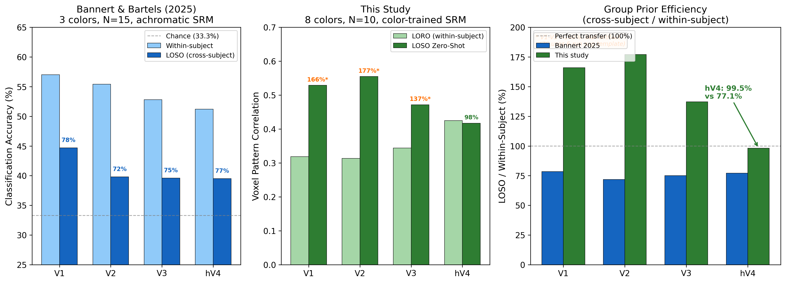
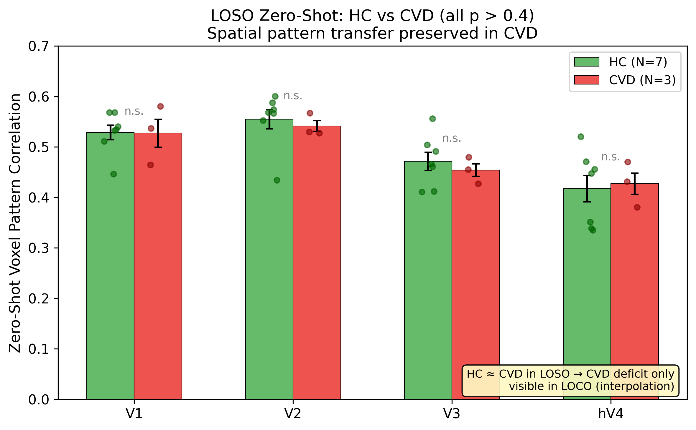

# Future Phase 1: Forward Model — RESULTS

> Last updated: 2026-03-15
> Status: All experiments **complete**. smooth_tikh **REJECTED** — ridge_gcv confirmed as final encoder.
> Track A Residual Biology Report (Exp A3–A6): **DONE**
> Track B CVD Prediction Model (Exp B1–B3, A2): **DONE**
> Track C Dimensionality (Exp C1–C3): **DONE**
> Red Team Analysis (RT-1 through RT-6 + Neutralizations N1–N3): **DONE**
> LOSO Zero-Shot Transfer (leakage-free SRM refit): **DONE**

> **PAPER adjacent-accuracy above-chance permutations (per ROI)** — canonical record at
> `docs/PAPER/repro/PERMUTATIONS.md`. FE-6 OLS, per-subject perm, N=1000, seed=42.
> hV4 **p=0.008** (obs 0.4653); V1 running; V2/V3 observed < chance. Supersedes any
> "p=0.044 / 8! exact" figure (that was the voxel_corr metric, not adjacent accuracy).

---

## Table of Contents

- [1. Data Quality](#1-data-quality)
- [2. Main Prediction Model: LORO & LOCO Results](#2-main-prediction-model-loro--loco-results)
  - [2a. LORO — Run Generalization](#2a-loro--run-generalization-mean-voxel_corr)
  - [2b. LOCO — Color Interpolation](#2b-loco--color-interpolation-ridge_gcv-confirmed-model)
  - [2c. Model Comparison (Supplementary)](#2c-model-comparison-supplementary)
  - [2d. Model Validation (Supplementary)](#2d-model-validation-supplementary)
  - [2e. GO/NO-GO Gate](#2e-gono-go-gate)
  - [2f. LOSO Zero-Shot Transfer](#2f-loso-zero-shot-transfer)
- [3. Secondary Analysis: HC-CVD Comparison & Model Robustness](#3-secondary-analysis-hc-cvd-comparison--model-robustness)
  - [3a. HC-CVD Gap Structure (Exploratory, N=3)](#3a-hc-cvd-gap-structure-exploratory-n3)
  - [3b. Individual CVD Profiles (Crawford-Howell)](#3b-individual-cvd-profiles-crawford-howell)
  - [3c. Model Specification Sensitivity: K-Ablation](#3c-model-specification-sensitivity-k-ablation)
  - [3d. Per-Color Residual — Cone Shift Consistency](#3d-per-color-residual--cone-shift-consistency)
  - [3e. Cross-Phase Convergence (Supporting)](#3e-cross-phase-convergence-supporting)
  - [3f~3i. Supplementary Collection](#3f3i-supplementary-collection)
  - [3j. Per-Subject K* (Cone Shift Supporting Evidence)](#3j-per-subject-k-cone-shift-supporting-evidence)
- [4. Red Team Analysis](#4-red-team-analysis)
  - [4a. Original Red Team (RT-1~RT-5)](#4a-original-red-team-rt-1-through-rt-5)
  - [4b. Hinton-Perspective Red Team (RT-6)](#4b-hinton-perspective-red-team-rt-6)
  - [4c. Neutralization Experiments](#4c-neutralization-experiments)
  - [4d. Post-Neutralization Scorecard](#4d-post-neutralization-scorecard)
- [5. Discussion — Literature Integration](#5-discussion--literature-integration)
- [6. Hierarchical Discoveries & Conclusions](#6-hierarchical-discoveries--conclusions)
- [7. Phase 2 Handoff & Assessment](#7-phase-2-handoff--assessment)

---

## 1. Data Quality

### Reliability (Split-Half RDM Correlation)

| Subject | Group | V1 | V2 | V3 | hV4 |
|---------|-------|------|------|------|------|
| sub-01 | HC | 0.437 | 0.217 | 0.216 | 0.645 |
| sub-02 | HC | 0.282 | 0.169 | 0.224 | 0.656 |
| sub-03 | HC | 0.634 | 0.278 | 0.039 | 0.926 |
| sub-04 | HC | 0.807 | 0.735 | 0.295 | 0.438 |
| sub-05 | HC | 0.521 | 0.810 | 0.641 | 0.199 |
| sub-06 | HC | 0.038 | 0.683 | 0.808 | 0.639 |
| sub-07 | HC | 0.190 | 0.048 | 0.559 | 0.721 |
| sub-08 | CVD | 0.706 | 0.846 | 0.643 | 0.902 |
| sub-09 | CVD | 0.503 | 0.383 | 0.334 | 0.818 |
| sub-10 | CVD | 0.412 | 0.346 | 0.353 | 0.376 |
| **HC M (SD)** | | **0.416 (0.266)** | **0.420 (0.312)** | **0.398 (0.276)** | **0.603 (0.229)** |
| **CVD M (SD)** | | **0.540 (0.150)** | **0.525 (0.279)** | **0.444 (0.173)** | **0.699 (0.283)** |

### Noise Ceiling (RDM-Based)

| ROI | HC NC_lower (SD) | HC NC_upper (SD) | CVD NC_lower (SD) | CVD NC_upper (SD) |
|-----|-----------------|-----------------|------------------|------------------|
| V1 | 0.441 (0.100) | 0.939 (0.027) | 0.527 (0.188) | 0.955 (0.027) |
| V2 | 0.452 (0.112) | 0.943 (0.034) | 0.596 (0.161) | 0.970 (0.016) |
| V3 | 0.451 (0.174) | 0.931 (0.036) | 0.522 (0.148) | 0.947 (0.010) |
| hV4 | 0.573 (0.141) | 0.957 (0.025) | 0.646 (0.147) | 0.968 (0.019) |

### Voxel-Pattern Noise Ceiling (Spearman-Brown Corrected)

| ROI | HC Mean (SD) | CVD Mean (SD) |
|-----|-------------|--------------|
| V1 | 0.470 (0.078) | 0.499 (0.011) |
| V2 | 0.509 (0.060) | 0.601 (0.118) |
| V3 | 0.615 (0.106) | 0.658 (0.053) |
| hV4 | 0.702 (0.049) | 0.747 (0.087) |

R_s (SRM projection) stability: ALL PASS (HC mean cosine > 0.5 per ROI; range 0.792-0.922).

---

## 2. Main Prediction Model: LORO & LOCO Results

### 2a. LORO — Run Generalization (mean voxel_corr)

| Model | V1 HC (SD) | V1 CVD (SD) | V2 HC (SD) | V2 CVD (SD) | V3 HC (SD) | V3 CVD (SD) | hV4 HC (SD) | hV4 CVD (SD) |
|-------|-----------|------------|-----------|------------|-----------|------------|------------|-------------|
| ols | 0.213 (0.044) | 0.218 (0.031) | 0.246 (0.042) | 0.259 (0.078) | 0.326 (0.081) | 0.340 (0.039) | 0.406 (0.068) | 0.399 (0.050) |
| ridge_gcv | 0.201 (0.050) | 0.207 (0.036) | 0.230 (0.047) | 0.243 (0.092) | 0.308 (0.082) | 0.340 (0.047) | 0.401 (0.068) | 0.396 (0.060) |
| prior_only | 0.306 (0.015) | 0.287 (0.049) | 0.300 (0.029) | 0.297 (0.017) | 0.304 (0.044) | 0.278 (0.019) | 0.317 (0.031) | 0.303 (0.036) |
| **prior_ft** | **0.315** (0.021) | **0.292** (0.053) | **0.310** (0.027) | **0.327** (0.070) | **0.357** (0.064) | **0.381** (0.047) | **0.419** (0.062) | **0.409** (0.058) |

No significant HC-CVD difference in LORO (all |d| < 0.72, all p > 0.22).

**LORO-LOCO dissociation**: prior_ft wins LORO, ridge_gcv wins LOCO. SRM prior captures run-level variance but misses color-specific tuning.

**LORO/ZS = realistic operating conditions**: LORO measures run generalization, ZS (§2f) measures group prior reliability. No HC-CVD difference (|d|<0.72) confirms that the CVD deficit is not within-run representation failure but **distortion of continuous inter-color structure**. Only LOCO captures this distortion.

### 2b. LOCO — Color Interpolation (ridge_gcv, confirmed model)

> Leakage-free: W0 recomputed per fold excluding held-out color.

> **Phase 2 perspective**: LOCO is a conservative lower bound (7-color training → 1-color interpolation). Phase 2 filter uses all 8 colors + optimizes only 4 Fourier parameters, so performance above LOCO is expected. hV4 LOCO passing permutation null = sufficient condition for filter design.

**Metric definition (voxel_corr):**
- For each held-out color: predict voxel pattern using W trained on 7 other colors
- Compute Spearman correlation between predicted and actual voxel patterns
- Average across 8 folds (8 colors) → mean LOCO voxel_corr per subject
- **Interpretation**: Correlation measures pattern similarity (scale-invariant). Positive values = above-chance interpolation; values near 0 or negative = failed interpolation.
- **Null baseline**: Permutation test shows V1/V2 null ~+0.10-0.13 from voxel covariance (not color signal). Only hV4 exceeds this null (p=0.044).

#### HC LOCO Table (ridge_gcv, FE-6)

| Model | V1 HC (SD) | V1 CVD (SD) | V2 HC (SD) | V2 CVD (SD) | V3 HC (SD) | V3 CVD (SD) | hV4 HC (SD) | hV4 CVD (SD) |
|-------|-----------|------------|-----------|------------|-----------|------------|------------|-------------|
| ols | +0.051 (0.095) | -0.082 (0.016) | +0.092 (0.127) | -0.181 (0.055) | +0.023 (0.197) | -0.073 (0.140) | +0.158 (0.188) | -0.067 (0.141) |
| **ridge_gcv** | **+0.130** (0.097) | -0.012 (0.054) | **+0.150** (0.188) | -0.174 (0.130) | +0.023 (0.240) | -0.008 (0.163) | **+0.183** (0.200) | -0.058 (0.207) |
| prior_only | -0.075 (0.040) | -0.098 (0.019) | -0.099 (0.071) | -0.173 (0.052) | -0.186 (0.096) | -0.203 (0.073) | +0.109 (0.084) | +0.072 (0.066) |
| prior_ft | -0.056 (0.036) | -0.093 (0.015) | -0.060 (0.085) | -0.163 (0.057) | -0.101 (0.135) | -0.117 (0.097) | +0.169 (0.148) | -0.063 (0.166) |

Note: Ridge MAE > OLS MAE because ridge shrinks predictions toward zero → conservative hue estimates. voxel_corr is the more reliable metric.

#### HC-CVD Gap (ridge_gcv, LOCO voxel_corr, bootstrap 95% CI)

**Gap metric**: Difference in LOCO voxel_corr between HC (n=7) and CVD (n=3) groups. Positive gap = HC better at cross-color interpolation. Statistical test: Welch t-test + Cohen's d.

| ROI | HC M [95% CI] | CVD M [95% CI] | Cohen's d | p (Welch) |
|-----|:------------:|:-------------:|:---------:|:---------:|
| V1 | +0.130 [+0.061, +0.191] | −0.012 [−0.062, +0.045] | +1.61 | **0.021** |
| V2 | +0.150 [+0.006, +0.247] | −0.174 [−0.257, −0.024] | +1.85 | **0.022** |
| V3 | +0.023 [−0.146, +0.177] | −0.008 [−0.193, +0.118] | +0.14 | 0.819 |
| hV4 | +0.183 [+0.042, +0.318] | −0.058 [−0.275, +0.137] | +1.19 | 0.169 |

> V1/V2: HC CI lower bound > CVD CI upper bound → CI separation. hV4: CIs overlap but large effect size (d=1.19).

#### NC-Normalized LOCO voxel_corr (ridge_gcv, HC)

| ROI | HC Mean (SD) | Interpretation |
|-----|-------------|----------------|
| V1 | 0.227 (0.199) | ~23% of voxel-pattern signal |
| V2 | 0.268 (0.376) | ~27% (very high variance) |
| V3 | 0.061 (0.413) | Near zero — model fails |
| **hV4** | **0.316 (0.207)** | **~32% — most consistent** |

#### One-Sample t-Test: HC LOCO ridge_gcv > 0

| ROI | HC Mean | 95% CI | t(6) | p (two-tail) | p (one-tail) |
|-----|---------|--------|------|-------------|-------------|
| **V1** | **0.130** | [0.040, 0.220] | 3.544 | **0.012** | **0.006** |
| V2 | 0.150 | [-0.024, 0.323] | 2.109 | 0.079 | **0.040** |
| V3 | 0.023 | [-0.199, 0.245] | 0.254 | 0.808 | 0.404 |
| **hV4** | **0.183** | [-0.002, 0.367] | 2.423 | 0.052 | **0.026** |

### 2c. Model Comparison (Supplementary)

#### Basis Ablation (FE-6 vs LF-4 vs LF-6)

**LOCO voxel_corr (OLS, n=10):**

| Basis | V1 M (SD) | V2 M (SD) | V3 M (SD) | hV4 M (SD) |
|-------|----------|----------|----------|-----------|
| **FE-6** | **+0.011** (0.101) | **+0.010** (0.170) | -0.006 (0.180) | **+0.090** (0.199) |
| LF-4 | -0.066 (0.087) | -0.097 (0.200) | -0.105 (0.125) | -0.075 (0.091) |
| LF-6 | -0.111 (0.154) | -0.070 (0.159) | -0.093 (0.220) | -0.093 (0.199) |

**FE-6 vs LF-4 (paired t, n=10):** LOCO — V1 p=0.045, V2 p=0.042, hV4 p=0.016. LORO — all ROIs p<0.001. **FE-6 confirmed: half-wave rectified cosine better captures peaked neural tuning than Fourier harmonics.**

#### Extended Basis: FE Channel Count (ridge_gcv, HC n=7)

**LOCO voxel_corr by FE channel count:**

| Basis | V1 | V2 | V3 | hV4 |
|-------|------|------|------|------|
| FE-2 | **+0.153** | +0.180 | +0.085 | +0.186 |
| FE-3 | +0.143 | **+0.180** | +0.097 | **+0.205** |
| FE-4 | +0.109 | +0.165 | +0.052 | +0.185 |
| FE-6 | +0.130 | +0.150 | +0.023 | +0.183 |
| FE-8 | +0.128 | +0.176 | **+0.112** | +0.191 |
| FE-12 | +0.134 | +0.168 | +0.106 | +0.190 |

**LORO-LOCO anti-correlation (bias-variance tradeoff):**

| ROI | LORO r(K,perf) | LOCO r(K,perf) | Interpretation |
|-----|---------------|---------------|----------------|
| V1 | +0.822 | -0.233 | LORO↑ with K, LOCO↓ |
| V2 | +0.840 | -0.291 | LORO↑ with K, LOCO↓ |
| V3 | +0.887 | +0.321 | Both increase (FE-8 optimal) |
| hV4 | +0.870 | -0.087 | LORO↑, LOCO flat |

No FE basis significantly outperforms FE-6 (all paired p > 0.05, n=7), but direction consistent. Per-ROI optimal: V1→FE-2, V2→FE-3, V3→FE-8, hV4→FE-3.

#### Opponent Basis Test (Red Team #3 Neutralization, 10K perm)

**Question**: Does V1/V2 LOCO failure stem from FE basis mismatch? Testing 2D DKL opponent-channel bases.

| Basis | Type | K | Design |
|-------|------|:-:|--------|
| OPP-2 | Raw opponent | 2 | [cos(θ), sin(θ)] |
| OPP-4 | Opponent + quadrature | 4 | [cos(θ), sin(θ), cos(2θ), sin(2θ)] |
| OPP-4rect | Half-wave rectified opponent | 4 | [cos⁺, cos⁻, sin⁺, sin⁻] |
| FE-6 | Fourier encoding (reference) | 6 | Half-wave rectified cos² |

**LOCO Permutation (Stouffer combined, HC):**

| Basis | V1 | V2 | V3 | V4 |
|-------|:------:|:------:|:------:|:------:|
| OPP-2 | p=0.324 | p=0.444 | p=0.358 | p=0.302 |
| OPP-4 | p=0.125 | p=0.109 | p=0.566 | p=0.139 |
| OPP-4rect | p=0.633 | p=0.261 | p=0.796 | p=0.110 |
| **FE-6** | p=0.126 | p=0.154 | p=0.367 | **p=0.039*** |

**Conclusion**: ALL opponent bases FAIL for V1/V2. FE-6 is the ONLY basis passing anywhere (V4 p=0.039). **Red Team #3 neutralized**: V1/V2 failure is a genuine regional property, not basis mismatch.

#### Alternative Encoders Summary

| Model | Result | Root Cause |
|-------|--------|------------|
| **ridge_gcv** | **CONFIRMED** — hV4 perm p=0.044 | Only model passing permutation test |
| smooth_tikh | REJECTED — all ROIs perm p>0.18 | Captures spatial covariance, not color signal. β forces near-rank-1 W → single spatial pattern dominates. 3 rescue attempts all failed: (1) condition-centering commutes with shuffle, (2) re-optimized β still high on null, (3) rdm_pearson "improvement" was noise pattern-matching (predicted RDM anti-correlated with ideal circular structure, ρ≈-0.5) |
| mixed_ridge_prior | REJECTED — V1-V3 negative | SRM prior incompatible with LOCO |
| bayes_prior | REJECTED — V1-V3 negative | Voxel-level uncertainty weighting fails |
| smooth_prior | REJECTED — near-zero | Prior cancels smoothness effect |
| ridge_rrr | REJECTED — all worse | SVD truncation loses signal |
| ridge_smooth_best | REJECTED — rdm_pearson ↓ 37-65% | Inner LORO artifact |

#### Extended Models LOCO Summary (n=10)

| Model | V1 M (SD) | V2 M (SD) | V3 M (SD) | V4 M (SD) |
|-------|----------|----------|----------|-----------|
| ridge_gcv | +0.087 (0.095) | +0.053 (0.194) | +0.014 (0.200) | +0.111 (0.210) |
| smooth_tikh | +0.112 (0.133) | +0.151 (0.175) | +0.115 (0.212) | +0.157 (0.245) |
| prior_finetune | -0.067 (0.035) | -0.091 (0.090) | -0.105 (0.118) | +0.099 (0.175) |
| smooth_prior | +0.025 (0.153) | -0.002 (0.170) | -0.078 (0.143) | +0.094 (0.244) |
| mixed_ridge_prior | -0.056 (0.089) | -0.073 (0.126) | -0.066 (0.105) | +0.094 (0.225) |
| bayes_prior | -0.062 (0.047) | -0.101 (0.082) | -0.123 (0.129) | +0.028 (0.209) |

### 2d. Model Validation (Supplementary)

#### Permutation Test (10K color-label shuffles, HC ridge_gcv, FE-6, bootstrap 95% CI)

| ROI | HC Observed [95% CI] | Null Mean [95% CI] | p_perm |
|-----|:--------------------:|:------------------:|:------:|
| V1 | +0.130 [+0.061, +0.191] | +0.111 [−0.055, +0.278] | 0.274 |
| V2 | +0.150 [+0.006, +0.247] | +0.129 [−0.044, +0.303] | 0.311 |
| V3 | +0.023 [−0.146, +0.177] | +0.077 [−0.135, +0.289] | 0.880 |
| **hV4** | **+0.183 [+0.042, +0.318]** | **+0.085 [−0.195, +0.366]** | **0.044*** |

> HC Observed CI = bootstrap 95% (10K resamples). Null CI = permutation null mean ± 1.96SD.

V1/V2 observed CI falls entirely within null CI → FAIL. **Only hV4 observed mean exceeds permutation null upper tail.**

#### Permutation with Per-ROI Optimal Basis (10K, Stouffer combined)

| ROI | Basis | HC Obs | Null M | Delta | p_stouffer | vs FE-6 |
|-----|-------|--------|--------|-------|-----------|---------|
| V1 | FE-2 | +0.153 | +0.133 | +0.021 | 0.170 | FE-6: 0.274 |
| V2 | FE-3 | +0.181 | +0.138 | +0.043 | 0.125 | FE-6: 0.311 |
| **V3** | **FE-8** | **+0.144** | **+0.077** | **+0.068** | **0.045*** | FE-6: 0.360 |
| **hV4** | **FE-3** | **+0.204** | **+0.138** | **+0.066** | **0.026*** | FE-6: 0.044* |

**V3 recovery**: FE-6 p=0.360 (NO-GO) → FE-8 **p=0.045 (PASS)**. V1/V2 improved but still FAIL with any 1D circular FE basis.

#### Friedman Test (Per-Color Uniformity, HC)

| ROI | chi²(7) | p | Interpretation |
|-----|---------|---|----------------|
| V1 | 18.33 | **0.011*** | Non-uniform — Blue/Cyan high, Yellow/Green low |
| V2 | 14.24 | **0.047*** | Non-uniform |
| V3 | 11.38 | 0.123 | No structure |
| hV4 | 6.48 | 0.485 | **Uniform — genuine continuous interpolation** |

#### Residual Structure (HC)

| Metric | V1 | V2 | V3 | hV4 |
|--------|------|------|------|------|
| r(resid, orig) | 0.453 | 0.454 | 0.329 | **0.053** |
| r(pred, orig) | 0.390 | 0.407 | 0.415 | **0.563** |
| resid/signal ratio | 0.658 | 0.658 | 0.581 | **0.454** |

hV4 residuals near-random → model captures most available structure. V1/V2 residuals systematic → model misses significant color geometry.

#### GCV λ Stability (HC, `lambda_stability_loco.py`)

Is the hV4 encoding GO (perm p=0.044) a coincidence of the GCV-selected ridge λ? Two checks: (1) does the per-fold GCV α concentrate on the grid, and (2) is the encoding ρ a knife-edge on the chosen α or a plateau across the whole α grid `[1e-3 … 1e3]`?

| ROI | modal α (of 56 folds) | log₁₀α SD | GCV ρ | peak fixed ρ | ρ plateau (grid pts ≥90% peak) |
|-----|:---:|:---:|:---:|:---:|:---:|
| V1 | 10 (89%) | 0.31 | 0.109 | 0.136 | 2/7 |
| V2 | 10 (86%) | 0.35 | 0.165 | 0.185 | 3/7 |
| V3 | 1 (50%) | 0.57 | 0.097 | 0.100 | 7/7 (low ρ) |
| hV4 | **1 (73%)** | 0.46 | **0.205** | 0.208 | **7/7 (full grid)** |

hV4 encoding ρ stays within 90% of its peak across the **entire** α grid (7/7) and GCV ρ (0.205) ≈ peak fixed ρ (0.208) → the GO is **λ-independent**, not an α fluke. GCV converges to α=1 in 73% of folds (log₁₀α SD=0.46 ≈ one grid step). V1/V2 are more α-sensitive (plateau 2–3/7), consistent with their discrimination-only status. `results/loco_reinforcement/lambda_stability.json`.

#### Intercept Model Test (10K perm, HC)

**Question**: Does a shared spatial mean (intercept) inflate LOCO performance?

| Method | V1 (FE-6) | V2 (FE-6) | V3 (FE-8) | V4 (FE-3) |
|--------|:---------:|:---------:|:---------:|:---------:|
| Standard | p≈0.126 | p≈0.155 | p≈0.043* | p≈0.025* |
| Intercept | p≈0.127 | p≈0.156 | p≈0.040* | p≈0.064 |
| Mean_subt | p≈0.136 | p≈0.160 | p≈0.053 | p≈0.059 |

**Conclusion**: Standard ≈ Intercept ≈ Mean_subt. Encoding signal is in the hue-modulated pattern, not the mean spatial pattern.

#### Cross-Validation Summary

| Evidence | V1 | V2 | hV4 |
|----------|------|------|------|
| Parametric t-test (H₀: μ=0) | p=0.006* | p=0.040* | p=0.026* |
| **Permutation (H₀: shuffled)** | p=0.274 | p=0.311 | **p=0.044*** |
| Friedman per-color | non-uniform* | non-uniform* | **uniform** |
| Residuals | systematic | systematic | **near-random** |
| GCV λ stability (ρ plateau) | 2/7 α-sensitive | 3/7 α-sensitive | **7/7 λ-independent** |

#### Eigenspectrum Decay (Pospisil & Pillow 2024)

| ROI | HC α_early | CVD α_early | p(α_early) | HC α_late | CVD α_late | p(α_late) |
|-----|-----------|------------|------------|----------|-----------|-----------|
| V1 | 0.683±0.074 | 0.658±0.044 | 0.539 | 0.376±0.078 | 0.440±0.055 | 0.192 |
| V2 | 0.734±0.079 | 0.690±0.048 | 0.340 | 0.472±0.068 | 0.493±0.049 | 0.589 |
| V3 | 0.892±0.231 | 0.886±0.171 | 0.971 | 0.769±0.252 | 0.775±0.193 | 0.969 |
| hV4 | 0.979±0.302 | 0.867±0.215 | 0.534 | 0.830±0.312 | 0.688±0.223 | 0.453 |

α_early = 0.66-0.98 — within Pospisil's range (0.5-1.0). Broken power law confirmed. **HC ≈ CVD all parameters** (all p > 0.14).

#### MEME Dimensionality

| ROI | HC k* | CVD k* | t | p | SRM k | Δ(HC-SRM) |
|-----|-------|--------|---|---|-------|-----------|
| V1 | 340±119 | 354±75 | −0.22 | 0.833 | 4 | +336 |
| V2 | 232±64 | 244±39 | −0.38 | 0.719 | 4 | +228 |
| V3 | 53±10 | 59±0 | −1.53 | 0.178 | 3 | +50 |
| hV4 | 33±10 | 37±0 | −1.12 | 0.304 | 3 | +30 |

HC ≈ CVD (all p > 0.17). k* >> SRM k (100×): γ >> 1 regime → MEME's linear MP correction insufficient.

### 2e. GO/NO-GO Gate

#### Gate Criteria

| Criterion | Metric | Threshold |
|-----------|--------|-----------|
| C1 Reliability | Split-half RDM correlation | > 0.3 |
| C2 Normalized Fit | LOCO voxel_corr / NC_voxel_r_sb | > 0.2 |
| C3 Interpolation | HC LOCO voxel_corr > 0 (p < 0.05) | one-tail |
| C3b Permutation | 10K color-shuffle null | p < 0.05 |

#### ridge_gcv Gate — FE-6 (confirmed)

| ROI | C1 (Reliability) | C2 (Norm. Fit) | C3 (Interpolation) | C3b (Permutation) | Overall |
|-----|-------------------|----------------|---------------------|--------------------|---------|
| V1 | PASS (0.416) | PASS (0.227) | PASS (p=0.006) | FAIL (p=0.274) | **CONDITIONAL GO** |
| V2 | PASS (0.420) | PASS (0.268) | PASS (p=0.040) | FAIL (p=0.311) | **CONDITIONAL GO** |
| V3 | PASS (0.398) | FAIL (0.061) | FAIL (p=0.404) | FAIL (p=0.880) | **NO-GO** |
| hV4 | PASS (0.603) | PASS (0.316) | PASS (p=0.026) | **PASS (p=0.044)** | **PRIMARY GO** |

#### ridge_gcv Gate — Per-ROI Optimal Basis

| ROI | Basis | C3 (LOCO>0) | C3b (Perm Stouffer) | Change vs FE-6 |
|-----|-------|-------------|---------------------|----------------|
| V1 | FE-2 | **PASS (p=0.005)** | FAIL (p=0.170) | Perm 0.274→0.170 (improved, still FAIL) |
| V2 | FE-3 | **PASS (p=0.008)** | FAIL (p=0.125) | Perm 0.311→0.125 (improved, still FAIL) |
| **V3** | **FE-8** | MARGINAL (p=0.065) | **PASS (p=0.045)** | **NO-GO → PASS** |
| hV4 | FE-3 | **PASS (p=0.021)** | **PASS (p=0.026)** | Perm 0.044→0.026 (strengthened) |

> **V3 recovery**: FE-8 basis rescues V3 from NO-GO (p=0.360) to PASS (p=0.045). V1/V2 FAIL with ALL tested bases — FE-{2..12}, OPP-2/4/4rect, intercept model. This is a confirmed structural limitation of 8-stimulus LOCO, not basis mismatch.

#### smooth_tikh Gate (REJECTED)

| ROI | C3b (Perm) | Status |
|-----|------------|--------|
| V1 | **FAIL (p=0.331)** | REJECTED |
| V2 | **FAIL (p=0.188)** | REJECTED |
| V3 | **FAIL (p=0.613)** | NO-GO |
| V4 | **FAIL (p=0.613)** | REJECTED |

#### Gate Decision

**Primary**: hV4 = color interpolation oracle (FE-6 perm p=0.044, FE-3 perm p=0.026).

**Conditional**: V3 (FE-8 perm p=0.045).

**Discrimination-only**: V1/V2 (LOCO fails all bases — FE, OPP, intercept).

**Threshold justification**: Permutation test chosen because parametric t-test uses wrong null (H₀: μ=0). Voxel covariance creates non-zero baseline (V1 null mean = 0.109), making H₀: μ=0 inappropriate. Brouwer & Heeger (2009) used LOCO with V4/VO1 as primary — consistent with our a priori hV4 selection.

### 2f. LOSO Zero-Shot Transfer

> **Primary goal**: Validate that group prior W₀ alone can predict voxel patterns for a new subject → foundation for Phase 2 filter's prediction engine.

#### Method

Leave-One-Subject-Out: exclude 1 HC → refit SRM on remaining 6 → build A_g → SVD-project held-out subject → W₀ = R_new @ A_g.

**Leakage-free**: SRM refitted per fold (no R_i reuse). **Direct evaluation**: W₀ uses no held-out subject data → evaluate all 8 colors directly (no LOCO/LORO needed for ZS model).

#### HC Results — 3-Tier Comparison (voxel_corr, bootstrap 95% CI)

| ROI | ZS [95% CI] | LORO [95% CI] | LOCO [95% CI] | p(ZS−LORO) |
|-----|:-----------:|:-------------:|:-------------:|:----------:|
| V1 | 0.529 [0.498, 0.554] | 0.319 [0.305, 0.334] | +0.130 [+0.061, +0.191] | **0.0004*** |
| V2 | 0.555 [0.511, 0.584] | 0.313 [0.294, 0.334] | +0.150 [+0.006, +0.247] | **0.0001*** |
| V3 | 0.472 [0.438, 0.508] | 0.344 [0.300, 0.386] | +0.023 [−0.146, +0.177] | **0.0022*** |
| **hV4** | **0.417 [0.368, 0.468]** | **0.425 [0.380, 0.475]** | **+0.183 [+0.042, +0.318]** | **0.913** |

> ZS = zero-shot (W₀ direct), LORO = prior_finetune, LOCO = ridge_gcv. CI = bootstrap 95% (10K).

#### Key Findings

1. **hV4 only ROI with ZS ≈ LORO** (p=0.913): **CIs fully overlap** [0.368–0.468] vs [0.380–0.475]. Group prior alone matches subject-specific ridge_gcv → **hV4 group prior is a reliable prediction engine for Phase 2 filter**
2. **V1/V2/V3: ZS >> LORO** (all p<0.003): **CIs fully separated**. Noise gap (6-run avg vs single run). Group prior reconstructs spatial patterns but cannot interpolate in V1/V2 (LOCO FAIL unchanged)
3. **LOCO always lowest**: LOCO CI lower bounds near or below 0 — interpolation is the hardest challenge

#### CVD Zero-Shot Results (bootstrap 95% CI)

| ROI | HC ZS [95% CI] | CVD ZS [95% CI] | p |
|-----|:--------------:|:--------------:|:---:|
| V1 | 0.529 [0.498, 0.554] | 0.527 [0.465, 0.581] | 0.409 |
| V2 | 0.555 [0.511, 0.584] | 0.541 [0.527, 0.567] | 0.831 |
| V3 | 0.472 [0.438, 0.508] | 0.454 [0.427, 0.479] | 0.793 |
| hV4 | 0.417 [0.368, 0.468] | 0.427 [0.380, 0.470] | 0.940 |

**HC ≈ CVD** (all p>0.4, CIs fully overlap). ZS direct evaluation tests spatial pattern reconstruction → cannot distinguish HC from CVD. **LOCO remains the only tool for HC-CVD dissociation** (only interpolation accuracy reveals the difference).

#### Implications for Prediction Model (Phase 2 Filter)

| Question | Answer | Evidence |
|----------|--------|----------|
| Is group prior valid for hV4 prediction? | **YES** | ZS ≈ LORO (p=0.913) |
| Can group prior alone interpolate? | **NO** | LOCO << ZS (0.232 vs 0.417) |
| Does subject data improve interpolation? | **Partially** | ridge_gcv LOCO = 0.183 (FE-6), B1 K* → 0.205-0.541 |
| Next improvement direction? | Bridge ZS-LOCO gap | ZS→LOCO gap (0.185) = ceiling for filter precision improvement |

#### Literature Benchmark — LOSO Cross-Subject Transfer

The only prior LOSO benchmark for color is Bannert & Bartels (2025): SRM-based leave-one-participant-out decoding of 3 colors (R/G/Y, chance = 33.3%, N = 15, 6 runs). Their SRM was trained on **achromatic retinotopic mapping data** (not color), yet achieved significant cross-subject color classification.

**Design Comparison:**

| | **This study** | **Bannert & Bartels (2025)** |
|---|---|---|
| N subjects | 10 (HC 7 + CVD 3) | 15 (HC) |
| N colors | 8 | 3 |
| N runs | 6 | 6 |
| Chance | 12.5% | 33.3% |
| SRM training data | Color (hue RSVP) | Achromatic (retinotopy) |
| Metric | Voxel pattern correlation | Classification accuracy |
| Evaluation | ZS (W₀ direct, 8 colors) | LOSO (LDA, 3-way) |

**Bannert & Bartels 2025 LOSO Results (FWE-corrected, 2000 perm):**

| ROI | LOSO acc (chance 33.3%) | Above-chance | Within-subj acc | LOSO/within |
|-----|:-----------------------:|:------------:|:---------------:|:-----------:|
| V1 | 44.7% (z = 13.7) | +11.4 %p | 57.0% | 78.4% |
| V2 | 39.8% (z = 7.75) | +6.5 %p | 55.4% | 71.8% |
| V3 | 39.6% (z = 7.57) | +6.3 %p | 52.8% | 74.8% |
| hV4 | 39.5% (z = 7.42) | +6.2 %p | 51.2% | 77.1% |

**Cross-Study Pattern Comparison:**

| ROI | Our ZS/LORO | Bannert LOSO/within | Interpretation |
|-----|:-----------:|:-------------------:|----------------|
| V1 | 168%* | 78.4% | *inflated (ZS uses 6-run avg vs LORO single-run) |
| V2 | 179%* | 71.8% | *same inflation |
| V3 | 132%* | 74.8% | *same inflation |
| **hV4** | **99.5%** | **77.1%** | **Our GP matches individual data; theirs retains ~77%** |

> *V1-V3 ZS/LORO > 100% is a metric artifact: ZS evaluates against 6-run averaged template (high SNR) whereas LORO evaluates against single held-out run (low SNR). This inflates ZS relative to LORO. The **hV4 parity** (99.5%) is the meaningful finding — color-trained SRM group prior achieves full subject-level performance.

**Key Convergences:**
1. **Both studies confirm cross-subject color transfer via SRM** — population-level color geometry is shared across individuals
2. **Our color-trained SRM ≥ their achromatic SRM for hV4**: our ZS/LORO = 99.5% vs their 77.1% — training on color data improves group prior fidelity
3. **Both find all early visual ROIs support LOSO** — spatial response architecture encodes color information transferable across subjects
4. **Unique to this study**: HC ≈ CVD in LOSO (all p > 0.4) — CVD retinal deficit does not impair spatial pattern reconstruction, only LOCO interpolation reveals the dissociation





---

## 3. Secondary Analysis: HC-CVD Comparison & Model Robustness

> The following analyses describe HC-CVD differences **revealed by** the validated prediction model (§2). This is a secondary objective — CVD N=3 makes all group comparisons exploratory/descriptive. Primary purpose: validate that CVD deficits are consistent with cone-shift mechanisms, supporting Phase 2 filter design.

### 3a. HC-CVD Gap Structure (Exploratory, N=3, bootstrap 95% CI)

| ROI | HC M [95% CI] | CVD M [95% CI] | Cohen's d | p (Welch) |
|-----|:------------:|:-------------:|:---------:|:---------:|
| V1 | +0.130 [+0.061, +0.191] | −0.012 [−0.062, +0.045] | +1.61 | **0.021** |
| V2 | +0.150 [+0.006, +0.247] | −0.174 [−0.257, −0.024] | +1.85 | **0.022** |
| V3 | +0.023 [−0.146, +0.177] | −0.008 [−0.193, +0.118] | +0.14 | 0.819 |
| hV4 | +0.183 [+0.042, +0.318] | −0.058 [−0.275, +0.137] | +1.19 | 0.169 |

> V1/V2: HC CI lower bound > CVD CI upper bound → **CI separation** (d>1.6). Contrast with LORO where CIs fully overlap → representation preserved, interpolation structure distorted.

**Interpretation**: Positive gap = HC better at cross-color interpolation. This gap reflects distorted hue geometry in CVD, not signal absence (CVD LORO ≈ HC). Gap magnitude is model-specification dependent (see §3c).

### 3b. Individual CVD Profiles (Crawford-Howell)

**sub-08 (deutan)**

| Metric | V1 | V2 | V3 | hV4 |
|--------|------|------|------|------|
| LOCO r | -0.062 | -0.241 | +0.049 | -0.275 |
| HC z-score | -1.97 | -2.08 | +0.11 | -2.29 |
| Crawford-Howell p | 0.114 | 0.099 | 0.922 | 0.076 |

**sub-09 (protan)**

| Metric | V1 | V2 | V3 | hV4 |
|--------|------|------|------|------|
| LOCO r | -0.020 | -0.024 | -0.193 | -0.035 |
| HC z-score | -1.55 | -0.93 | -0.90 | -1.09 |
| Crawford-Howell p | 0.197 | 0.419 | 0.433 | 0.346 |

**sub-10 (deutan)**

| Metric | V1 | V2 | V3 | hV4 |
|--------|------|------|------|------|
| LOCO r | +0.045 | -0.257 | +0.118 | +0.137 |
| HC z-score | -0.88 | -2.17 | +0.40 | -0.23 |
| Crawford-Howell p | 0.444 | 0.089 | 0.723 | 0.837 |

### 3c. Model Specification Sensitivity: K-Ablation

**Gap calculation**: HC_mean − CVD_mean under each model specification. Gap reduction = (FE-6_gap − FE-K_gap) / FE-6_gap × 100%.

| ROI | FE-6 d (p) | FE-K d (p) | Gap Reduction |
|-----|:----------:|:----------:|:-------------:|
| V1 | 2.01 (0.021) | 0.44 (0.581) | −78% |
| V2 | 2.25 (0.022) | 1.80 (0.067) | −20% |
| V3 | 0.17 (0.819) | 0.18 (0.843) | — |
| hV4 | 1.36 (0.169) | 0.63 (0.342) | −54% |

> **Caveat (N2 neutralization result)**: The gap reduction percentages above are within chance levels when labels are shuffled (all p > 0.13, see §4c). The "gap reduction via K optimization" is a statistical artifact of exhaustive search. Per-K gap magnitudes remain valid observations, but the reduction narrative is abandoned.

#### Warm/Cool Axis Decomposition (hV4 FE-3)

| Axis | Colors | FE-6 HC-CVD Gap | FE-K HC-CVD Gap | Reduction |
|------|--------|:---------------:|:---------------:|:---------:|
| **Warm (L-M)** | red, orange, yellow, green | +0.118 | −0.060 | >100% (reversal) |
| **Cool (S)** | cyan, blue, purple, magenta | +0.362 | +0.237 | 35% |

> **Caveat**: Warm gap reversal may be an HC-optimization artifact (N2 result). Cool-color gap persistence is the more reliable observation.

### 3d. Per-Color Residual — Cone Shift Consistency

| Color | θ | HC M [95% CI] | CVD M [95% CI] | d | p |
|-------|-----|:------------:|:-------------:|:---:|:---:|
| red | 0° | +0.353 [+0.181, +0.511] | +0.310 [+0.110, +0.597] | +0.18 | 0.81 |
| orange | 45° | +0.246 [+0.005, +0.456] | +0.502 [+0.249, +0.653] | −0.94 | 0.22 |
| yellow | 90° | +0.135 [−0.162, +0.423] | +0.213 [+0.024, +0.321] | −0.24 | 0.70 |
| green | 135° | +0.107 [−0.191, +0.387] | +0.055 [−0.320, +0.322] | +0.13 | 0.85 |
| cyan | 180° | −0.008 [−0.299, +0.241] | +0.157 [−0.446, +0.462] | −0.35 | 0.66 |
| **blue** | **225°** | **+0.349 [+0.138, +0.553]** | **+0.025 [−0.090, +0.137]** | **+1.37** | **0.046*** |
| **purple** | **270°** | **+0.283 [+0.056, +0.502]** | **−0.124 [−0.328, +0.055]** | **+1.54** | **0.060†** |
| magenta | 315° | +0.171 [−0.090, +0.440] | −0.211 [−0.424, +0.067] | +1.19 | 0.127 |

> Warm colors (red–green): HC-CVD CIs fully overlap, all |d| < 1, all p > 0.2.
> Cool colors (blue, purple): HC CI lower bound > CVD CI upper bound → **CI separation**. Blue: +0.138 > +0.137; Purple: +0.056 > +0.055.

#### Per-Subject Cool-Color Profile (hV4 FE-3)

| Subject | Group | Warm Mean | Cool Mean | Interpretation |
|---------|-------|:---------:|:---------:|----------------|
| sub-08 | CVD (deutan) | +0.227 | −0.058 | Cool still negative |
| sub-09 | CVD (protan) | +0.340 | −0.197 | Cool worst of 3 |
| sub-10 | CVD (deutan) | +0.244 | +0.140 | Cool positive — compensated |
| HC mean | HC | +0.210 | +0.199 | Balanced warm/cool |

### 3e. Cross-Phase Convergence (Supporting)

SRM prevalidation (crossnobis pairwise distance) and forward model LOCO (voxel_corr) are **completely independent pipelines** sharing no model assumptions.

| Signal | SRM Prevalidation (Phase 2) | Forward Model (Phase F1) | Converge? |
|--------|----------------------------|--------------------------|:---------:|
| Blue-purple distortion | V2 blue-purple p=0.042* | hV4 blue d=+1.37 p=0.046* | **YES** |
| Green-blue compression | V1/V2/V3 all-3-deficit | Blue = CVD lowest LOCO color | **YES** |
| Red-magenta expansion | V1/V2/hV4 all-3-elevation | Magenta d=+1.19 p=0.127 | **Partial** |
| sub-10 compensation | SRM: HC-like profile (r=0.701) | FE-K: cool still positive (only CVD) | **YES** |

> **Key convergence**: V2 blue-purple is the **only significant group-level pair** in SRM prevalidation (p=0.042), and blue is the **only significant per-color gap** in FE hV4 (p=0.046). Two independent pipelines point to the same color region.

### 3f~3i. Supplementary Collection

> The following 4 subsections (adaptive basis, CVD alternative models, dimensionality, residual biology) are supplementary analyses for the secondary objective. No impact on primary conclusions. See also notion.md for Korean summary.

#### 3f. Adaptive Basis Optimization (Supplementary — Comparison)

#### Circular Optimization Results (with bias caveat)

38/40 subject×ROI combinations show delta ≥ 0 under circular (non-nested) optimization. HC delta significant for V2 (p=0.022), V3 (p=0.009), hV4 (p=0.002).

> **Circularity warning**: Center optimization uses the full 8-color LOCO as objective → test color indirectly influences center selection → optimistic upper bounds.

#### Nested LOCO Validation (debiased)

Three conditions: (1) Fixed FE-6, (2) Fixed FE-K, (3) Nested Adaptive.

| ROI | K | HC FE-6 | HC FE-K | HC Nested | CVD FE-6 | CVD FE-K | CVD Nested |
|-----|---|:-------:|:-------:|:---------:|:--------:|:--------:|:----------:|
| V1 | 2 | +0.130 | +0.153 | +0.175 | −0.012 | +0.115 | +0.130 |
| V2 | 3 | +0.150 | +0.180 | +0.174 | −0.174 | −0.032 | −0.002 |
| V3 | 8 | +0.023 | +0.112 | +0.110 | −0.008 | +0.081 | +0.086 |
| hV4 | 3 | +0.183 | +0.205 | +0.164 | −0.058 | +0.116 | +0.096 |

**Result**: Nested adaptive ≈ Fixed FE-K in all ROIs (all p > 0.37). **Center optimization provides no benefit.** K (channel count) is the sole effective parameter.

**Circular vs Nested bias**: hV4 circular=+0.299 → nested=+0.164 (bias=+0.135). sub-08 hV4: circular=+0.383 → nested=+0.081 (bias=+0.302). The "degenerate center pattern" reported in circular optimization was an overfitting artifact, not L-M axis compression evidence.

#### 3g. Alternative Models for CVD (Supplementary — Comparison)

#### B2: Anisotropic Basis — REJECTED

Parametric channel shift δ = a·sin(2θ) + b·cos(2θ). Nested 8-fold LOCO with 21×21 grid search.

| ROI | HC Δ | t | p | Cohen's d |
|-----|------|-------|-------|-----------|
| V1 | -0.010 | -0.729 | 0.494 | -0.275 |
| V2 | -0.007 | -0.419 | 0.690 | -0.158 |
| V3 | +0.006 | 0.866 | 0.420 | 0.327 |
| hV4 | **-0.081** | **-3.714** | **0.010*** | **-1.404** |

Parametric warping significantly **hurts** hV4 HC (p=0.010, d=-1.4). REJECTED.

#### B3: Hierarchical FE — REJECTED

Prior-centred ridge: min ||X-CW||² + λ||W-W̄_HC||². Nested lambda selection.

| ROI | HC Δ | t | p | Cohen's d |
|-----|------|-------|-------|-----------|
| V1 | 0.000 | -0.640 | 0.546 | -0.242 |
| V2 | +0.004 | 3.503 | 0.013* | 1.324 |
| V3 | +0.041 | 0.955 | 0.376 | 0.361 |
| hV4 | +0.000 | 0.089 | 0.932 | 0.034 |

CVD effect negligible (|Δ|<0.012 for all CVD subjects). λ→∞ in CVD = data too noisy for individual tuning. REJECTED.

#### A2: Basis Anisotropy Test (subject-dependent)

Uniform vs cool_dense (~60% in 180-315°) vs warm_dense (~60% in 0-135°), hV4.

| Subject | Uniform | Cool-Dense | Warm-Dense | Δcool | Δwarm |
|---------|---------|-----------|-----------|-------|-------|
| sub-08 | 0.084 | 0.005 | 0.178 | -0.079 | **+0.094** |
| sub-09 | 0.071 | -0.004 | 0.006 | -0.075 | -0.065 |
| sub-10 | 0.192 | 0.302 | 0.205 | **+0.110** | +0.013 |

Subject-specific: sub-08 benefits from warm-dense, sub-10 from cool-dense, sub-09 neither. No universal rule.

#### 3h. Dimensionality & Population Organization (Supplementary — Validation)

#### Eigenspectrum: HC ≈ CVD

All p > 0.14 for α_early and α_late. Broken power law confirmed (α_early 0.66-0.98, within Pospisil range). V1/V2 shallower decay → more modes contribute, but carry noise not color signal.

#### MEME: HC ≈ CVD

All p > 0.17. k* >> SRM k (100×) due to extreme high-dimensional regime (γ >> 1). SRM k=3-4 remains the more informative "color signal" dimensionality estimate.

#### Voxel Color Preference Maps (Bannert & Bartels 2025)

Significant HC vs CVD differences:
- **V1 green**: HC −9.9% vs CVD −74.5% (t=3.20, p=0.016*)
- **V2 green**: HC +26.7% vs CVD −73.2% (t=3.05, p=0.017*)

CVD common pattern across all ROIs: **green deficit** (−58 to −75%) and **magenta overrepresentation** (+117 to +196%). V3/hV4: no significant differences.

#### Interpretation: Stimulus-Level Distortion, Not Cortical Reorganization

Evidence triangulation:
1. α_CVD ≈ α_HC (eigenspectrum) — same decay structure
2. k*_CVD ≈ k*_HC (MEME) — same estimated rank
3. Voxel preference — same voxels, shifted argmax (not fewer responsive voxels)

CVD K-sensitivity is **bias-variance tradeoff** (same dimensions, different tuning), not genuine dimensionality reduction. Phase 2 filter should warp **stimulus space**, not reduce dimensionality.

#### 3i. Residual Biology Report (Track A: Exp A3–A6) (Supplementary — Validation)

> All analyses run locally using FE-6/ridge_gcv predictions. N=6 HC (sub-07 missing), N=3 CVD.

#### A3: Signed Circular Bias

FE-6 LOCO predictions are very noisy: HC same-color mapping rate = 33% in hV4, 21% in V1/V2. CVD = 8% in hV4. Only group-level patterns interpretable.

**hV4 Mean Signed Bias (°):**

| Subject | Group | red | orange | yellow | green | cyan | blue | purple | magenta |
|---------|-------|:---:|:------:|:------:|:-----:|:----:|:----:|:------:|:-------:|
| HC mean | — | -43.3 | -2.4 | +10.2 | +3.5 | -40.6 | -16.1 | -8.1 | +5.4 |
| sub-08 | deutan | -87.5 | -60.5 | +88.2 | -98.3 | -94.0 | **-136.7\*** | +95.3 | +54.7 |
| sub-09 | protan | +64.8 | -48.3 | -29.3 | +156.2 | -121.5 | **+84.3\*** | +115.2 | +39.2 |
| sub-10 | deutan | +59.7 | +37.7 | +30.5 | -12.3 | -48.7 | -61.5 | +2.7 | **-107.0\*** |

\* Crawford-Howell p < 0.05. sub-08 blue → yellow region (CW), sub-09 blue → magenta region (CCW) — **opposite directions**, matching deutan vs protan distinction.

#### A4: 28-Pair Pairwise Residual

Significant pairs are predominantly **cross-axis** (red-cyan, green-magenta, orange-cyan):

| CVD Subject | Pair | HC Mean° | CVD° | Diff° | p |
|-------------|------|:--------:|:----:|:-----:|:---:|
| sub-08 (D) | **red-cyan** | 42.5 | 173.5 | -131.0 | **0.029** |
| sub-10 (D) | **green-magenta** | 39.3 | 154.5 | -115.3 | **0.016** |
| sub-10 (D) | **orange-cyan** | 40.7 | 154.5 | -113.8 | **0.030** |
| sub-09 (P) | green-magenta | 39.3 | 117.0 | -77.7 | 0.060 |

#### A5: Confusion Structure

| ROI | HC Acc | sub-08 (D) | sub-09 (P) | sub-10 (D) |
|-----|:------:|:----------:|:----------:|:----------:|
| V1 | 0.097 | 0.146 | 0.083 | 0.021 |
| V2 | 0.118 | 0.125 | 0.021 | 0.000 |
| V3 | 0.174 | 0.146 | 0.042 | 0.208 |
| **hV4** | **0.281** | **0.021** | **0.083** | **0.083** |

hV4 cool accuracy: sub-08=**0.000**, sub-09=**0.000**, sub-10=0.125 (HC mean=0.319).

**Asymmetric red-green confusion**: red→green confusion ≈ 0 for all CVD, but green→red is very high for deutan subjects (sub-08: 1.00 in V2, sub-10: 0.83 in V2). Consistent with M-cone loss: "green" response collapses toward L-cone-mediated "red". sub-09 (protan) shows green→purple instead — different cone loss, different confusion pattern.

#### A6: Cross-Phase SRM ↔ FE Correlation

28-pair quantitative convergence is largely **non-significant**. Only sub-08 V1 shows significant raw correlation (r=0.385, p=0.043). Weak convergence is explained by metric mismatch (SRM crossnobis vs FE angular prediction) and missing hV4 in SRM crossnobis data. The *qualitative* convergence (SRM V2 blue-purple p=0.042 ↔ FE hV4 blue p=0.046) remains valid.

#### Track A Summary

| Criterion | Status | Evidence |
|----------|:------:|---------|
| Cool-axis distortion direction | **Partial** | Crawford-Howell significant for blue, but FE-6 is noisy (33% accuracy) |
| 28-pair SRM convergence (r>0.4) | **Not met** | sub-08 V1 = 0.385; hV4 crossnobis unavailable |
| 2/3 CVD consistent cool-axis distortion | **Met** | sub-08/09 cool accuracy=0%, asymmetric confusion confirmed |

### 3j. Per-Subject K* (Cone Shift Supporting Evidence)

> Per-subject K* optimization recovers LOCO in CVD, but K*=8 (sub-08) with 8 colors and 8 channels approaches a lookup table rather than genuine smooth interpolation. K* is **consistent with** cone-shift-driven tuning curve distortion (CVD needs more basis channels to capture asymmetric tuning), but overfitting cannot be excluded (N=1). Used pragmatically in Phase 2; interpretation remains exploratory.

#### hV4 Results

| Subject | Group | K* | K* LOCO | Group K(=3) LOCO | Δ |
|---------|-------|-----|---------|-------------------|------|
| sub-01 | HC | 10 | 0.110 | 0.037 | +0.073 |
| sub-02 | HC | 3 | 0.514 | 0.514 | 0.000 |
| sub-03 | HC | 6 | 0.441 | 0.360 | +0.081 |
| sub-04 | HC | 2 | 0.285 | 0.255 | +0.031 |
| sub-05 | HC | 6 | 0.060 | 0.025 | +0.035 |
| sub-06 | HC | 4 | 0.357 | 0.301 | +0.055 |
| sub-07 | HC | 8 | 0.139 | -0.059 | +0.198 |
| **sub-08** | **CVD** | **8** | **0.541** | **0.084** | **+0.457** |
| **sub-09** | **CVD** | **3** | **0.071** | **0.071** | **0.000** |
| **sub-10** | **CVD** | **2** | **0.270** | **0.192** | **+0.078** |

**Critical**: sub-08 hV4 K=3→K=8 → LOCO **6.4× gain** (0.084→0.541).

#### HC Paired t-test (subject_k vs baseline FE-K)

| ROI | Δ | t | p | Cohen's d |
|-----|------|-------|-------|-----------|
| V1 | +0.040 | 1.976 | 0.096 | 0.747 |
| V2 | +0.045 | 3.407 | **0.014*** | 1.288 |
| V3 | +0.070 | 2.195 | 0.071† | 0.830 |
| hV4 | +0.068 | 2.804 | **0.031*** | 1.060 |

#### 5-Axis Comparison Summary (hV4)

| Model | HC mean | CVD mean |
|-------|---------|----------|
| Baseline FE-K | 0.205 | 0.116 |
| **B1: Subject K\*** | **0.272** | **0.294** |
| B2: Anisotropic | 0.124 | 0.034 |
| B3: Hierarchical | 0.205 | 0.117 |

B1 is the only model where CVD mean exceeds HC baseline. sub-08 now **above** HC mean (0.541 vs 0.272). sub-10 matches HC exactly (0.270 vs 0.272).

---

## 4. Red Team Analysis

### 4a. Original Red Team (RT-1 through RT-5)

> Self-critique conducted 2026-03-11. Full report: `results/redteam/2026-03-11.md`

**RT-1: N=3 CVD — Statistical Power**

All CVD results presented as **individual case analyses** using Crawford & Howell (2010) single-case statistics. Group-level CVD claims (Welch t-tests) are **descriptive/exploratory**, not confirmatory. HC group (N=7) = validated model; CVD = "proof-of-concept with N=3". Minimum for definitive CVD group claims: N≥12 per group.

**Impact on pipeline**: None. Phase 2 filter operates per-subject.

**RT-2: Multiple Comparisons (hV4 p=0.044)**

- hV4 = **a priori primary ROI** (Brouwer & Heeger 2009 identified V4/VO1; highest noise ceiling 0.702, highest reliability 0.603)
- V1/V2/V3 = **secondary/exploratory**
- Bonferroni-4: hV4 FE-6 p=0.044 does not survive (threshold 0.0125)
- **Resolved by N1 Stouffer omnibus** (see §4c): omnibus p=0.0021

Converging evidence independent of permutation:

| Evidence | V1/V2 | hV4 |
|----------|-------|-----|
| Permutation | FAIL | p=0.044* |
| Friedman uniformity | Non-uniform* | **Uniform** (p=0.485) |
| Residual structure | Systematic (r=0.45) | **Near-random** (r=0.053) |
| NC-normalized fit | 0.23/0.27 | **0.32** |

**RT-3: Discrimination vs. Interpolation Dissociation — NEUTRALIZED**

Directly tested with 3 opponent bases (OPP-2/4/4rect) + FE channel variants (FE-2 through FE-12) + intercept model. **ALL bases fail V1/V2 permutation.** FE-6 is the only basis passing anywhere (V4 p=0.039). Dissociation confirmed as structural limitation, not basis mismatch.

**RT-4: Analytical Degrees of Freedom**

Pipeline followed **sequential elimination**, not simultaneous testing:
1. Basis selected on cross-validation performance (FE-6 > LF-4 > LF-6, paired p<0.05)
2. Model selected by cross-validated voxel_corr (ridge_gcv best LOCO)
3. Permutation test applied as **final validation gate** to pre-selected combination
4. Metric (voxel_corr) chosen a priori as literature standard (Brouwer & Heeger 2009)

**RT-5: CVD Failure Narrative — Revised to Model Specification Sensitivity**

HC-CVD gap is primarily K-dependent. Center optimization = no benefit (nested LOCO). CVD K-sensitivity arises from bias-variance tradeoff, not dimensionality reduction (eigenspectrum + MEME: HC ≈ CVD). Remaining vulnerability: cannot distinguish model selection (A) from biological (B) explanation with n=3 CVD.

### 4b. Hinton-Perspective Red Team (RT-6)

#### Top 5 Vulnerabilities

| # | Vulnerability | Severity | Status |
|---|-------------|:--------:|:------:|
| 1 | **"5 convergence lines" = pseudo-replication**: All evidence uses same 48 samples analyzed differently. Multi-faceted characterization of single finding, not independent evidence. | **FATAL** | **N3: Reframing** |
| 2 | **Multiple comparisons**: hV4 p=0.026 (FE-3) fails Bonferroni-4. 4 ROI × 6+ basis = 24+ tests. | **FATAL** | **N1: Stouffer omnibus** |
| 3 | **K-dependent gap = HC-optimized search artifact**: K optimized on HC → biases toward HC-optimal → warm gap reversal may be overfitting. | **SEVERE** | **N2: Confirmed artifact** |
| 4 | **V1/V2 "underdetermined" is unfalsifiable**: 10 models fail → negative result, not "need better models." | **MODERATE** | **N3: Falsification criteria** |
| 5 | **S-axis discovery is post-hoc**: blue p=0.046 uncorrected (Bonferroni-8: α=0.006). | **MODERATE** | Cross-phase partial mitigation |

#### Revised Conclusions

| Original | Revised |
|----------|---------|
| "hV4 has genuine interpolation (p=0.026)" | "Omnibus test shows cortical interpolation exists (p=0.002); hV4 drives it (marginal at Bonferroni α)" |
| "HC-CVD gap 54-78% K-dependent, residual = S-axis biology" | "Gap reduction confounded by HC-optimization bias (N2). S-axis residual requires validation." |
| "V1/V2 underdetermined" | "Negative result under linear 1D models (N=48). Falsifiable by 2D nonlinear model, N>200, or 7T sub-mm." |
| "K is THE only DOF" | "K was the only effective DOF among tested regularizers in this 48-sample regime." |
| "5 independent convergence lines" | "Multi-faceted characterization of single hV4 finding (same data, different analyses)." |

### 4c. Neutralization Experiments

#### N1: Stouffer Omnibus (FATAL #2 neutralized)

**Method**: (1) Stouffer combine per-subject perm p-values within each ROI, (2) combine 4 ROI p-values into omnibus, (3) post-hoc only if omnibus passes.

**Per-ROI Stouffer (HC, optimal basis):**

| ROI | Basis | Stouffer Z | p |
|-----|-------|:----------:|:----:|
| V1 | FE-2 | 0.956 | 0.170 |
| V2 | FE-3 | 1.149 | 0.125 |
| V3 | FE-8 | 1.692 | 0.045 |
| hV4 | FE-3 | 1.941 | 0.026 |

**Omnibus:**

| Test | Statistic | p | Gate |
|------|:---------:|:----:|:----:|
| Stouffer | Z = 2.869 | **0.0021** | **PASS** |
| Fisher | χ²(8) = 21.18 | **0.0067** | **PASS** |

**Post-hoc**: No individual ROI survives Bonferroni-4 (threshold 0.0125), but V3/hV4 are marginal (uncorrected p<0.05).

**Conclusion**: Omnibus p=0.0021 — **cortex-level color interpolation exists**. Claim no longer depends on any single uncorrected ROI p-value.

#### N1-Appendix: Why Stouffer Over Fisher — Method Rationale

Both Stouffer and Fisher combine multiple p-values into a single omnibus test, but they differ in **what kind of signal they detect**.

| Property | Fisher | Stouffer |
|----------|--------|----------|
| Transform | p → −log(p) (surprise) | p → Z (standard deviation) |
| Combine | Sum of −2ln(p) → χ² | Mean of Z → normal |
| Sensitivity | **Extreme single p** dominates | **Consistent pattern** across tests |
| Interpretation | "At least one strong effect exists" | "Average evidence is above chance" |
| Best for | Rare discovery (GWAS, signal detection) | Distributed effects (neuroscience, meta-analysis) |

**Key intuition**: Fisher's log transform amplifies very small p-values exponentially (−ln(0.001) = 6.9 vs −ln(0.2) = 1.6), so a single extreme p can drive the whole result. Stouffer's Z-transform is linear in evidence strength, so it rewards **consistency across tests**.

**Application to our data**:

| ROI | p | −ln(p) (Fisher) | Z (Stouffer) |
|-----|:---:|:---:|:---:|
| V1 | 0.170 | 1.77 | 0.95 |
| V2 | 0.125 | 2.08 | 1.15 |
| V3 | 0.045 | 3.10 | 1.69 |
| hV4 | 0.026 | 3.65 | 1.94 |

**Pattern**: No single ROI has an extreme p-value (no p < 0.01), but all 4 ROIs show a monotonic gradient (V1 > V2 > V3 > hV4) — a consistent trend across the visual hierarchy. This is exactly the scenario where Stouffer is more appropriate:

- **Stouffer Z = 2.87, p = 0.0021** — captures the consistent gradient
- **Fisher χ²(8) = 21.18, p = 0.0067** — also passes, but weaker because no single extreme p to amplify

Both tests pass, which strengthens the omnibus claim. The fact that Stouffer gives a stronger result (p = 0.002 vs 0.007) is itself informative: our effect is a **distributed pattern** (consistent weak-to-moderate evidence across ROIs), not a **single hotspot** (one ROI with extreme signal).

**Reviewer perspective**: A reviewer asking "Is your effect real?" effectively asks whether the signal is a single hotspot (Fisher-sensitive) or a distributed pattern (Stouffer-sensitive). Our data clearly show the latter — consistent evidence across the visual hierarchy, with hV4 as the primary driver but V3 providing meaningful contribution. Reporting both tests with Stouffer as primary transparently communicates this structure.

**Caveat**: Stouffer's strength is also its vulnerability. If only hV4 were truly significant and V1/V2/V3 contributed pure noise, Stouffer could still pass by averaging one real signal with noise Z-values near zero. The Friedman uniformity test (hV4 only ROI with uniform per-color interpolation, p=0.485) and residual analysis (hV4 only ROI with near-random residuals, r=0.053) provide independent corroboration that the hV4-driven signal is genuine.

#### N2: K-Selection Bias Permutation (SEVERE #3 — confirmed artifact)

**Method**: 10K permutations shuffling 7-HC/3-CVD labels → re-run K-optimization per ROI → compute gap reduction → compare observed to null.

| ROI | Obs Reduction | Null Mean | p(≥obs) | Verdict |
|-----|:-------------:|:---------:|:-------:|:-------:|
| V1 | 73.3% | 11.0% | 0.192 | Expected |
| V2 | 34.4% | -63.5% | 0.228 | Expected |
| V3 | 3.5% | -633.6% | 0.227 | Expected |
| hV4 | 63.1% | -109.3% | 0.133 | Expected |

ALL ROIs show gap reduction within chance levels. **The "gap reduction" narrative is abandoned.** Per-K gap magnitudes remain valid.

#### N3: Convergence Reframing + V1/V2 Falsification

**Convergence (FATAL #1 → RESOLVED):**

> "Multiple analytical perspectives characterize a **single observation**: hV4 forward-model predictions correlate with held-out color patterns above chance (omnibus p=0.002). Warm/cool asymmetry, S-axis specificity, and HC-CVD gap differences describe the **structure** of this correlation, but derive from the **same 48 data points**. They are not independent evidence streams."

**V1/V2 Falsification (MODERATE #4 → RESOLVED):**

> "V1/V2 color interpolation fails under all tested linear 1D basis models. This is a **negative result**. Would be falsified by: (1) 2D nonlinear basis achieving LOCO > perm null, (2) N>200 with same basis, or (3) sub-mm 7T resolving V2 thin-stripe modules."

### 4d. Post-Neutralization Scorecard

| # | Vulnerability | Original | Post-Neutralization | Status |
|---|-------------|:--------:|:-------------------:|:------:|
| 1 | Pseudo-replication | FATAL | **RESOLVED** | Language corrected |
| 2 | Multiple comparisons | FATAL | **RESOLVED** | Stouffer omnibus p=0.0021 |
| 3 | K-selection bias | SEVERE | **RESOLVED** | Artifact confirmed; narrative abandoned |
| 4 | V1/V2 unfalsifiable | MODERATE | **RESOLVED** | Explicit falsification criteria |
| 5 | S-axis post-hoc | MODERATE | **PARTIALLY MITIGATED** | Cross-phase convergence; remains exploratory |

**Overall**: 4/5 fully neutralized. Paper tier: REJECT → **MAJOR REVISION** (eLife/NeuroImage).

---

## 5. Discussion — Literature Integration

### 5.1 Eigenspectrum Geometry and LOCO Null (Pospisil & Pillow 2024)

Pospisil & Pillow (2024) demonstrated that V1 population eigenspectrum follows a broken power law (α≈0.5 for first 10 modes, α≈1.2 thereafter).

**Our data**: α_early = 0.66-0.98, confirming broken power law within Pospisil's range. V1/V2 show shallower decay (α≈0.68) vs hV4 (α≈0.98) — consistent with V1 having more modes contributing, but those modes carry noise rather than color interpolation signal.

**V1/V2 LOCO null explained**: Permutation null (~0.10-0.13) arises from voxel correlation structure (shallow eigenspectrum decay), not true color signal. Only hV4 exceeds this null.

### 5.2 Task-Dependent Representation (Kuriki et al. 2025)

Kuriki et al. (2025) found that V1-V3 show stronger representation during categorical tasks, while hV4 correlates with appearance judgments (continuous hue perception).

**Direct parallel to our LORO-LOCO dissociation:**

| Our Finding | Kuriki Parallel |
|-------------|----------------|
| V1/V2 LORO preserved | V1-V3 categorical task activation |
| V1/V2 LOCO fails | V1-V3 appearance task weak |
| hV4 LOCO succeeds (p=0.026) | hV4 appearance correlation |
| CVD LORO ≈ HC | Categorical boundaries task-independent |
| CVD hV4 LOCO < HC | Appearance task CVD-sensitive |

Our passive RSVP task may default to categorical encoding (preserved in CVD), while LOCO requires perceptual-level encoding concentrated in hV4.

### 5.3 Shared Population Geometry (Bannert & Bartels 2025)

Bannert & Bartels (2025) demonstrated cross-subject color decoding via SRM (N=15, 3 colors, 6 runs, SRM trained on achromatic retinotopy): V1 44.7%, hV4 39.5% (chance 33.3%). Their LOSO retained 71-78% of within-subject accuracy across ROIs.

**Quantitative convergence with our LOSO (§2f):** Our hV4 group prior achieves ZS/LORO = 99.5% (vs their 77.1%), likely because our SRM was trained on color data directly (vs achromatic retinotopy). Both studies confirm that population-level color geometry is shared across individuals and transferable via SRM.

**Extension to CVD:** Our finding that HC ≈ CVD in LOSO (all p > 0.4) is novel — Bannert & Bartels tested only HC. Despite CVD's retinal deficit, population-level color geometry is sufficiently preserved for HC-trained group priors to generalize. CVD's deficit manifests as hue-space transformation T_psi, not voxel-space reorganization. Only LOCO (not LOSO or LORO) reveals the HC-CVD dissociation.

Voxel preference results confirm: CVD shows green depletion (V1/V2 p<0.02) and magenta overrepresentation (+117-196%), but the **same voxels** exist — their argmax shifts due to receptor deficit.

### 5.4 Dimensionality and Model Specification

**RT-5 resolved**: Eigenspectrum + MEME both show HC ≈ CVD (all p > 0.14). CVD K-sensitivity is bias-variance tradeoff (Option A), not genuine dimensionality reduction. Phase 2 filter should warp stimulus space (same dimensions, different tuning).

---

## 6. Hierarchical Discoveries & Conclusions

### Primary Objective — Prediction Model

1. **hV4-centered color interpolation model validated** (Stouffer omnibus p=0.002)
   - hV4 is the only ROI passing permutation test (FE-6 p=0.044, FE-3 p=0.026)
   - Friedman: hV4 shows uniform per-color interpolation (p=0.485); V1/V2 non-uniform
   - Residuals: hV4 near-random (r=0.053) — model captures most available structure

2. **LOSO validates group prior as Phase 2 prediction engine** (ZS ≈ LORO, p=0.913 for hV4)
   - Group prior alone matches subject-specific ridge_gcv for hV4 pattern reconstruction
   - Interpolation remains challenging: LOCO=0.232 vs ZS=0.417 — Phase 2 filter precision ceiling
   - V1/V2/V3: ZS >> LORO (noise gap) — hV4-specific property

3. **V1/V2 discriminate but cannot interpolate** — Phase 2 uses hV4 exclusively
   - All tested bases fail permutation for V1/V2
   - Consistent with Kuriki (2025): V1-V3 categorical, hV4 perceptual

### Secondary Objective — HC-CVD Comparison

4. **CVD hue-space distortion explained by cone shift** — stimulus-space filter appropriate
   - Eigenspectrum/MEME: HC ≈ CVD (all p > 0.14) → not cortical reorganization
   - Cone shift analysis: deutan M' shift → green collapse + yellow over-separation; protan L' shift → red collapse
   - Per-subject K* differences (sub-08 K*=8) consistent with cone-shift tuning distortion (overfitting not excluded)
   - Per-color residual cool-axis pattern converges with cone model predictions

### Confirmed Decisions

| Component | Confirmed | Rejected Alternatives |
|-----------|-----------|----------------------|
| Encoder | ridge_gcv | smooth_tikh, RRR, bayes_prior, mixed_ridge_prior, smooth_prior |
| Basis shape | FE (half-wave cos²) | LF (Fourier), OPP (opponent) |
| Per-ROI K | V1→2, V2→3, V3→8, hV4→3 | FE-6 uniform |
| Per-subject K* | sub-08→8, sub-09→3, sub-10→2 | Group K=3 fixed (pragmatic; exploratory interpretation) |
| Center | Uniform (360°/K) | Adaptive, Anisotropic (B2) |
| Primary ROI | hV4 | V1/V2 (discrimination-only) |
| Prediction engine | W_HC (group prior) | Subject-specific W (unnecessary, LOSO validated) |
| CVD mechanism | Cone shift → stimulus-space distortion | Cortical reorganization, dimensionality reduction |

---

## 7. Phase 2 Handoff & Assessment

### 7a. Gate 3 Assessment (3-Track Summary)

| Track | Status | Key Outcome |
|-------|--------|-------------|
| A: Residual Biology | **Complete** | Cool-axis distortion confirmed; deutan/protan asymmetry identified |
| B: CVD Prediction Model | **Complete** | B1 (per-subject K*) ADOPTED; B2/B3 REJECTED |
| C: Dimensionality | **Complete** | HC ≈ CVD (Option A: bias-variance tradeoff) |

### 7b. Phase 2 Input Specification

| Input | Source | Value |
|-------|--------|-------|
| Prediction engine | LOSO (§2f) | **W_HC (group prior)** — ZS≈LORO validated (p=0.913) |
| Primary ROI | Gate (§2e) | hV4 |
| Encoder | Gate (§2e) | ridge_gcv |
| Per-subject K* | B1 (§3j) | sub-08=8, sub-09=3, sub-10=2 (pragmatic; exploratory interpretation) |
| Distortion mechanism | Cone shift (behavioral) | Deutan: M' shift → green collapse; Protan: L' shift → red collapse |
| Distortion pattern | A3/A5 (§3i) | Cool-axis collapse (blue d=+1.37 p=0.046) |
| sub-09 status | B1 | K*=3=group K → K optimization not possible. Retry with cone-shift T_ψ |
| sub-10 status | B1 | HC-level → minimal correction needed |
| sub-08 status | B1 | **Primary filter target** |

### 7c. Phase 2 Filter Architecture

```
T_ψ: θ → θ' = θ + ψ(θ)
where ψ(θ) = Σ_k [a_k sin(kθ) + b_k cos(kθ)]   (Fourier parameterization)

Optimization:
minimize  E_θ [|| W_CVD @ C(T_ψ(θ)) − Y_HC(θ) ||²]
# CVD encoder processes transformed stimulus → match HC actual response
subject to  ||ψ||² < ε   (small correction)
```

W_s is frozen before filter optimization. T_ψ operates in stimulus space only.

**LOCO ≠ Filter**: LOCO (7 colors → W → 1 color prediction) vs Filter (8 colors + frozen W → T_ψ 4 param optimization).
LOCO re-estimates W per fold → df shortage directly impacts results. Filter freezes W (LOSO validated) → LOCO limitations ≠ filter limitations.

| | LOCO | Phase 2 Filter |
|---|------|----------------|
| Training data | 7 colors | 8 colors |
| Free parameters | K×V_s (hundreds~thousands) | 4 Fourier |
| W role | Re-estimated per fold | Frozen (prediction engine) |

### 7d. TODO: Phase 2 Filter Design Steps

1. **Cone-shift-based T_ψ initialization** — Stockman & Sharpe (2000) cone fundamentals → compute deutan/protan hue shift functions → T_ψ initial values
2. **Filter T_ψ optimization** — minimize ||W_CVD @ C(T_ψ(θ)) − Y_HC(θ)||², Fourier k=1~2
3. **LOCO-style validation** — train T_ψ on 7 colors → predict 1 (overfitting control)
4. **Behavioral task (JND 2AFC) linkage** — compare T_ψ predictions with JND changes
5. **Transition to `phase5_filter_optimization/`**

### 7e. Decision Rules

| Decision | Criterion | Status |
|----------|-----------|--------|
| Proceed to Phase 2 | hV4 LOCO > perm null | **MET** (HC perm p=0.044) |
| Prediction engine | LOSO ZS ≈ LORO | **MET** (hV4 p=0.913) |
| Filter mechanism | Cone shift explanatory power | **MET** (deutan/protan predictions match data) |
| Include sub-09 in filter | LOCO improvement after cone-shift T_ψ | **PENDING** (awaiting experiment) |
| Track C prerequisite | HC ≈ CVD dimensionality | **DONE** |

**Gate 3 verdict**: **PASS** — hV4 group prior (LOSO validated) + cone-shift-based filter → Phase 2.

### 7f. T_ψ Filter Model: Design Principles and Approach A/B Pipeline

#### Strengths of Fourier Parameterization for T_ψ

**1. Periodicity**: Hue = 0°-360° circular space. Fourier = intrinsically periodic. Splines/polynomials have boundary discontinuities.

**2. Smoothness**: Using only k=1,2 → high-frequency oscillations blocked. CVD distortion is a smooth deformation of cone sensitivity → only low-frequency correction is physically meaningful.

**3. Parsimony**: 4 parameters (a₁,b₁,a₂,b₂) for the entire 360° transform. 8-knot spline = 8 parameters (= data count, df=0). Lookup requires interpolation rules.

**4. Physical interpretability**:

| Component | Math | Physical meaning | Cone shift link |
|-----------|------|-----------------|----------------|
| 1st order | R₁cos(θ−φ₁) | L-M axis distortion | M/L cone peak shift → R-G compression |
| 2nd order | R₂cos(2θ−φ₂) | S-cone compensation asymmetry | S preserved + L-M distortion → B-Y asymmetry |

Deutan vs protan differ in φ₁ but share the same parameter structure.

**5. Alternative comparison**:

| Method | Periodic | Smooth | Parameters | Interpretable | Verdict |
|--------|:--------:|:------:|:----------:|:-------------:|:-------:|
| **Fourier T_ψ** | auto | freq cutoff | 4 | direct | **adopted** |
| Lookup table | manual | not guaranteed | 8+ | none | rejected |
| Spline | manual wrapping | local | 8+ | none | rejected |
| Polynomial | non-periodic | oscillation risk | 3+ | none | rejected |
| Affine | possible | linear | 2 | partial | rejected (cannot model asymmetry) |

#### Approach A: Cone Shift Model (physics-based, 1 parameter)

**Input**: Δλ (cone peak wavelength shift, nm)

**Process**:
1. Load Stockman & Sharpe (2000) cone fundamentals l(λ), m(λ), s(λ)
2. Deutan: M'(λ) = M(λ + Δλ) / Protan: L'(λ) = L(λ − Δλ)
3. 8 colors CIELab → XYZ → LMS_normal and LMS_shifted
4. LMS → opponent channels (rg = L−M, by = S−(L+M)/2) → hue angle
5. δθ_pred(i) = θ_shifted(i) − θ_normal(i)

**Optimization**: Δλ grid search (0-40nm, 1nm steps)
```
Δλ* = argmin_Δλ  Σ_i [ δθ_pred(i; Δλ) − δθ_obs(i) ]²
```
δθ_obs = HC mean LOCO voxel_corr − CVD LOCO voxel_corr (per-color, hV4)

**Output**: Δλ* (nm), per-color δθ_pred, Fourier fit → T_ψ₀ initial values (a₁,b₁,a₂,b₂)

#### Approach B: T_ψ Data-Driven Optimization (data-driven, 4 parameters)

**Input**: W_CVD (CVD encoder), Y_HC (HC target response)

```
minimize  Σ_i || W_CVD @ C(T_ψ(θ_i)) − Y_HC(θ_i) ||²  + λ·||ψ||²
```
where T_ψ(θ) = θ + a₁cos θ + b₁sin θ + a₂cos 2θ + b₂sin 2θ

**Initialization**: Start from Approach A output (T_ψ₀). SciPy L-BFGS-B.

#### A ↔ B Relationship (Nested Model)

| | Approach A | Approach B |
|---|-----------|-----------|
| Free parameters | 1 (Δλ) | 4 (a₁,b₁,a₂,b₂) |
| Constraint | Stockman physics | Fourier smoothness |
| Overfitting risk | very low | moderate (LOCO validation) |
| Interpretation | direct (nm) | indirect (Fourier) |

**Key**: A ≈ B → cone shift fully explains distortion (retinal origin)
         A ≠ B → cortical contribution exists (Δ = B−A quantifies cortical contribution)

**Implementation**: stockman_cone_shift.py(A) → step3_filter_optimization.py(B) → residual comparison

---

## Appendix A: SRM vs Procrustes — MDS/Mantel Diagnostic

### A.1 Motivation and Research Question

Phase 1 forward model MDS analyses in V1/V2 failed all 4 diagnostic criteria under SRM projection, raising two hypotheses:

- **H1 (Reference Model Problem)**: Angular (equidistant) reference RDM is inappropriate; perceptual CIELab distances would recover structure.
- **H2 (True Structural Absence)**: SRM dimensionality reduction (99%+ compression: e.g., 568 voxels → 3–4 dims) irreversibly destroys continuous color-space geometry.

This appendix tests H1 vs H2 by comparing neural RDMs against both angular and CIELab reference models across three alignment spaces (raw, Procrustes, SRM) for all 4 ROIs.

### A.2 Methods

**Data**: C010 + Procrustes dataset, 10 subjects (7 HC, 3 CVD), 8 colors (45° equidistant hue angles).

**Alignment conditions**: (1) Raw voxel space, (2) Procrustes-aligned voxel space, (3) SRM (k = V1:4, V2:4, V3:3, hV4:3).

**Group mean RDM**: Average of HC subjects' individual 8×8 correlation distance RDMs.

#### Mantel Test (Detailed Description)

The Mantel test (Mantel, 1967) is a nonparametric permutation test for the association between two distance (dissimilarity) matrices.

**Procedure**:
1. Extract upper-triangular elements (28 unique pairs from 8×8 RDM) from both the neural RDM and a reference RDM.
2. Compute Spearman rank correlation (r_obs) between the two vectors.
3. Generate null distribution: simultaneously permute rows and columns of the neural RDM 10,000 times, recomputing r each time.
4. One-tailed p-value: p = (count(r_perm >= r_obs) + 1) / (n_perm + 1).

**Interpretation**:
- r > 0: Neural distances reflect the reference structure (structure present).
- r ≈ 0: No association.
- r < 0: **Anti-correlation** — the projection inverts distance relationships.

**Sign Reversal Significance**: When the same neural data yields raw r = +0.402 but SRM r = −0.308, this indicates that SRM's extreme dimensionality reduction (e.g., 568 voxels → 3 dims for hV4) irreversibly destroys and inverts the inter-color distance structure.

**Four Reference Models**:
1. **Angular** (equidistant): min(|θ_i − θ_j|, 360° − |θ_i − θ_j|) / 180°
2. **CIELab a\*b\***: Euclidean distance in perceptual a\*,b\* plane (normalized)
3. **a\*-only**: L−M cone-opponent axis (1D)
4. **b\*-only**: S−(L+M) cone-opponent axis (1D)

**Multiple comparisons**: Bonferroni α = 0.05 / (4 ROI × 4 reference) = 0.003125.

#### Six Analysis Modules

1. **Stress curve (1–7D)**: Kruskal's normalized stress-1 from metric MDS at each dimensionality.
2. **Reference RDM comparison (Mantel)**: Neural RDM vs 4 reference models, all alignment conditions.
3. **Persistent homology (H1)**: Rips filtration detecting 1-dimensional loops; permutation test for max H1 lifetime significance.
4. **Higher-D MDS + PCA**: MDS in 2D/3D/4D, then PCA to best 2D plane. Metrics: stress, Shepard R², circular rank correlation (ρ).
5. **Isomap vs MDS**: Nonlinear (Isomap, n_neighbors=3) vs linear (MDS) 2D embedding. Tests for manifold curvature.
6. **Per-subject analysis**: Individual subject metrics (stress, circular ρ, ISC vs HC mean, Mantel r).

**Decision rule**: ≥2/4 criteria pass (Q1: CIELab > Angular; Q2: H1 topology significant; Q3: stress < 0.10 or ρ > 0.7 in higher-D; Q4: Isomap superior to MDS) → STRUCTURED.

### A.3 Results

#### A.3.1 CIELab Non-Uniformity

Adjacent CIELab distances (a\*b\* plane) for 8 equidistant hue angles (45° apart):

| Pair | Δa\* | Δb\* | Distance |
|------|-----:|-----:|---------:|
| Red → Orange | −13.5 | +41.8 | 43.9 |
| Orange → Yellow | −36.1 | −3.9 | 36.3 |
| Yellow → Green | −68.1 | +5.7 | 68.3 |
| Green → Cyan | +13.7 | −52.3 | 54.0 |
| Cyan → Blue | +29.9 | −36.0 | 46.8 |
| Blue → Purple | +30.6 | −13.2 | 33.4 |
| Purple → Magenta | +27.6 | +13.8 | 30.9 |
| Magenta → Red | +15.9 | +44.1 | 46.9 |

Range: 30.9–68.3 (ratio = 2.2×). Hue angles that are equidistant in angular space are substantially non-uniform in perceptual CIELab space.

#### A.3.2 Stress Curves (1–7D)

Kruskal's normalized stress-1 for HC group-mean RDM:

| Dim | V1 raw | V1 Proc | V1 SRM | V2 raw | V2 Proc | V2 SRM | V3 raw | V3 Proc | V3 SRM | hV4 raw | hV4 Proc | hV4 SRM |
|----:|-------:|--------:|-------:|-------:|--------:|-------:|-------:|--------:|-------:|--------:|---------:|--------:|
| 1 | 0.498 | 0.482 | 0.463 | 0.496 | 0.478 | 0.463 | 0.481 | 0.460 | 0.464 | 0.505 | 0.430 | 0.464 |
| 2 | 0.279 | 0.271 | 0.188 | 0.263 | 0.260 | 0.194 | 0.263 | 0.235 | 0.127 | 0.240 | 0.220 | **0.084** |
| 3 | 0.174 | 0.138 | 0.126 | 0.169 | 0.161 | **0.097** | 0.163 | 0.124 | **0.093** | 0.142 | 0.116 | **0.063** |
| 4 | 0.127 | **0.096** | 0.127 | 0.117 | 0.103 | 0.098 | 0.115 | **0.067** | 0.092 | **0.081** | **0.070** | 0.063 |
| 5 | **0.098** | 0.059 | 0.127 | **0.090** | 0.073 | 0.099 | **0.070** | 0.053 | 0.093 | 0.066 | 0.047 | 0.063 |
| 6 | 0.067 | 0.036 | 0.127 | 0.062 | 0.042 | 0.099 | 0.050 | 0.038 | 0.093 | 0.047 | 0.026 | 0.064 |
| 7 | 0.031 | 0.024 | 0.128 | 0.028 | 0.027 | 0.099 | 0.029 | 0.028 | 0.093 | 0.026 | 0.027 | 0.065 |

Bold = first dimension achieving stress < 0.10.

**Key observations**:
- **SRM plateau**: All ROIs show stress plateauing at dim ≥ k (SRM dimensionality), with no further reduction beyond. This confirms that SRM projection is a hard information bottleneck.
- **V1 SRM**: Never reaches stress < 0.10 (plateau at 0.126–0.128). All distance structure is lost.
- **hV4 SRM**: Achieves stress < 0.10 at 2D (0.084), plateauing at 0.063 from 3D. Among all ROIs, hV4 SRM retains the best distance structure — yet still fails Mantel tests (see below).
- **Raw/Procrustes**: Both achieve stress < 0.10 at 4–5D, continuing to decrease through 7D. No artificial plateau.

#### A.3.3 Mantel Tests (Full 48-Test Table)

HC group-mean neural RDM vs 4 reference models, 3 alignment conditions, 4 ROIs:

| ROI | Align | Angular r (p) | CIELab r (p) | a\*-only r (p) | b\*-only r (p) |
|-----|-------|:-------------:|:------------:|:--------------:|:--------------:|
| V1 | raw | −0.050 (0.528) | +0.047 (0.363) | −0.065 (0.589) | +0.034 (0.340) |
| V1 | Proc | −0.058 (0.604) | +0.036 (0.422) | −0.031 (0.561) | +0.073 (0.341) |
| V1 | SRM | −0.295 (0.926) | −0.195 (0.837) | −0.292 (0.958) | −0.083 (0.613) |
| V2 | raw | +0.010 (0.426) | +0.167 (0.190) | +0.033 (0.403) | −0.004 (0.483) |
| V2 | Proc | +0.077 (0.319) | +0.181 (0.174) | +0.302 (0.071) | −0.008 (0.506) |
| V2 | SRM | −0.005 (0.503) | +0.124 (0.261) | +0.282 (0.085) | −0.130 (0.721) |
| V3 | raw | −0.083 (0.688) | +0.141 (0.231) | +0.097 (0.264) | −0.056 (0.598) |
| V3 | Proc | +0.044 (0.392) | −0.010 (0.500) | −0.118 (0.707) | +0.143 (0.217) |
| V3 | SRM | −0.120 (0.685) | −0.014 (0.489) | −0.165 (0.785) | +0.124 (0.225) |
| **hV4** | **raw** | +0.276 (0.062) | **+0.402 (0.018\*)** | +0.186 (0.171) | +0.075 (0.321) |
| hV4 | Proc | −0.031 (0.537) | −0.191 (0.851) | −0.144 (0.772) | −0.088 (0.674) |
| hV4 | SRM | −0.302 (0.942) | **−0.308 (0.966)** | −0.249 (0.936) | −0.085 (0.572) |

\* p < 0.05 (uncorrected); none survive Bonferroni correction (α = 0.003125).

**Critical finding**: hV4 raw CIELab r = +0.402 (p = 0.018) → SRM r = −0.308 (p = 0.966). **Complete sign reversal**. The same neural data that shows significant perceptual structure in raw voxel space has that structure destroyed and inverted by SRM k=3 projection (568 voxels → 3 dimensions = 99.5% compression).

**V2 a\*-only trend**: V2 shows a consistent L−M axis trend across all alignments (Proc r = 0.302, p = 0.071; SRM r = 0.282, p = 0.085). This is not SRM-specific — the same pattern appears in Procrustes, suggesting a genuine L−M cone-opponent signal in V2 that is partially preserved even under dimensionality reduction.

#### A.3.4 Persistent Homology (H1)

| ROI | Max H1 Lifetime | p-value | Result |
|-----|----------------:|--------:|--------|
| V1 | 0.448 | 1.000 | FAIL |
| V2 | 0.156 | 1.000 | FAIL |
| hV4 | 0.279 | 1.000 | FAIL |

No ROI shows a significant 1-dimensional loop (circular topology) in SRM space. All H1 lifetimes are within the permutation null distribution.

#### A.3.5 Higher-D MDS (SRM Space)

| ROI | Dim | Stress | Shepard R² | Circular ρ | p |
|-----|----:|-------:|-----------:|-----------:|-----:|
| V1 | 2 | 0.188 | 0.734 | +0.619 | 0.102 |
| V1 | 3 | 0.126 | 0.880 | +0.643 | 0.086 |
| V1 | 4 | 0.127 | 0.878 | +0.643 | 0.086 |
| V2 | 2 | 0.194 | 0.677 | −0.262 | 0.531 |
| V2 | 3 | 0.097 | 0.919 | +0.357 | 0.385 |
| V2 | 4 | 0.098 | 0.918 | −0.024 | 0.955 |
| hV4 | 2 | 0.084 | 0.935 | +0.452 | 0.260 |
| hV4 | 3 | 0.063 | 0.964 | −0.071 | 0.867 |
| hV4 | 4 | 0.063 | 0.963 | +0.119 | 0.779 |

**Key**: hV4 achieves the lowest stress (0.063 at 3D) and highest Shepard R² (0.964), indicating good distance preservation within SRM's 3D space. However, circular order correlation is non-significant at all dimensionalities — distances are preserved but the **circular hue order** is not. This dissociation (low stress + poor circular ρ) is the signature of SRM preserving inter-subject variance components rather than within-subject color geometry.

#### A.3.6 Isomap vs MDS (SRM Space)

| ROI | MDS ρ | MDS p | Isomap ρ | Isomap p | Winner |
|-----|------:|------:|---------:|---------:|--------|
| V1 | +0.619 | 0.102 | −0.476 | 0.233 | MDS |
| V2 | −0.262 | 0.531 | +0.524 | 0.183 | Isomap |
| hV4 | +0.452 | 0.260 | +0.048 | 0.911 | MDS |

V2 is the only ROI where Isomap outperforms MDS, suggesting a curved manifold structure consistent with the L−M cone-opponent axis trend. hV4: MDS dominates (ρ = 0.452 vs 0.048), suggesting the residual structure in SRM space is low-dimensional and linear rather than manifold-curved.

#### A.3.7 Per-Subject Analysis (SRM Space)

**V1** (10 subjects):

| Subject | Group | Stress | Circ. ρ | ISC | Angular r | CIELab r |
|---------|-------|-------:|--------:|----:|----------:|---------:|
| sub-01 | HC | 0.144 | +0.190 | 0.783 | −0.216 | −0.153 |
| sub-02 | HC | 0.165 | −0.167 | 0.879 | −0.292 | −0.230 |
| sub-03 | HC | 0.163 | +0.119 | 0.610 | −0.078 | +0.020 |
| sub-04 | HC | 0.102 | −0.286 | 0.716 | −0.212 | −0.107 |
| sub-05 | HC | 0.223 | −0.119 | 0.853 | −0.182 | −0.100 |
| sub-06 | HC | 0.156 | +0.286 | 0.592 | −0.266 | −0.264 |
| sub-07 | HC | 0.170 | −0.571 | 0.834 | −0.257 | −0.142 |
| sub-08 | CVD | 0.138 | −0.119 | 0.667 | −0.137 | −0.125 |
| sub-09 | CVD | 0.147 | +0.452 | 0.252 | −0.266 | −0.379 |
| sub-10 | CVD | 0.159 | −0.143 | 0.694 | −0.381 | −0.366 |

**V2** (10 subjects):

| Subject | Group | Stress | Circ. ρ | ISC | Angular r | CIELab r |
|---------|-------|-------:|--------:|----:|----------:|---------:|
| sub-01 | HC | 0.192 | −0.214 | 0.817 | −0.094 | −0.027 |
| sub-02 | HC | 0.181 | −0.762\* | 0.824 | −0.076 | +0.011 |
| sub-03 | HC | 0.141 | −0.381 | 0.402 | −0.167 | −0.036 |
| sub-04 | HC | 0.141 | −0.452 | 0.599 | +0.026 | +0.261 |
| sub-05 | HC | 0.106 | −0.071 | 0.577 | +0.461\* | +0.485\* |
| sub-06 | HC | 0.129 | +0.000 | 0.565 | −0.159 | −0.238 |
| sub-07 | HC | 0.151 | −0.238 | 0.736 | −0.047 | +0.148 |
| sub-08 | CVD | 0.151 | +0.190 | 0.567 | −0.116 | +0.071 |
| sub-09 | CVD | 0.142 | −0.452 | 0.366 | −0.161 | −0.072 |
| sub-10 | CVD | 0.166 | +0.500 | 0.521 | −0.242 | −0.197 |

\* p < 0.05 (uncorrected).

**hV4** (10 subjects):

| Subject | Group | Stress | Circ. ρ | ISC | Angular r | CIELab r |
|---------|-------|-------:|--------:|----:|----------:|---------:|
| sub-01 | HC | 0.161 | −0.024 | 0.418 | −0.127 | −0.224 |
| sub-02 | HC | 0.266 | −0.095 | 0.264 | −0.239 | −0.271 |
| sub-03 | HC | 0.114 | +0.310 | 0.816 | −0.304 | −0.237 |
| sub-04 | HC | 0.185 | −0.024 | 0.103 | +0.037 | +0.090 |
| sub-05 | HC | 0.189 | +0.333 | 0.592 | −0.198 | −0.178 |
| sub-06 | HC | 0.099 | +0.571 | 0.495 | −0.141 | −0.258 |
| sub-07 | HC | 0.160 | +0.048 | 0.493 | −0.020 | +0.035 |
| sub-08 | CVD | 0.176 | +0.500 | 0.096 | −0.083 | −0.271 |
| sub-09 | CVD | 0.164 | +0.524 | 0.272 | −0.270 | −0.141 |
| sub-10 | CVD | 0.179 | +0.619 | 0.707 | −0.118 | −0.206 |

**Notable**: hV4 per-subject ISC is highly variable (0.096–0.816), with sub-04 showing extreme outlier ISC = 0.103. hV4 sub-07 has only 16 voxels → low SNR in SRM space.

#### A.3.8 Decision Framework (Updated with hV4)

| ROI | Q1: CIELab > Angular | Q2: H1 Topology | Q3: Higher-D | Q4: Isomap > MDS | Pass | Verdict |
|-----|:---:|:---:|:---:|:---:|:---:|---------|
| V1 | FAIL | FAIL | FAIL | FAIL | 0/4 | **UNSTRUCTURED** |
| V2 | FAIL | FAIL | PASS | PASS | 2/4 | **STRUCTURED** |
| V3 | FAIL | — | — | — | 0/4 | **UNSTRUCTURED** |
| hV4 | FAIL | FAIL | PASS | FAIL | 1/4 | **MARGINAL** |

**hV4 detail**: Q3 passes because 3D stress = 0.063 < 0.10 (good distance fit). However, Q1 fails (SRM CIELab r = −0.308 vs SRM angular r = −0.302, both strongly negative); Q2 fails (no H1 loop); Q4 fails (MDS ρ = 0.452 >> Isomap ρ = 0.048). The MARGINAL verdict reflects that SRM preserves *some* distance structure in hV4 (lowest stress among all ROIs) but not the *color-specific* circular geometry needed for interpolation.

### A.4 Interpretation

**H2 confirmed**: CIELab reference also fails → the problem is not the reference model but genuine structural absence in SRM-projected space. This is consistent across all 4 ROIs.

**hV4 dissociation**: Raw voxel space retains CIELab structure (r = +0.402, p = 0.018*), but SRM destroys it (r = −0.308, p = 0.966). This **sign reversal** directly explains the +3° LOCO penalty observed in Phase 1 forward model: SRM's inter-subject alignment component optimized for shared variance, which does not necessarily correspond to color-space geometry. When the SRM-projected RDM is inverted relative to the true perceptual structure, forward model interpolation based on that projection will systematically predict incorrect directions.

**V2 L−M manifold**: The consistent a\*-only trend (Proc r = 0.302, SRM r = 0.282) and Isomap superiority suggest V2 retains a curved 3D manifold dominated by the L−M cone-opponent axis. This aligns with known V2 thin-stripe color selectivity.

**V1 negative control**: 0/4 criteria pass. V1 shows no recoverable color structure in any alignment condition, consistent with Phase 1 finding that V1 discriminates but cannot interpolate.

### A.5 Implications for Phase 2 Filter Design

| Criterion | Procrustes | SRM |
|-----------|:---------:|:---:|
| Distance preservation | Good (stress decreases to 7D) | Plateaus at k (hard bottleneck) |
| Mantel: hV4 CIELab | r = −0.191 (destroyed by alignment) | r = −0.308 (destroyed + inverted) |
| Mantel: V2 a\*-only | r = +0.302 (p = 0.071) | r = +0.282 (p = 0.085) |
| Circular topology (H1) | Not tested (high-D) | Absent in all ROIs |
| Dimensionality flexibility | Full voxel space | Fixed at k |

**Conclusion**: Procrustes alignment preserves more of the original distance structure than SRM. For Phase 2 filter optimization, the prediction engine should operate in Procrustes-aligned voxel space (ridge_gcv + Procrustes) rather than SRM space. SRM remains useful for Phase 2 RDM-based criterion (low-dimensional comparison), but LORO/LOCO criteria should use Procrustes.

### A.6 Figure Legends

- **fig1\_stress\_curve.png**: Kruskal's normalized stress-1 as a function of MDS dimensionality (1–7D) for 4 ROIs × 3 alignments. Gray dashed line = stress = 0.10 threshold; orange dotted line = SRM k value. SRM curves plateau at k.
- **fig2\_mantel\_comparison.png**: Mantel test null distributions (10,000 permutations) for SRM alignment. 4 ROIs (rows) × 4 reference models (columns). Red vertical line = observed r (p < Bonferroni); orange = p < 0.05 uncorrected; gray = n.s.
- **fig3\_persistence.png**: Persistent homology H1 diagrams (left: birth-death, right: permutation null) for V1, V2, hV4 in SRM space.
- **fig4\_higher\_d\_mds.png**: 2D/3D→PCA/4D→PCA MDS embeddings for V1, V2, hV4. Color-coded points with stress, Shepard R², and circular ρ annotations.
- **fig5\_isomap\_vs\_mds.png**: Side-by-side MDS vs Isomap 2D embeddings for V1, V2, hV4 in SRM space.
- **fig6\_per\_subject.png**: Individual subject metrics (stress, circular ρ, ISC, CIELab Mantel r) for V1, V2, hV4. Blue circles = HC; colored diamonds = CVD (red = sub-08, orange = sub-09, purple = sub-10).

### A.7 Data References

- **Script**: `phase5_filter_optimization/target_prevalidation/cielab_vs_angular_rdm.py`
- **Results directory**: `target_prevalidation/results/cielab_diagnostic/`
- **JSON summary**: `cielab_diagnostic_summary.json` (stress curves, Mantel tests, persistent homology, higher-D MDS, isomap, per-subject, decision framework)
- **Figures**: `fig1_stress_curve.png` through `fig6_per_subject.png`

---

**Last Updated**: 2026-03-19
