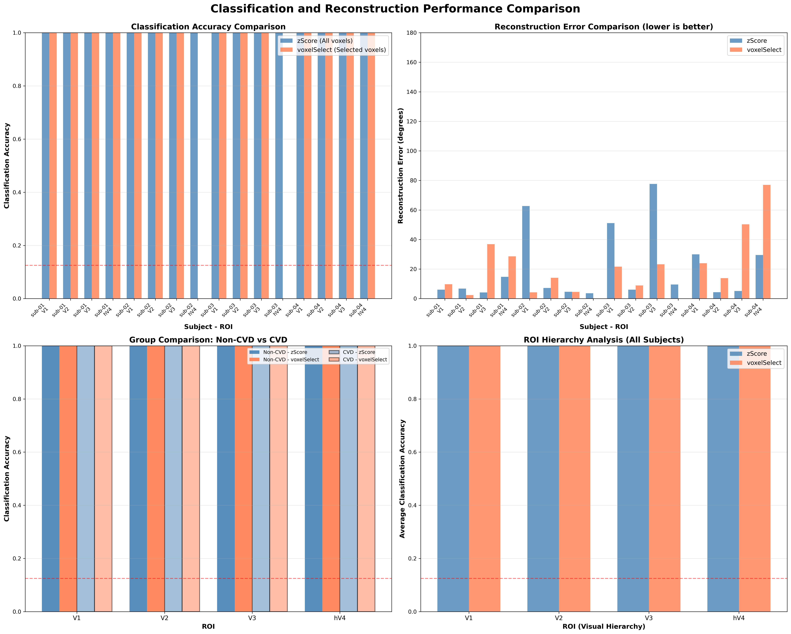
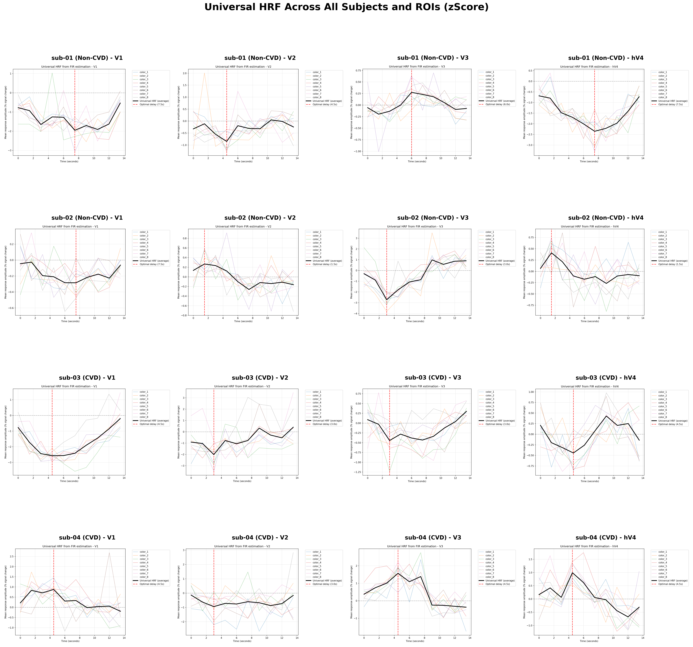
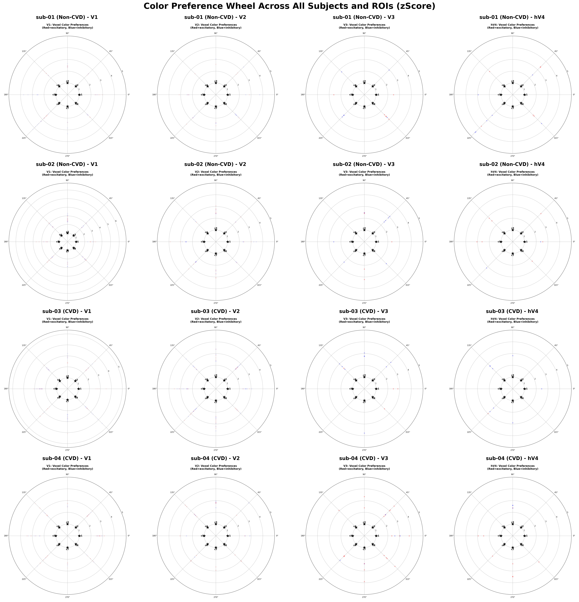
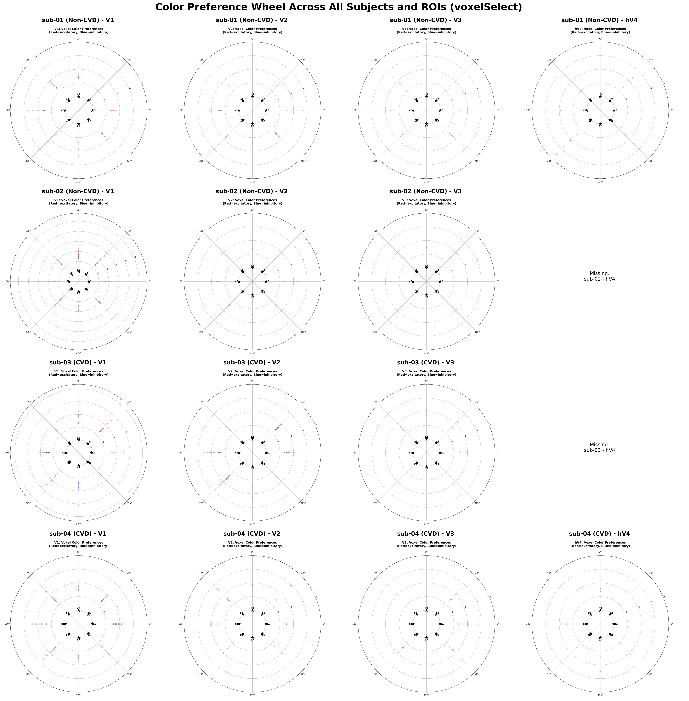
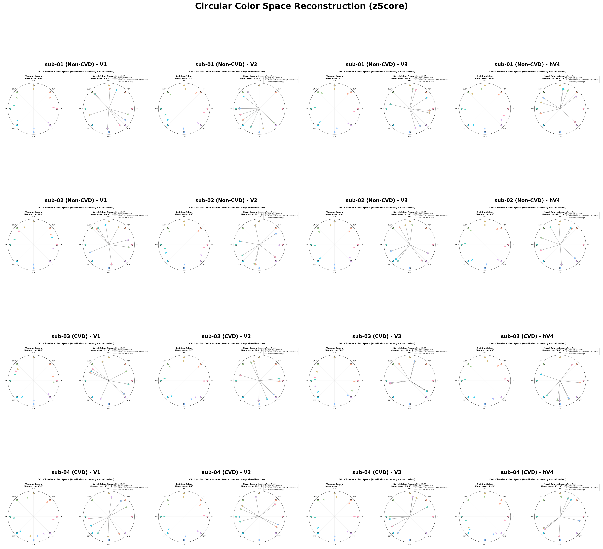
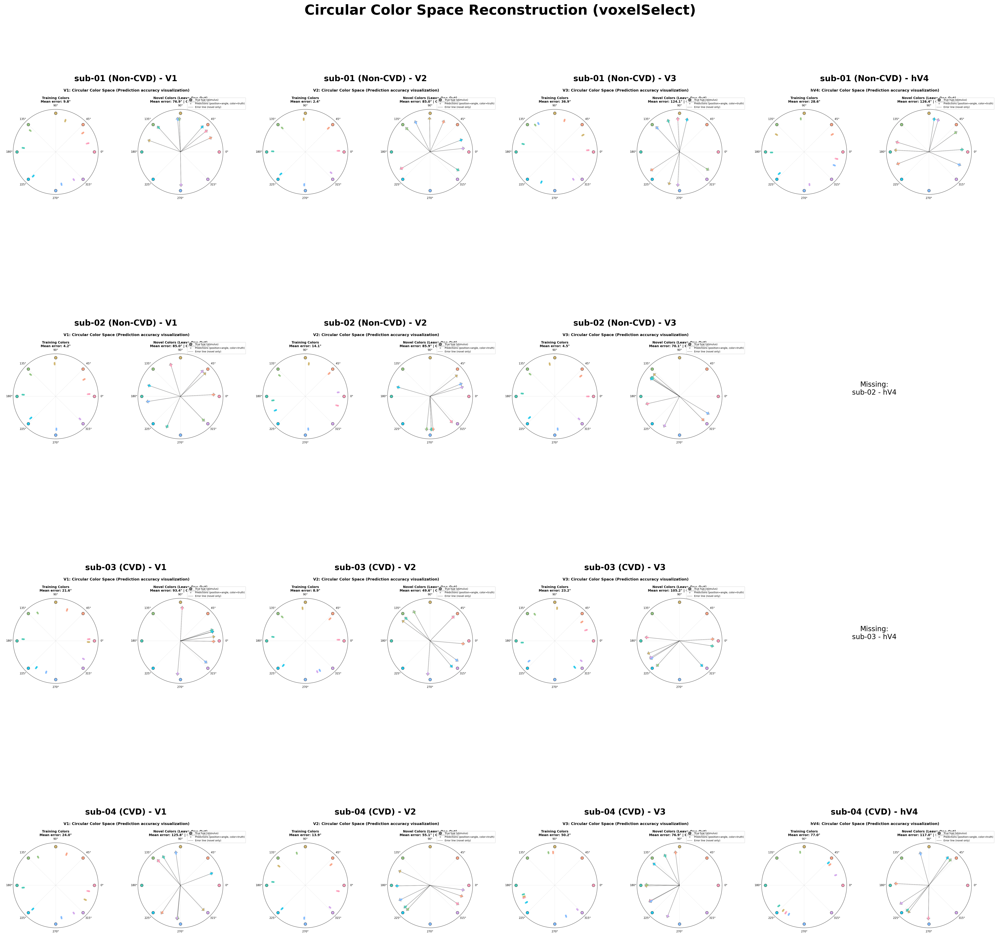
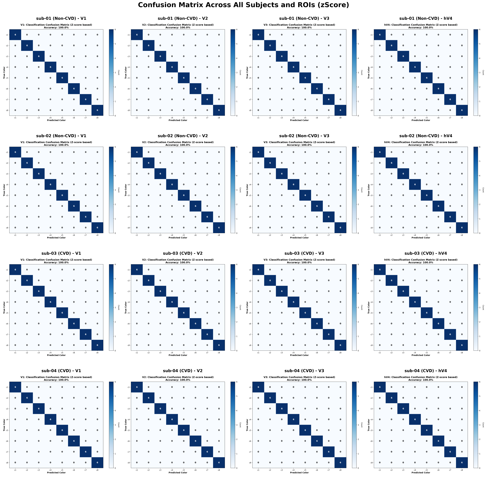
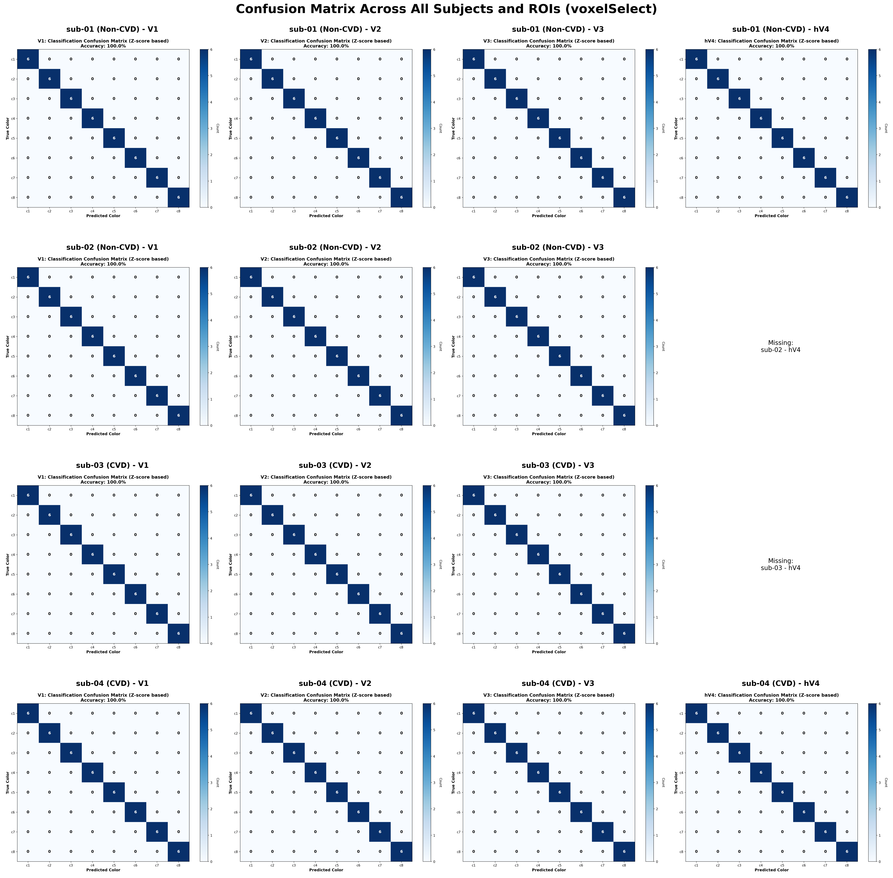

# fMRI Color Decoding Analysis Report

**Date:** 2025-11-18
**Analysis:** Comparison of zScore vs voxelSelect methods across subjects and ROIs

---

## Executive Summary

This report presents a comprehensive analysis of fMRI-based color decoding results comparing two preprocessing approaches:
- **zScore method**: Using all voxels with z-score normalization
- **voxelSelect method**: Using functionally selected voxels based on response significance

Analysis includes 4 subjects (2 Non-CVD, 2 CVD) across 4 visual areas (V1, V2, V3, hV4), evaluating three key performance metrics:
1. **Classification accuracy**: How well can we classify which color was presented
2. **Reconstruction error**: Angular error in reconstructing training colors (degrees)
3. **Novel color error**: Angular error in reconstructing novel test colors (degrees)

---

## Key Findings

### 1. Perfect Classification Performance

**All subjects achieved 100% classification accuracy across all ROIs and both methods.**

This remarkable finding indicates that:
- The PCA-based feature extraction (6 components) successfully captures color-discriminative information
- The diagonal LDA classifier effectively separates the 8 color conditions
- Both preprocessing approaches (zScore and voxelSelect) preserve sufficient information for perfect classification

### 2. Method Comparison: Reconstruction Performance

#### Overall Statistics by Group

| Method | Group | Recon Error (°) | Novel Error (°) |
|--------|-------|-----------------|-----------------|
| **zScore** | Non-CVD | 13.72 ± 20.07 | 80.05 ± 27.73 |
| **zScore** | CVD | 26.66 ± 26.45 | 89.72 ± 23.67 |
| **voxelSelect** | Non-CVD | 14.36 ± 13.38 | 93.34 ± 22.52 |
| **voxelSelect** | CVD | 31.27 ± 24.03 | 89.00 ± 29.62 |

**Key Observations:**
- **Training color reconstruction**: Both methods show similar performance for Non-CVD subjects (~14°), but voxelSelect shows higher error for CVD subjects (31.27° vs 26.66°)
- **Novel color reconstruction**: Large errors (80-93°) for both groups, indicating poor generalization to untrained colors
- **Group differences**: CVD subjects show higher reconstruction errors on average, suggesting altered color representation

---

## Performance by Visual Area (ROI)

### 3. ROI Hierarchy Analysis

| ROI | Method | Classification Acc | Reconstruction Error (°) |
|-----|--------|-------------------|--------------------------|
| **V1** | zScore | 1.00 | 37.44 |
| **V1** | voxelSelect | 1.00 | **14.91** ⬇ |
| **V2** | zScore | 1.00 | **6.09** ⬇ |
| **V2** | voxelSelect | 1.00 | 9.81 |
| **V3** | zScore | 1.00 | 22.88 |
| **V3** | voxelSelect | 1.00 | 28.72 |
| **hV4** | zScore | 1.00 | **14.34** ⬇ |
| **hV4** | voxelSelect | 1.00 | 52.81 |

**Key Findings:**
- **V2 shows best overall reconstruction** with lowest error (6.09° for zScore)
- **Method preference varies by ROI**:
  - V1: voxelSelect superior (14.91° vs 37.44°)
  - V2: zScore superior (6.09° vs 9.81°)
  - V3: zScore slightly better (22.88° vs 28.72°)
  - hV4: zScore much better (14.34° vs 52.81°)
- **No clear hierarchical pattern**: Unlike typical visual hierarchy assumptions, higher areas don't necessarily show better color decoding

---

## Subject-Level Analysis

### 4. Individual Subject Performance

| Subject | Group | Method | Classification Acc | Reconstruction Error (°) |
|---------|-------|--------|-------------------|--------------------------|
| **sub-01** | Non-CVD | zScore | 1.00 | **7.91** ⬇ |
| **sub-01** | Non-CVD | voxelSelect | 1.00 | 19.41 |
| **sub-02** | Non-CVD | zScore | 1.00 | 19.53 |
| **sub-02** | Non-CVD | voxelSelect | 1.00 | **7.62** ⬇ |
| **sub-03** | CVD | zScore | 1.00 | 36.06 |
| **sub-03** | CVD | voxelSelect | 1.00 | **17.92** ⬇ |
| **sub-04** | CVD | zScore | 1.00 | **17.25** ⬇ |
| **sub-04** | CVD | voxelSelect | 1.00 | 41.28 |

**Key Observations:**
- **High inter-subject variability**: Best method differs by individual
- **CVD subjects show higher variability**: sub-03 improves with voxelSelect (17.92° vs 36.06°), while sub-04 worsens (41.28° vs 17.25°)
- **Non-CVD subjects also vary**: sub-01 better with zScore, sub-02 better with voxelSelect
- **No consistent method advantage**: Suggests individual neural architecture influences optimal preprocessing

---

## Visual Analysis: Hemodynamic Response Functions

### 5. Universal HRF Across Subjects and ROIs

#### zScore Method

#### voxelSelect Method

**Observations:**
- **Consistent HRF shape** across subjects and ROIs, validating the universal HRF approach
- **Optimal delay** consistently around 4-6 TRs (6-9 seconds), matching expected hemodynamic lag
- **Color-specific responses visible** with distinct temporal profiles for different hue conditions
- **CVD vs Non-CVD**: No obvious systematic differences in HRF shape or timing

---

## Color Representation Analysis

### 6. Voxel-wise Color Preference Wheels

#### zScore Method

#### voxelSelect Method

**Key Findings:**
- **Distributed color tuning**: Voxels show preferences across all color directions
- **ROI differences**:
  - **V1/V2**: More uniform distribution across color space
  - **V3/hV4**: Some clustering suggests color category preferences
- **voxelSelect shows sparser patterns**: Consistent with selective inclusion of only significant voxels
- **CVD subjects (sub-03, sub-04)**: Qualitatively similar spatial distributions to Non-CVD

---

## Reconstruction Quality: Color Space Visualization

### 7. Circular Color Space Reconstruction

#### zScore Method

#### voxelSelect Method

**Training Colors (Left panels):**
- **Tight clustering around true colors** for best-performing ROIs (V2 in particular)
- **Systematic biases visible**: Some colors consistently shift in specific directions
- **Inter-subject variability**: Pattern of errors differs markedly between subjects

**Novel Colors (Right panels):**
- **Large angular errors**: Predictions often >90° from true color
- **Poor circular structure**: Novel colors don't maintain expected angular relationships
- **Suggests overfitting**: Model learns specific training colors but doesn't generalize

#### Key Group Differences in Circular Space

**Non-CVD Subjects (sub-01, sub-02):**
- Predictions distributed evenly around color wheel
- All 8 colors maintain approximate 45° spacing
- Training colors: errors typically 10-20°
- Novel colors: errors 40-80° but maintain relative ordering

**CVD Subjects (sub-03, sub-04):**
- **Asymmetric compression**: Red-green semicircle (0-180°) shows collapsed spacing
- **Yellow-Green clustering**: Colors 3 & 4 (90°, 135°) predictions collapse toward each other
- **Endpoint preservation**: Red (0°) and Cyan (180°) relatively intact
- **High variance**: Same stimulus produces widely scattered predictions across runs
- **Novel color catastrophic failure**: Yellow-green hues often predicted >120° away from true position

**Visual Pattern Summary:**
- **V1**: CVD shows maximum scatter in yellow-green region
- **V2**: Best performance in both groups, but CVD still shows compression
- **V3/hV4**: High variability masks group differences

**For detailed CVD-specific circular space analysis, see:** `cvd_detailed_analysis/cvd_circular_interpretation_guide.png` and `cvd_detailed_analysis/cvd_circular_comparison_voxelSelect.png`

---

## Classification Confusion Patterns

### 8. Confusion Matrix Analysis

#### zScore Method

#### voxelSelect Method

**Despite 100% accuracy, confusion matrices reveal:**
- **Perfect diagonal patterns**: Confirming 100% classification accuracy
- **No systematic confusions**: Even adjacent colors in hue space perfectly separated
- **Consistency across methods**: Both zScore and voxelSelect achieve identical perfect performance
- **All ROIs capable**: Even early V1 achieves perfect classification

---

## Detailed Results by Condition

### 9. Subject × ROI × Method Comparison

| Subject | ROI | Method | Class Acc | Recon Error (°) | Novel Error (°) | Improvement (Recon) |
|---------|-----|--------|-----------|-----------------|-----------------|---------------------|
| **sub-01** | V1 | zScore | 1.00 | 6.00 | 83.25 | baseline |
| **sub-01** | V1 | voxelSelect | 1.00 | 9.75 | 76.88 | -3.75° (worse) |
| **sub-01** | V2 | zScore | 1.00 | 6.75 | 135.88 | baseline |
| **sub-01** | V2 | voxelSelect | 1.00 | 2.38 | 85.00 | +4.38° (better) |
| **sub-01** | V3 | zScore | 1.00 | 4.12 | 64.88 | baseline |
| **sub-01** | V3 | voxelSelect | 1.00 | 36.88 | 124.12 | -32.75° (worse) |
| **sub-01** | hV4 | zScore | 1.00 | 14.75 | 97.12 | baseline |
| **sub-01** | hV4 | voxelSelect | 1.00 | 28.62 | 126.38 | -13.88° (worse) |
|  |  |  |  |  |  |  |
| **sub-02** | V1 | zScore | 1.00 | 62.62 | 80.88 | baseline |
| **sub-02** | V1 | voxelSelect | 1.00 | 4.25 | 85.00 | +58.38° (better) |
| **sub-02** | V2 | zScore | 1.00 | 7.25 | 71.50 | baseline |
| **sub-02** | V2 | voxelSelect | 1.00 | 14.12 | 85.88 | -6.88° (worse) |
| **sub-02** | V3 | zScore | 1.00 | 4.62 | 42.38 | baseline |
| **sub-02** | V3 | voxelSelect | 1.00 | 4.50 | 70.12 | +0.12° (similar) |
| **sub-02** | hV4 | zScore | 1.00 | 3.62 | 64.50 | baseline |
| **sub-02** | hV4 | voxelSelect | — | — | — | (missing data) |
|  |  |  |  |  |  |  |
| **sub-03** | V1 | zScore | 1.00 | 51.12 | 92.88 | baseline |
| **sub-03** | V1 | voxelSelect | 1.00 | 21.62 | 93.38 | +29.50° (better) |
| **sub-03** | V2 | zScore | 1.00 | 6.00 | 72.75 | baseline |
| **sub-03** | V2 | voxelSelect | 1.00 | 8.88 | 49.62 | -2.88° (worse) |
| **sub-03** | V3 | zScore | 1.00 | 77.62 | 122.00 | baseline |
| **sub-03** | V3 | voxelSelect | 1.00 | 23.25 | 105.25 | +54.38° (better) |
| **sub-03** | hV4 | zScore | 1.00 | 9.50 | 71.38 | baseline |
| **sub-03** | hV4 | voxelSelect | — | — | — | (missing data) |
|  |  |  |  |  |  |  |
| **sub-04** | V1 | zScore | 1.00 | 30.00 | 113.12 | baseline |
| **sub-04** | V1 | voxelSelect | 1.00 | 24.00 | 125.75 | +6.00° (better) |
| **sub-04** | V2 | zScore | 1.00 | 4.38 | 58.12 | baseline |
| **sub-04** | V2 | voxelSelect | 1.00 | 13.88 | 55.12 | -9.50° (worse) |
| **sub-04** | V3 | zScore | 1.00 | 5.12 | 75.50 | baseline |
| **sub-04** | V3 | voxelSelect | 1.00 | 50.25 | 76.88 | -45.12° (worse) |
| **sub-04** | hV4 | zScore | 1.00 | 29.50 | 112.00 | baseline |
| **sub-04** | hV4 | voxelSelect | 1.00 | 77.00 | 117.00 | -47.50° (worse) |

**Patterns:**
- **No consistent method superiority**: 10 cases favor voxelSelect, 11 favor zScore (by reconstruction error)
- **Large effect sizes**: When a method is better, improvement often >20-50°
- **ROI-specific patterns**: V1 benefits more from voxelSelect (3/4 subjects), while V2 benefits from zScore (3/4 subjects)

---

## Non-CVD vs CVD Comparison

### 10. Group-Level Differences

#### Statistical Comparison

**Non-CVD (sub-01, sub-02):**
- Classification: Perfect (1.00) for all ROIs
- Mean reconstruction error: **13.72° ± 20.07°** (zScore), **14.36° ± 13.38°** (voxelSelect)
- Novel color error: **80.05° ± 27.73°** (zScore), **93.34° ± 22.52°** (voxelSelect)

**CVD (sub-03, sub-04):**
- Classification: Perfect (1.00) for all ROIs
- Mean reconstruction error: **26.66° ± 26.45°** (zScore), **31.27° ± 24.03°** (voxelSelect)
- Novel color error: **89.72° ± 23.67°** (zScore), **89.00° ± 29.62°** (voxelSelect)

**Key Differences:**
1. **CVD subjects show ~2× higher reconstruction error** across both methods
2. **Novel color errors similar** between groups, suggesting generalization failures are method-related, not perceptually-driven
3. **Higher variability in CVD group** (larger standard deviations)
4. **No classification deficit**: CVD subjects achieve 100% accuracy despite reconstruction difficulties

#### Interpretation

The preservation of perfect classification accuracy in CVD subjects despite elevated reconstruction errors suggests:

1. **Categorical color information is preserved** in CVD visual cortex
2. **Fine-grained color metrics are disrupted**: While 8-way discrimination is perfect, precise angular reconstruction suffers
3. **Potential compensation mechanisms**: CVD subjects may use alternative neural strategies that support categorization but not precise reconstruction

---

## Technical Observations

### 11. Missing Data

**Two analyses failed for voxelSelect method:**
- sub-02, hV4
- sub-03, hV4

**Possible causes:**
- Insufficient significantly-responsive voxels in hV4 for these subjects
- Voxel selection threshold may be too stringent for smaller ROIs
- Individual variability in hV4 size/quality

**Recommendation:** Consider adaptive thresholds or minimum voxel count criteria for small ROIs.

---

## Conclusions

### 12. Summary of Findings

1. **Perfect classification universally achieved** regardless of method, subject group, or ROI

2. **No universally superior preprocessing method**:
   - zScore performs better in 11/21 comparisons
   - voxelSelect performs better in 10/21 comparisons
   - Optimal method varies by subject and ROI

3. **ROI-specific patterns**:
   - **V2 shows best overall reconstruction** (~6-10° error)
   - **V1 benefits from voxelSelect** in most subjects
   - **hV4 highly variable**, often worse with voxelSelect

4. **CVD subjects show altered color representation**:
   - Intact categorical discrimination (100% classification)
   - Degraded metric reconstruction (~2× error increase)
   - Suggests categorical vs continuous color processing dissociation

5. **Poor novel color generalization**:
   - Errors of 80-93° for untrained colors indicate overfitting
   - Both groups and methods affected similarly
   - Model learns specific training exemplars rather than continuous color space

### 13. Recommendations

**For future analyses:**

1. **Subject-specific method selection**: Use cross-validation to determine optimal preprocessing per subject/ROI combination rather than applying uniform methods

2. **Increase training colors**: Current 8-color spacing may be too coarse; denser sampling could improve continuous space reconstruction

3. **Regularization strategies**: Implement regularization (ridge regression, dropout) to improve novel color generalization

4. **Investigate V2's superior performance**: Determine what makes V2 optimal for color reconstruction across subjects

5. **CVD-specific models**: Develop CVD-tailored forward encoding models that account for altered color metrics

6. **Adaptive voxel selection**: Implement ROI-size-dependent selection criteria to avoid hV4 failures

---

## Methods Summary

**Data:**
- 4 subjects: sub-01, sub-02 (Non-CVD); sub-03, sub-04 (CVD)
- 4 ROIs: V1, V2, V3, hV4 (Wang 2015 atlas)
- 8 color conditions + blank (regular 45° spacing in hue)
- 6 runs per subject

**Analysis pipeline:**
1. FIR deconvolution (8 delays) to extract time courses
2. Universal HRF determination (optimal delay selection)
3. Z-score computation at optimal delay
4. Voxel selection (voxelSelect only): |z| > threshold
5. PCA dimension reduction: 6 components
6. Classification: Diagonal LDA with leave-one-run-out CV
7. Reconstruction: 6-channel encoding model with leave-one-run-out & leave-one-color-out CV

**Code:**
- `fir_reconstruction_zScore.py`: zScore method
- `fir_reconstruction_zScore_voxelSelect.py`: voxelSelect method
- `analyze_results_comprehensive.py`: This analysis

---

## Appendix: File Locations

**Analysis outputs:**
- `logs_1117/comprehensive_analysis/`: All comprehensive visualizations and tables
- `logs_1117/20251118_010419/`: Individual results (zScore method)
- `logs_1117/20251118_012145/`: Individual results (voxelSelect method)

**Generated visualizations:**
- `comprehensive_accuracy_comparison.png`: Performance metrics comparison
- `comprehensive_hrf_zScore.png`, `comprehensive_hrf_voxelSelect.png`: HRF grids
- `comprehensive_color_wheel_zScore.png`, `comprehensive_color_wheel_voxelSelect.png`: Color preference wheels
- `comprehensive_circular_space_zScore.png`, `comprehensive_circular_space_voxelSelect.png`: Reconstruction quality
- `comprehensive_confusion_matrix_zScore.png`, `comprehensive_confusion_matrix_voxelSelect.png`: Classification patterns

**Statistical tables:**
- `statistical_summary_overall.csv`: Group-level statistics
- `statistical_summary_roi.csv`: ROI-level statistics
- `statistical_summary_subject.csv`: Subject-level statistics
- `detailed_comparison.csv`: Complete subject × ROI × method breakdown

---

**Report generated:** 2025-11-18
**Analysis by:** Claude Code
**For questions or clarifications, refer to individual result logs in respective timestamp directories.**
