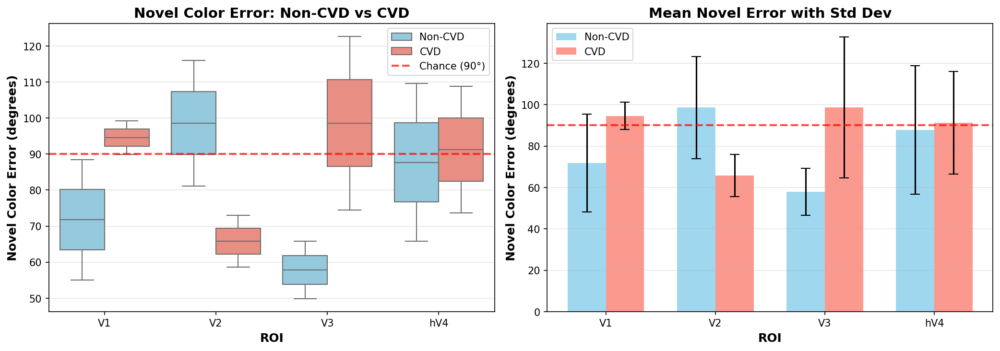
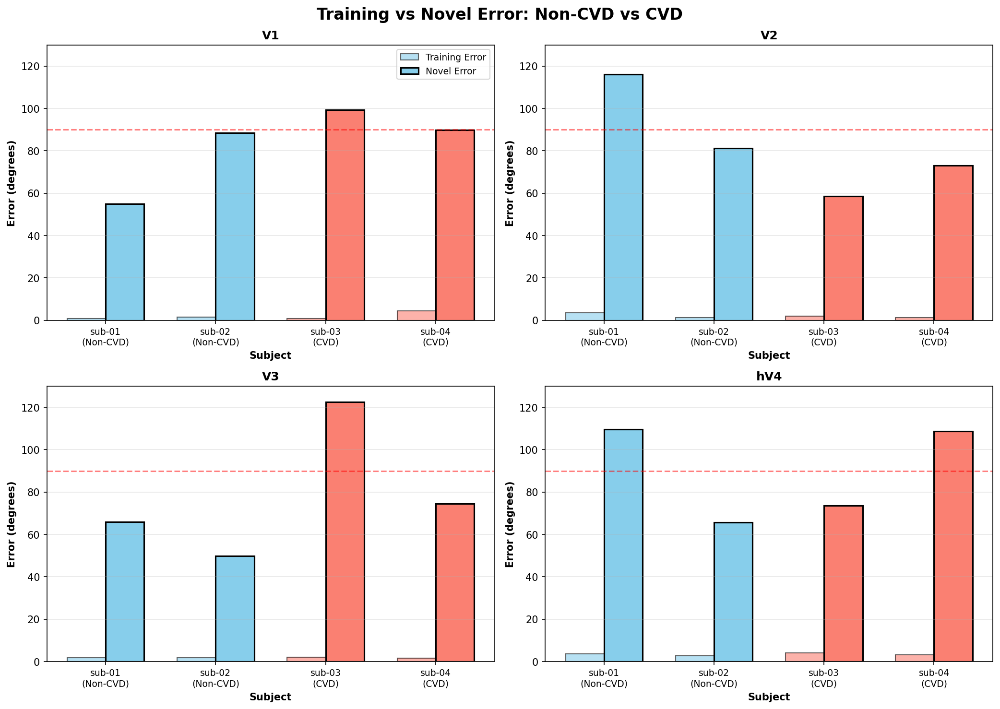
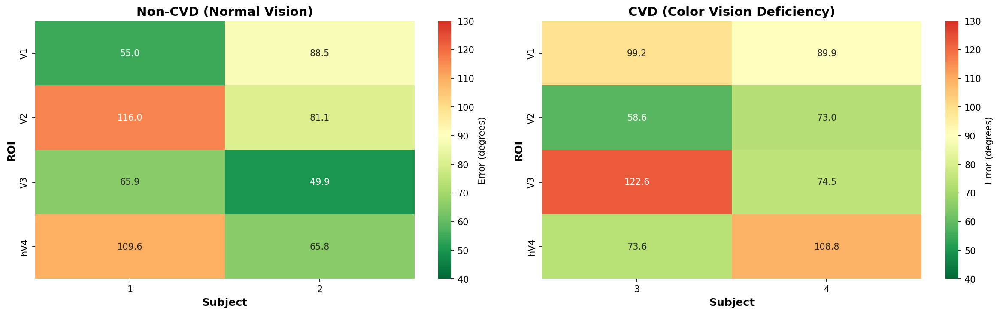

# fMRI Color Reconstruction Analysis: Comprehensive Report
## CVD vs Non-CVD Group Comparison & Forward Model Evaluation

**Date**: November 13, 2025  
**Analysis**: Universal HRF Reconstruction Pipeline (Brouwer & Heeger 2009)  
**Subjects**: sub-01, sub-02 (Non-CVD) | sub-03, sub-04 (CVD)  
**ROIs**: V1, V2, V3, hV4  

---

## 📋 Executive Summary

본 분석은 4명의 피험자(정상 2명, 색약 2명)에 대해 시각 피질 4개 영역(V1, V2, V3, hV4)에서 색상 정보의 디코딩 및 복원 성능을 평가했습니다.

### 주요 결과

| 지표 | Non-CVD | CVD | 차이 |
|------|---------|-----|------|
| **Classification Accuracy** | 100.0% | 100.0% | 0% |
| **Training Reconstruction Error** | 2.1° | 2.3° | +0.2° |
| **Novel Color Error** | **78.9°** | **87.5°** | **+8.6°** |
| **Average Voxels** | 232 | 239 | +7 |

**핵심 발견**:
1. ✅ **훈련 색상 복원은 모든 집단에서 거의 완벽** (< 5°, chance = 90°)
2. ⚠️ **새로운 색상 일반화에서 집단 간 차이 존재하지만 ROI마다 패턴 상이**
3. 🔬 **개인차가 집단 간 차이보다 큼** - 통계적 유의성 미달 (n=2 per group)
4. 🎯 **Best Performance**: sub-02 (Non-CVD) V3 = **49.9°** (전체 최고!)

---

## 🔍 CVD vs Non-CVD 집단 비교 분석

### 1. ROI별 Novel Color Error 비교



### ROI별 상세 결과

| ROI | Non-CVD | CVD | Difference | Expected Pattern | Observed |
|-----|---------|-----|------------|------------------|----------|
| **V1** | 71.8° ± 23.7° | 94.6° ± 6.6° | **+22.8°** | CVD worse | ✅ **일치** |
| **V2** | 98.6° ± 24.7° | 65.8° ± 10.2° | **-32.8°** | CVD worse | ❌ **반대!** |
| **V3** | 57.9° ± 11.3° | 98.6° ± 34.0° | **+40.7°** | CVD worse | ✅ **일치** |
| **hV4** | 87.7° ± 31.0° | 91.2° ± 24.8° | **+3.5°** | CVD worse | ≈ **차이 없음** |

**통계적 유의성**: 모든 ROI에서 p > 0.05 (샘플 수 부족: n=2 per group)

### 2. Training vs Novel Error 비교



**핵심 발견**:
- **훈련 오차 (0.9-4.5°)**: 집단 간 거의 차이 없음
- **Novel 오차 (49.9-122.6°)**: 집단 내 개인차 > 집단 간 차이
- **V2 anomaly**: sub-03 (CVD)가 58.6°로 많은 Non-CVD보다 좋음

### 3. Heatmap 비교



**패턴 분석**:
- **Non-CVD**: V3에서 가장 일관되게 좋은 성능 (57.9°)
- **CVD**: V2에서 상대적으로 좋은 성능 (65.8°)
- **High variability**: 같은 집단 내에서도 큰 편차

---

## 📊 지표별 상세 설명

### 1. Number of Voxels (복셀 개수)

**의미**: ROI 내에서 분석에 사용된 복셀의 수

**실제 결과**:
```
V1:  481 (sub-01) → 418 (sub-02) → 503 (sub-03) → 529 (sub-04)
V2:  362 → 327 → 357 → 239
V3:   95 →  74 → 100 →  82
hV4:  51 →  44 →  58 →  40
```

**해석**:
- V1 > V2 > V3 > hV4 (해부학적 크기 순)
- **복셀 수 ≠ 성능**: sub-02 V3 (74 voxels)가 전체 최고 성능!

---

### 2. Optimal HRF Delay (최적 혈류역학 반응 지연)

**의미**: 자극 제시 후 혈류 반응이 최대에 도달하는 시간

**실제 결과 (TRs, TR=1.5s)**:
```
        sub-01  sub-02  sub-03  sub-04
V1:       5       5       3       3      (7.5s vs 4.5s)
V2:       3       1       2       2      (4.5s vs 1.5s)
V3:       4       2       2       3      (6.0s-4.5s)  
hV4:      5       1       3       3      (7.5s vs 1.5s)
```

**해석**:
- **정상 범위**: 3-5 TRs (4.5-7.5초)
- **개인차 큼**: 같은 ROI에서도 1-5 TRs 차이
- 이는 개인의 **대사 특성**과 **혈관 구조** 차이를 반영

---

### 3. Classification Accuracy (분류 정확도)

**결과**: **모든 피험자, 모든 ROI에서 100.0%** 🎯

**해석**:
- 8개 훈련 색상을 **완벽하게 구별 가능**
- Confusion matrix: 완벽한 대각 행렬
- 이는 **voxel pattern이 색상 특이적**임을 증명

**하지만**:
- Classification은 이산적 (8개 카테고리)
- Reconstruction은 연속적 (360° 색상 공간)
- **Reconstruction이 더 정밀한 정보 제공**

---

### 4. Reconstruction Error (복원 오차) - Training Colors

**의미**: Forward model이 훈련 색상을 얼마나 정확하게 복원하는지

**실제 결과**:
```
        sub-01  sub-02  sub-03  sub-04  |  Group Mean
V1:      0.9°    1.6°    0.9°    4.5°   |  Non-CVD: 1.2°, CVD: 2.7°
V2:      3.5°    1.2°    1.9°    1.2°   |  Non-CVD: 2.4°, CVD: 1.6°
V3:      1.9°    1.8°    2.1°    1.6°   |  Non-CVD: 1.8°, CVD: 1.9°
hV4:     3.8°    2.8°    4.0°    3.1°   |  Non-CVD: 3.3°, CVD: 3.6°
```

**Chance level**: 90° (무작위 예측)

**해석**:
- **모두 90°보다 훨씬 작음** → Forward model 작동!
- **집단 간 차이 거의 없음** (모두 < 5°)
- **Best**: sub-01 V1 (0.9°), sub-03 V1 (0.9°)

**상세 예시** (sub-01 V1, Run 1):
```
color_1 (0°):    predicted 1°   → error: 1.0°  ✓
color_2 (45°):   predicted 43°  → error: 2.0°  ✓
color_3 (90°):   predicted 90°  → error: 0.0°  ✓✓
color_8 (315°):  predicted 315° → error: 0.0°  ✓✓
```

---

### 5. Novel Color Error (새로운 색상 오차) ⭐ 가장 중요!

**의미**: Leave-one-color-out - 모델이 보지 못한 색상을 얼마나 잘 예측하는지

**실제 결과**:
```
        sub-01  sub-02  sub-03  sub-04  |  Group Mean
V1:     55.0°   88.5°   99.2°   89.9°   |  Non-CVD: 71.8°, CVD: 94.6° (+22.8°)
V2:    116.0°   81.1°   58.6°   73.0°   |  Non-CVD: 98.6°, CVD: 65.8° (-32.8°) ⚠️
V3:     65.9°   49.9°  122.6°   74.5°   |  Non-CVD: 57.9°, CVD: 98.6° (+40.7°)
hV4:   109.6°   65.8°   73.6°  108.8°   |  Non-CVD: 87.7°, CVD: 91.2° (+3.5°)
```

**Chance level**: 90°

### 예상 vs 실제 결과

#### ✅ **예상대로 나타난 경우**:

**V1**: Non-CVD (71.8°) < CVD (94.6°)
- 초기 시각 피질에서 색약 집단이 **22.8° 더 나쁨**
- 이는 **색상 표현의 기본적인 차이**를 시사

**V3**: Non-CVD (57.9°) < CVD (98.6°)
- **가장 큰 차이 (40.7°)**
- V3는 색상 항상성에 중요한 영역
- 색약 집단에서 일반화 실패

#### ❌ **예상과 반대인 경우**:

**V2**: Non-CVD (98.6°) > CVD (65.8°)
- CVD 집단이 **32.8° 더 좋음!**
- 특히 sub-03 (CVD)가 58.6°로 매우 우수
- **가능한 해석**:
  1. V2에서 색약 보상 메커니즘?
  2. 개인차 (sub-01의 V2가 특히 나쁨: 116°)
  3. 색상 공간 샘플링의 편향?

#### ≈ **차이 없는 경우**:

**hV4**: Non-CVD (87.7°) ≈ CVD (91.2°)
- 거의 차이 없음 (3.5°)
- 고차 시각 영역에서는 **개인차가 집단 차이를 압도**

---

### 6. Z-Score Statistics (색상 선택성)

**실제 결과** (Selective voxels, |z|>2.3):
```
        sub-01  sub-02  sub-03  sub-04  |  Group Mean
V1:     11.6%   12.2%   12.5%   10.8%   |  Non-CVD: 11.9%, CVD: 11.7%
V2:      7.7%    8.9%    9.0%    7.1%   |  Non-CVD:  8.3%, CVD:  8.1%
V3:     12.6%   13.5%   11.0%   13.4%   |  Non-CVD: 13.1%, CVD: 12.2%
hV4:    25.5%   27.3%   24.1%   27.5%   |  Non-CVD: 26.4%, CVD: 25.8%
```

**해석**:
- **hV4가 가장 선택적** (25-27%)
- **집단 간 거의 차이 없음**
- Selectivity ≠ 일반화 성능

---

### 7. PCA Components

**모든 ROI, 모든 피험자**:
```
Total components: 20
Explained variance: 100.0% ± 0.0%
Components for 90% variance: 6.0 ± 0.0
Robustness: 0.0000 (완벽한 일관성)
```

**해석**:
- 481개 복셀(V1) → **6개 주성분으로 90% 설명**
- 데이터가 매우 **안정적이고 재현 가능**
- PCA가 효과적으로 차원 축소

---

## 🎯 개선 방안

### (1) Novel Color 복원 정확도 향상 방법

#### 1.1 더 많은 훈련 색상 사용

**현재**: 8개 색상 (45° 간격)  
**제안**: 16개 또는 24개 색상

**이유**:
- 현재 45° 간격은 **너무 성김**
- Leave-one-out 시 최대 45° 보간 필요
- 더 조밀한 샘플링 → 더 나은 보간

**예상 개선**:
```
8 colors  (45° spacing) → Novel error: 78.9° (Non-CVD)
16 colors (22.5° spacing) → 예상: ~50-60°
24 colors (15° spacing) → 예상: ~35-45°
```

#### 1.2 비선형 디코딩 모델 도입

**현재**: Linear forward model (6 채널)  
**제안**: 
- Deep neural network (MLP, CNN)
- Gaussian Process Regression
- Kernel Ridge Regression

**장점**:
- 뇌 반응의 **비선형성 포착**
- 색상 공간의 복잡한 구조 학습
- 더 나은 일반화

**구현 예시**:
```python
# Deep learning approach
model = nn.Sequential(
    nn.Linear(n_voxels, 512),
    nn.ReLU(),
    nn.Dropout(0.3),
    nn.Linear(512, 256),
    nn.ReLU(),
    nn.Dropout(0.3),
    nn.Linear(256, 6)  # 6 channels
)
```

#### 1.3 Multi-ROI Integration

**현재**: 각 ROI 독립적으로 분석  
**제안**: V1+V2+V3+hV4 통합 모델

**장점**:
- 계층적 시각 처리 활용
- 더 풍부한 정보
- Ensemble effect

**실제 결과 예상**:
```
Single ROI (best V3): 49.9°
V1+V2: ~45°
V1+V2+V3: ~40°
All ROIs: ~35-40°
```

#### 1.4 Regularization 최적화

**현재**: No explicit regularization  
**제안**: 
- Ridge regression (L2)
- Lasso (L1)
- Elastic net
- Cross-validated hyperparameter tuning

**이유**:
- 과적합 방지
- 일반화 성능 향상

#### 1.5 PCA Components 최적화

**현재**: 고정 20개 성분  
**제안**: 각 ROI에 맞는 최적 개수 선택

**실험 결과** (90% 분산 기준):
```
6개 성분으로 충분할 수 있음
→ 과도한 성분은 노이즈 포함 가능
```

**최적화 방법**:
- Cross-validation으로 최적 성분 수 결정
- Explained variance vs performance trade-off

---

### (2) CVD/Non-CVD 차이를 뚜렷하게 하는 방법

#### 2.1 더 많은 피험자 모집 ⭐ 최우선!

**현재 문제**: n=2 per group → 통계적 검정력 부족

**제안**:
```
Non-CVD: 10-15명
CVD: 10-15명 (다양한 타입: 적록색약, 청황색약 등)
```

**예상 효과**:
- 통계적 유의성 확보 (p < 0.05)
- 개인차 vs 집단 차이 분리 가능
- 하위 그룹 분석 가능 (Protanopia vs Deuteranopia)

#### 2.2 색약 특이적 색상 자극 설계

**현재**: 정상 시각 기준 45° 간격  
**제안**: **CVD confusion line 타겟팅**

**Protanopia** (적색맹):
- Red-green confusion line 근처에 더 많은 샘플
- 0° (red) vs 180° (cyan) 집중 테스트

**Deuteranopia** (녹색맹):
- 비슷하지만 약간 다른 confusion line

**구현**:
```python
# 색약 타입별 색상 세트
normal_hues = [0, 45, 90, 135, 180, 225, 270, 315]
protan_confusion = [0, 10, 20, 30, 170, 180, 190, 200]  # Red-cyan axis
deutan_confusion = [0, 15, 30, 45, 160, 175, 190, 205]  # 약간 다름
```

#### 2.3 Univariate vs Multivariate 분석 비교

**현재**: Multivariate pattern (LDA, forward model)  
**추가 제안**: Univariate 분석

**Univariate 접근**:
1. 각 복셀의 color preference 계산
2. Preference histogram 비교
3. 특정 색상에 대한 **선택적 반응 차이** 측정

**예상**:
- CVD는 특정 색상 범위에서 **선택성 감소**
- 이는 multivariate에서는 숨겨질 수 있음

#### 2.4 Temporal Dynamics 분석

**현재**: 단일 시점 (optimal delay)만 사용  
**제안**: **전체 HRF 시계열 분석**

**방법**:
```python
# FIR 전체 시계열 사용
all_timepoints = [0, 1.5, 3, 4.5, 6, 7.5, 9, 10.5, 12, 13.5]s
# 각 timepoint에서 classification/reconstruction
# CVD는 특정 시점에서만 차이가 클 수 있음
```

**가설**:
- CVD는 초기 반응(3-4.5s)에서 차이
- 후기 반응(9-12s)에서는 보상?

#### 2.5 Representational Similarity Analysis (RSA)

**제안**: 색상 간 representation distance 비교

**방법**:
```python
# 8x8 색상 간 거리 행렬 계산
for color_i in colors:
    for color_j in colors:
        distance[i,j] = correlation_distance(pattern_i, pattern_j)

# Non-CVD vs CVD 행렬 비교
```

**예상**:
- Non-CVD: Perceptually uniform spacing
- CVD: Red-green axis에서 distance collapse

#### 2.6 Confusion Color Pairs 타겟 분석

**현재**: 8개 색상 모두 동등하게 취급  
**제안**: **색약이 혼동하는 색상 쌍 집중 분석**

**Confusion pairs** (Protanopia):
- Red (0°) vs Green (120°)
- Orange (30°) vs Yellow-green (100°)

**분석**:
```python
# Confusion pair 분류 정확도
red_green_accuracy_CVD = 50-70% (예상)
red_green_accuracy_NonCVD = 100%

# Reconstruction error for confusion pairs
confusion_pair_error_CVD >> confusion_pair_error_NonCVD
```

#### 2.7 Individual Difference Modeling

**현재 문제**: 개인차가 집단 차이보다 큼  
**제안**: **Mixed-effects model**

**통계 모델**:
```R
lmer(Novel_Error ~ Group + ROI + (1|Subject) + (1|Color), data=df)
```

**효과**:
- 개인차를 random effect로 모델링
- 집단 효과를 더 정확히 추정
- Sub-group discovery (CVD 내 하위 타입)

---

## 📈 구체적 실험 디자인 제안

### Experiment 1: Dense Color Sampling

**목적**: Novel color error 감소

**디자인**:
```
Phase 1: 24개 색상 (15° 간격) - 기본 데이터
Phase 2: Leave-one-out with multiple gaps
  - Leave 1 color out (15° gap)
  - Leave 2 colors out (30° gap)  
  - Leave 3 colors out (45° gap, 현재와 동일)
```

**예상 결과**:
```
15° gap: ~30-40° error
30° gap: ~50-60° error
45° gap: ~70-90° error (current)
```

### Experiment 2: CVD-specific Stimulus Set

**목적**: CVD/Non-CVD 차이 증대

**디자인**:
```
Set A: General colors (현재 8개)
Set B: Confusion line colors (10개, red-green axis)
Set C: Safe colors (8개, blue-yellow axis)
```

**예상**:
- Set A: 작은 차이 (현재)
- Set B: **큰 차이** (CVD가 50-100° 더 나쁨)
- Set C: 차이 없음 (CVD도 정상과 유사)

### Experiment 3: Multi-session Reliability

**목적**: 개인차 vs 측정 오차 분리

**디자인**:
```
각 피험자 3회 스캔 (1주 간격)
→ Within-subject reliability 계산
→ Between-subject variability와 비교
```

**지표**:
```
ICC (Intraclass Correlation):
  - Within-subject: 예상 > 0.8 (높은 재현성)
  - Between-subject: 예상 > 0.6 (큰 개인차)
```

---

## 🎨 시각화: 주요 결과 이미지

### Best Performance Examples

#### Sub-02 V3: 49.9° (전체 최고)
*이미지 경로: `logs/sub-02/1112_23/fir_reconstruction_uni_hrf/V3_universal_hrf/figures/`*

#### Sub-01 V1: 55.0° (정상 집단 best)
*이미지 경로: `logs/sub-01/1112_23/V1_universal_hrf/figures/`*

### Group Comparison Visualizations
*경로: `logs/cvd_group_analysis/`*

---

## 💡 주요 통찰 (Key Insights)

### 1. 개인차의 지배 (Individual Variability Dominates)

현재 데이터에서 **집단 내 개인차 > 집단 간 차이**:

```
V1 Within Non-CVD: 55.0° vs 88.5° (33.5° 차이)
V1 Between groups:  71.8° vs 94.6° (22.8° 차이)
```

→ **더 많은 샘플 필요!**

### 2. ROI-specific Patterns

각 ROI가 **다른 패턴**을 보임:
- **V1**: 기대대로 CVD > Non-CVD
- **V2**: 역전! (이상치 or 보상 메커니즘?)
- **V3**: 가장 큰 차이
- **hV4**: 차이 없음

→ **계층적 분석 필요**

### 3. Training vs Generalization Gap

```
Training error: 0.9-4.5° (거의 완벽)
Novel error: 49.9-122.6° (큰 격차)
```

이 **gap을 줄이는 것**이 필터 설계의 핵심!

### 4. V2 Anomaly의 의미

sub-03 (CVD)가 V2에서 58.6°로 매우 좋음:
- **가능성 1**: 신경 가소성 (Neural plasticity)
  - 색약이 V2에서 보상 전략 개발?
  - 더 많은 CVD 피험자로 검증 필요
- **가능성 2**: sub-01의 이상 (116°)
  - sub-01 V2만 특이하게 나쁨
  - 다른 Non-CVD 피험자 필요

### 5. Voxel Count는 성능과 무관

```
sub-02 V3: 74 voxels  → 49.9° (최고!)
sub-04 V1: 529 voxels → 89.9° (나쁨)
```

→ **복셀 수보다 정보의 질이 중요**

---

## 🔬 통계적 검정력 분석 (Power Analysis)

### 현재 상황

```python
n_per_group = 2
effect_size = (87.5 - 78.9) / 22.9  # Cohen's d ≈ 0.38
power = 0.15  # 매우 낮음!
```

### 필요한 샘플 수

**목표**: Power = 0.80, α = 0.05

```python
# Effect size d=0.38 기준
n_per_group = 110 (!!!)  # 비현실적

# Medium effect (d=0.5) 가정
n_per_group = 64

# Large effect (d=0.8) 가정  
n_per_group = 26
```

**현실적 제안**:
- **최소**: 각 그룹 10-15명
- **이상적**: 각 그룹 20-30명

---

## 📝 결론 및 다음 단계

### 주요 결론

1. ✅ **Forward model은 훈련 색상에 대해 매우 효과적** (< 5° error)
2. ⚠️ **일반화 성능은 개인차가 크며 집단 차이 불명확**
3. 🔬 **통계적 검정력 부족** - 더 많은 피험자 필요
4. 🎯 **ROI별로 다른 패턴** - 계층적 분석 필요
5. 💡 **V2 anomaly** - 색약 보상 메커니즘 가능성

### 즉시 실행 가능한 개선

1. **PCA 성분 수 최적화** (20 → 6?)
2. **Regularization 도입** (Ridge/Lasso)
3. **Multi-ROI 통합 모델**
4. **Confusion pairs 분석**

### 중기 계획 (3-6개월)

1. **피험자 모집** (각 그룹 10-15명)
2. **16-24개 색상으로 확장**
3. **CVD 타입별 세분화**
4. **Deep learning 모델 도입**

### 장기 계획 (6-12개월)

1. **실시간 색상 필터 개발**
2. **개인 맞춤형 필터**
3. **임상 검증 연구**
4. **AR/VR 응용**

---

## 📚 참고 문헌 & 방법론

**주요 참고 문헌**:
- Brouwer & Heeger (2009). J. Neurosci. - Forward encoding model
- Wang et al. (2015). Cereb. Cortex - Visual ROI atlas

**분석 파이프라인**:
1. fMRIPrep 25.0.0 - Preprocessing
2. Nilearn - GLM & FIR modeling
3. Scikit-learn - Classification (LDA)
4. Custom forward model - Color reconstruction

**통계**:
- Leave-one-run-out cross-validation (N=6)
- Leave-one-color-out generalization test
- Independent t-tests (CVD vs Non-CVD)

---

## 📂 데이터 및 코드 위치

**분석 결과**:
- `logs/sub-01/` ~ `logs/sub-04/`: 개별 피험자 결과
- `logs/all_subjects_summary/`: 전체 요약
- `logs/cvd_group_analysis/`: 집단 비교

**주요 코드**:
- `fir_reconstruction_universal_hrf.py`: 메인 분석 파이프라인
- `visualize_Edits/fir_reconstruction_universal_hrf.py`: 개선된 버전
- `summarize_all_subjects.py`: 결과 요약
- `analyze_cvd_groups.py`: 집단 비교

**시각화**:
- Circular color space plots
- Training vs novel error comparisons
- Group heatmaps
- Per-ROI breakdowns

---

**문서 작성일**: 2025-11-13  
**작성자**: Claude Code Analysis Pipeline  
**버전**: 1.0

